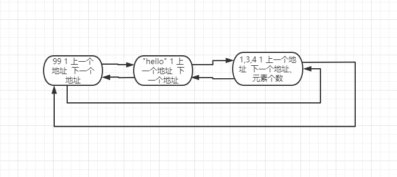

# Python 内存回收

在 Python 中主要通过**引用计数器**来进行垃圾回收，但只通过引用计数器会存在循环引用的问题，引入**标记清除**和**分代回收**的机制进行完善

##  引用计数器

### 1. 环状双向链表（refchain）


在运行 Python 文件时，底层会建立一张环状双向链表，所有创建的对象都会被加入这个 refchain 中，如：

```python
a = 99
b = "hello"
c = [1,3,4]
```

运行上面的代码时，会开辟一块空间用来存储 99、“hello”、[1,3,4]，这 3 个对象，，并把这三个对象加入 refchain 中，并存储一些基本的数据：

+ 对象的值
+ 引用的次数：默认是1
+ 上一个对象地址
+ 下一个对象地址



由上图可以看出，对于列表这种对象，除了存储以上 4 个基本的数据外，还会存储一些特有的数据，如：元素个数等。

```
d = a
```

当执行到此行时，由于 d 指向的还是 99 这个对象，因此会在 refchain 中将次对象的数据中的引用次数 +1，此时该对象的引用次数就变成 2 

```
del d
del a
```

当执行到 del b 这句时，会将 d 指向的对象，在 refchain 中将该对象的引用次数 -1 

当执行到 del a 这句时，会将 a 指向的对象，在 refchain 中将该对象的引用次数 -1 

此时，该对象的引用次数为 0 ，系统会对引用次数为 0 的对象进行垃圾回收或内存释放。

### 2. 循环引用

```
a = [1,2,3]
b = [4,5,6]
a.append(b)    //在 [1,2,3] 列表中添加第 4 个元素[4,5,6]
b.append(a)    //在 [4,5,6] 列表中添加第 4 个元素[1,2,3]

```

运行第一行时，[1,2,3] 这个列表对象在 refchain 中的引用计数器为 1

运行第二行时，[4,5,6] 这个列表对象在 refchain 中的引用计数器为 1

运行第三行时，由于将 [4,5,6] 对象作为元素添加到 [1,2,3] 中，所以 [4,5,6] 这个对象在 refchain 中的引用次数 +1，为 2

运行第四行时，由于将 [1,2,3] 对象作为元素添加到 [4,5,6] 中，所以 [1,2,3] 这个对象在 refchain 中的引用次数 +1，为 2

```
del a 
del b
```

当运行此时，[1,2,3] 和 [4,5,6] 在 refchain 中的引用计数 -1 ，为 1，但程序已经删除了这两个对象引用的变量了，也就意味着这两个对象没有被引用，对没有被引用的对象，系统应该是要对其进行垃圾回收的，但是由于 refchain 中的值不为 0，Python 是不会对这两个对象进行垃圾回收，而且会一直占用内存，这就是循环引用带来的问题，为解决此问题，引入了标记清除机制。

## 标记清除

在底层除了建立一张 refchain 表存储所有的对象外，另外在建立一张表存储那些可能存在**循环引用**的对象，也就是说，此时底层会有 2 张表：


可能存在循环引用的类型（元素可以是对象的数据类型）：

+ 列表

+ 字典
+ 元祖
+ 集合

系统会对存储可能存在循环引用对象的链表中对每一个对象进行扫描，看是否有循环引用，有的话会将双方的引用计数器减 1 ，此时会有 2 个问题：

+ 什么时候会扫描这个链表
+ 如果链表中存储的对象比较多，每次扫描时耗时会很长

为了解决这个问题，引入了分代回收机制

## 分代回收

会将标记清除的链表，分成 3 代进行回收：


+ 什么时候扫描？

  0 代：链表中的对象个数大于 700 时，扫描一次，会回收掉一些不引用的对象，剩下的对象将会被添加到 1 代中

  1 代：0 代扫描 10 超过 10 次，则 1 代扫描一次，会回收掉一些不引用的对象，剩下的对象将会被添加到 2 代中

  2 代：1 代扫描 10 超过 10 次，则 2 代扫描一次，

  

## 缓存机制

在 Python 中为了提高性能，Python 使用了池和 free_list 两种缓存的机制，来进行数据的缓存。

+ 池

  + int 类型：

    在运行 Python 的时候，系统会为我们创建一个小数据池，缓存常用的数， 范围是从 -5 -4~~257，超过此范围的时候，系统会为其开辟内存空间，并加入到 refchain 中。在此范围的对象，系统不会为其重新创建内存空间，会从池中直接取，其引用计数器的值会在默认 1 的基础上加 1

  + str 类型

    + 单字符：使用池的机制，将 ASII 字符进行缓存到 unicode_latiml，后续不会再创建相应的对象，直接从池中取

    + 字符串：对于由字母、数字、下划线组成的字符，且长度不超过 20 的有驻留机制，如果内存中有，不会再被创建

+ free_list

将一些引用计数器为 0 的对象从 refchain 中移除后，将其加入 free_list 缓存，等下次创建通类型的时候，直接从 free_list 中取，放入 refchain 中

  + float：默认free_list 个数为100个，超过的会直接清除

  + list：默认free_list 个数为 80个，超过的会直接清除

  + tuple：存储的容量是20，相当于20个索引，每个索引下可以存 2000 个对象

  + dict：默认free_list 个数为 80个，超过的会直接清除


## 参考文档

[内存管理与垃圾回收](https://www.bilibili.com/video/BV1F54114761?p=1)

（完）