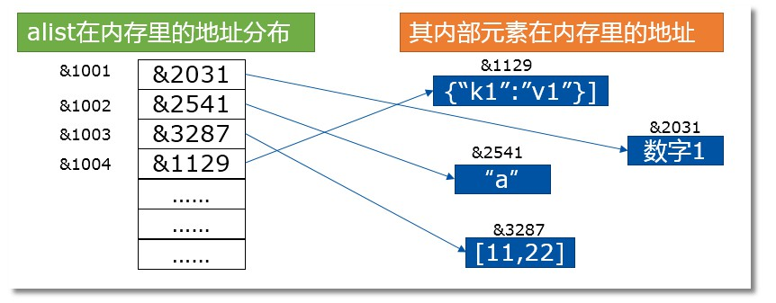

#  数据类型

## 数字类型

数字类型是不可变类型

支持 3 种类型：

+ 整数

  **说明**：整型，不带小数点

  **特殊**：python3 种的整型可以当作 Long 类型

  **长度**：

  + 32 位，通常连续分配内存空间
  + 可以使用 id(1) 进行查看内存地址

  **小整数对象池**：

  + 初始化时，会创建小整数对象池，方便调用，会一直存在
  + 范围从 -5 到 256
  + 目的：减小开销，提高性能
  + 在不创建 1 时直接使用 id(1)，可查看内存地址

  **缓冲区**：刚被删除的整数不会立即被回收，而会在后台缓冲一段时间，等待下一次的可能调用

  例：

  ```
  >>> a = 1000000
  >>> id(a)
  45818160
  >>> del a       # 删除变量a
  >>> b = 1000000
  >>> id(b)
  45818160
  ```

+ 浮点数

  + 通常说的小数
  + 对于很大或很小的浮点数，一般用科学计数法表示

  ```
  1.23x10^9==1.23e9
  0.000012==1.2e-5
  ```

+ 复数

  +  由实数部分和虚数部分构成 
  +  a + bj,或者 complex(a,b) 表示
  +  复数的实部 a 和虚部 b 都是浮点型  

## 布尔类型

类型值：Ture/False

布尔运算：计算结果时 Ture 或 False 的过程

 **布尔类型可以进行 and、or 和 not 运算** 

```
>>> True and True
True
>>> True or True
True
>>> not True
False
```

**其他运算：**

```
比较运算：
>>> True > False
True
>>> True < False
False
>>> True >=False
True

四则运算：
>>> True -1
0
>>> True + 1
2
>>> True *3
3
>>> False -1
-1
```

**注意 None（空值）：**

+  空值不是布尔类型，也不是数字类型 
+  **是NoneType** 

```
>>> bool(None)
False
>>> type(None)
<class 'NoneType'>
```

## 列表

有序可重复的元素集合

**数据结构：**

以  alist = [1, “a”, [11,22], {“k1”:”v1”}]  为例：



## 元组

序列结构，元组中的内容不可变

**不允许的操作：**

+ 新增
+ 删除
+ 修改

**创建元组注意：**

创建只有 1 个元素的元组时，必须加上逗号

```
>>> tup1 = (50,)        # 创建只包含一个元素的元组时，要在元素的后面跟个逗号
```

**元组只保证它的一级子元素不可变，对于嵌套的元素内部，不保证不可变！**

```
>>> tup = ('a', 'b', ['A', 'B'])
>>> tup[2][0] = 'X'
>>> tup[2][1] = 'Y'
>>> tup 
('a', 'b', ['X', 'Y'])
```

## 字符串

不可变的序列数据类型

### 字符串格式化

#### % 百分符格式化方法 

```python
print ("我叫 %s 今年 %d 岁!" % ('小明', 10))
print("%(name)s hello" %{'name':"www"})
# 对于百分数需要写 2 个 %
print("%s已下载了90%%了" %"电影")     
```

#### str.format() 格式化方法

+ 1.{0}、{1}、{2}:这一类是位置参数，引用必须按顺序，不能随意调整，否则就乱了。例如：

  ```
  tpl = "i am {0}, age {1}, really {0}".format("seven", 18)
  ```

+ 2.{name}、{age}、{gender}：这一类是关键字参数，引用时必须以键值对的方式，可以随意调整顺序。例如：

  ```
  tpl = "i am {name}, age {age}, really {name}".format(name="seven", age=18)
  ```

## 字典

 **不定长、可变、散列的集合类型** 

**特点：**

+ 元素个数不限，值得类型是任何数据

+ key 的值必须是不可变对象

+ key 唯一

字典遍历：

```
dic = {'Name': 'Jack', 'Age': 7, 'Class': 'First'}

# 1  直接遍历字典获取键，根据键取值
for key in dic:
    print(key, dic[key])

# 2  利用items方法获取键值，速度很慢，少用！
for key,value in dic.items():
    print(key,value)

#3  利用keys方法获取键
for key in dic.keys():
    print(key, dic[key])

#4  利用values方法获取值，但无法获取对应的键。
for value in dic.values():
    print(value)
```

## 集合

无序不重复元素的集

**核心：**自动去重

```
>>> s = set([1,1,2,3,3,4])
>>> s
{1, 2, 3, 4}        # 自动去重
>>> set("it is a nice day")     # 对于字符串，集合会把它一个一个拆开，然后去重
{'s', 'e', 'y', 't', 'c', 'n', ' ', 'd', 'i', 'a'}
```

**操作：**

+  add(key)方法可以添加元素到set中 

```
>>> s = {1, 2, 3, 4}
>>> s
{1, 2, 3, 4}
>>> s.add(5)
```

+  update()方法，将另一个对象更新到已有的集合中，会进行去重 

```
>>> s
{1, 2, 3, 4, 5}
>>> s.update("hello")
>>> s
{1, 2, 3, 4, 5, 'e', 'o', 'l', 'h'}
```

+  remove(key) 或 pop() 方法删除指定元素， pop方法无法设置参数，删除指定的元素

```
>>> s
{1, 2, 3, 4, 5, 'e', 'o', 'l', 'h'}
>>> s.remove("l")
>>> s
{1, 2, 3, 4, 5, 'e', 'o', 'h'}
>>> s.pop()
1
>>> s
{2, 3, 4, 5, 'e', 'o', 'h'}
>>> s.pop(3)
Traceback (most recent call last):
  File "<pyshell#22>", line 1, in <module>
    s.pop(3)
TypeError: pop() takes no arguments (1 given)
```

+  数学意义上的集合操作 

```
>>> s
{1, 2, 3, 4, 5, 'e', 'o', 'l', 'h'}
>>> s.remove("l")
>>> s
{1, 2, 3, 4, 5, 'e', 'o', 'h'}
>>> s.pop()
1
>>> s
{2, 3, 4, 5, 'e', 'o', 'h'}
>>> s.pop(3)
Traceback (most recent call last):
  File "<pyshell#22>", line 1, in <module>
    s.pop(3)
TypeError: pop() takes no arguments (1 given)
```


## bytes

**特点：**

+ 不可变的序列对象
+ 以字节为单位处理

创建方法：

```
b = b''         # 创建一个空的bytes
b = bytes()      # 创建一个空的bytes
b = b'hello'    #  直接指定这个hello是bytes类型
b = bytes('string',encoding='编码类型')  #利用内置bytes方法，将字符串转换为指定编码的bytes
b = str.encode('编码类型')   # 利用字符串的encode方法编码成bytes，默认为utf-8类型

bytes.decode('编码类型')：将bytes对象解码成字符串，默认使用utf-8进行解码。
```

与字符串的简单转换：

**string = b'xxxxxx'.decode()** 直接以默认的 utf-8 编码解码 bytes 成 string

**b = string.encode()** 直接以默认的 utf-8 编码 string 为 bytes

（完）

