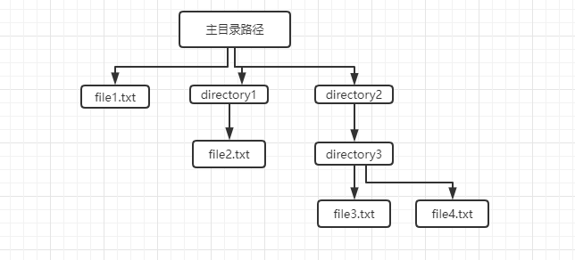

# os.walk()

**作用**：

- 主要用来遍历一个目录内各个子目录和子文件
- 是一个简单易用的文件、目录遍历器，可以帮助我们高效的处理文件、目录方面的事情

**原理**：递归遍历目录



## 方法参数介绍

```python
os.walk(top[, topdown=True[, onerror=None[, followlinks=False]]])
```

- **top** ：是要遍历的目录的地址, 返回的是一个三元组（dirpath, dirnames, filenames）
- **topdown** ：可选，True 则优先遍历 top 文件夹，与 top 文件夹中每一个子目录；否则优先遍历 top 的子目录（默认为开启）
- **onerror** ：可选，需要一个 callable 对象，当 walk 需要异常时，会调用
- **followlinks** ：可选，如果为 True，则会遍历目录下的快捷方式（linux 下是软连接 symbolic link ）实际所指的目录（默认关闭），如果为 False，则优先遍历 top 的子目录

### 返回的三元组介绍

+ dirpath：string，代表目录的路径

+ dirnames：list，包含了 dirpath 下所有子目录的名字

- filenames：list，包含了非目录文件的名字

## 代码示例

```python
path = os.getcwd()
for dirpath, dirnames, filenames in os.walk(path):
    print(dirpath)
    print(dirnames)
    print(filenames)
```

结果：

```python
F:\pylearn\learn
['test']
['bytes_str.py', 'get_file_md5_test.py', 'List_Tuple_Learning.py', 'Number_Learning.py', 'os_walk.py', 'String_Learning.py', '__init__.py']
F:\pylearn\learn\test
[]
['test.py', '__init__.py']
```

::: tip 知识点

当 top 路径下还有目录时，是会递归查询的

:::

（完）