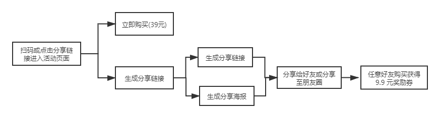
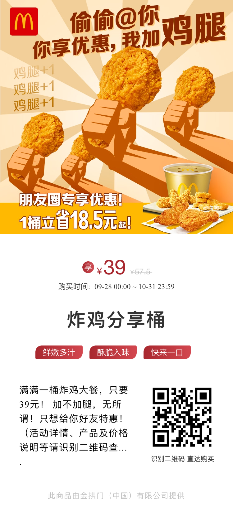
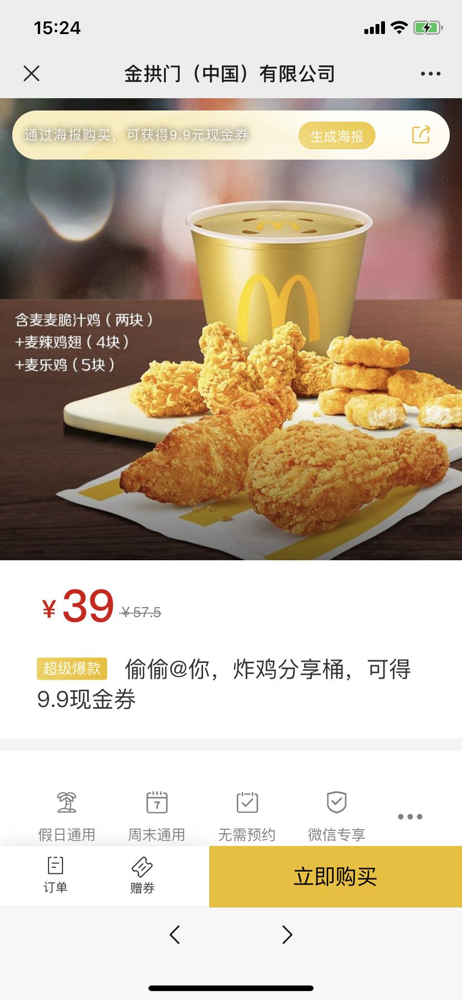
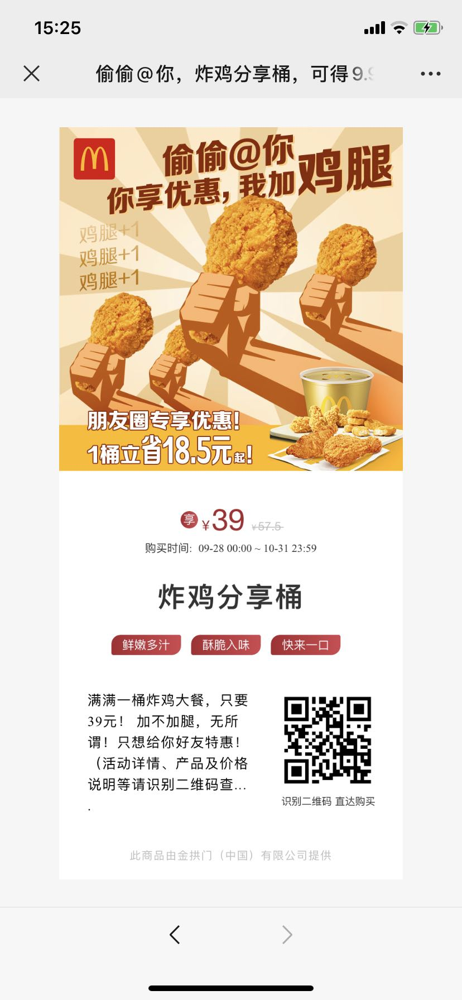

# 偷偷 @ 你，炸鸡分享桶，可得 9.9 现金券案例

## 一、基本型案例拆解 SOP

### 1、案例名称

偷偷 @ 你，炸鸡分享桶，可得 9.9 现金券

### 2、案例行业

快消，食品，新零售

### 3、案例目标

销售产品，建立分销体系

### 4、案例标签

分销

### 5、案例路径

### 6、产品亮点及可复用

1、活动海报：原价 57.5 元，活动价 39 元，1 桶立省 18.5 元等文案，洞察用户喜欢占便宜的心理，吸引用户扫码进入下单。

2、活动页面共有两个功能：

+ 立即购买  
+ 分销商品，超级爆款，“偷偷 @ 你，炸鸡分享桶，可得 9.9 现金券”，“通过海报购买，可获得 9.9 元现金券”醒目的文案，引导用户了解分校机制和操作方法。

3、顶部的生成海报按钮和分享按钮，点击即可生成分销海报和生成分享链接，操作简单，有利于用户分享。

### 7、待优化的点&解决方案

生成分享海报后，需要先保存图片后，再分享给朋友或分享至朋友圈，不能直接分享，操作有点繁琐

### 8、思考的点

本次活动可以用于线下实体零售店，如面包、奶茶等客单价低的商品，用户分享好友后可以活动现金或者优惠券，提供用户的复购率。

