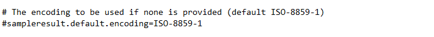

# JMeter 返回数据乱码问题

## 问题原因

+ 当响应数据或页面没有设置编码时，JMeter 会按照 jmeter. properties 文件中`sampleresult.default.encoding` 设置的格式解析
+ 默认是 ISO-8859-1

## 解决方法

有 2 种方式可以解决

### 方案一：

直接修改 jmeter.properties ：

设置 ``sampleresult.default.encoding = UTF-8`` 后，并将注释去掉，然后重启 JMeter

### 方案二：

使用 BeanShell PostProcessor 动态修改：

在请求节点下，添加 BeanShell PostProcessor，在其脚本框中输入：prev.setDataEncoding("UTF-8")

