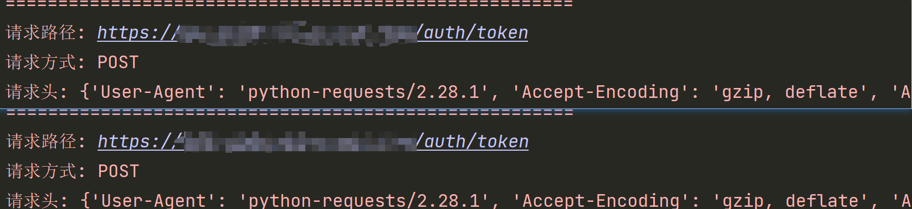

# logging 日志重复输出

## 问题描述

在接口自动化测试框架中，对测试用例增加日志输出时，会重复输出



## 问题分析

**原因**：没有移除 handler

**分析**：

+ 在执行 `logger = logging.getLogger*(__name__)` 时，会先检查内存中是否存在 `logger.log` 的 logger 对象， 存在则取出，不存在则新建
+ 实例化的 logger 对象中有个 handlers 属性来存储 handler
  + `logger.handlers` 起初是个空列表，执行 `logger.addHandler(console)` 时，会在 handlers 列表中添加一个 StreamHandler，用于输出一条日志
  + 在第二次被调用时，`logger.handlers` 中已经存在一个 StreamHandler 了，再次执行 `logger.addHandler(console)` 时，就会在 handlers 中再次添加一个新的 StreamHandler，就会输出两条日志
  + 以此类推，在重复被调用 N 次后，就会不断添加新的 StreamHandler，导致重复输出日志

## 解决方案

**在日志记录完之后移除 Handler**

### 方案一（推荐）

> 在 log 方法中做判断，如果已有 handler，则不再添加
> 
> 这种方式类似于单例模式思想

```python
    if not self.logger.handlers:
        # 把控制台日志对象给logging
        self.logger.addHandler(file_log)
        self.logger.addHandler(console)
```

### 方案二

> 每次创建不同 name 的 logger，每次都是新 logger，不会有添加多个 handler 的问题
> 
> 这种方式会导致内存中会存在很多 logger 对象

```python
# 每次创建的时候 name 都是不同的
self.logger = logging.getLogger(__name__)
```

### 方案三 

> 每次记录完日志之后，调用 removeHandler() 把这个 logger 里的 handler 移除掉
> 
> 这种方式就会不断的进行添加删除操作

```python
self.logger.removeHandler(console)
```

（完）