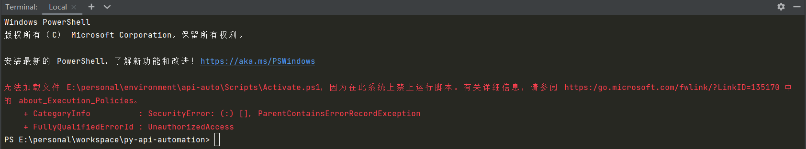
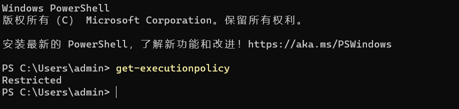
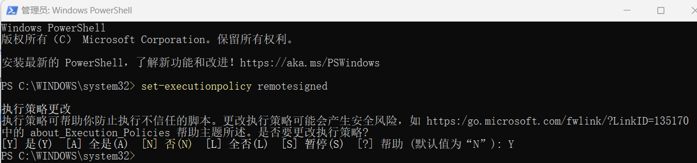

# Pycharm 虚拟环境设置问题

## 问题描述

Pycharm 中项目加载 even 环境后，提示无法加载文件

  

## 解决方案

> 在终端 PowerShell 中入 `get-executionpolicy`，查看权限，可以看到 Restricted

  

**权限**:

- Restricted：脚本不能运行（默认设置） 
- RemoteSigned：在本地创建脚本可以运行，但从网上下载的不能（拥有数字证书签名除外） 
- AllSigned：仅当脚本受信任的发布者签名时才能运行 
- Urestricted：允许所有脚本运行

> 以管理员身份在终端 PowerShell 中入 `set-executionpolicy remotesigned`，修改权限

  

