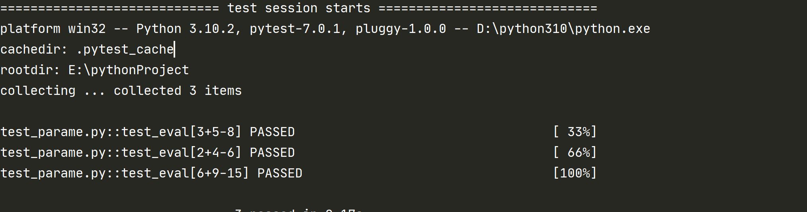
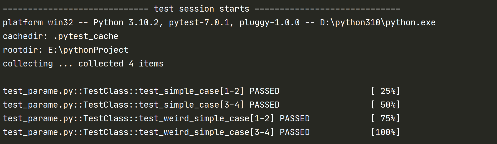
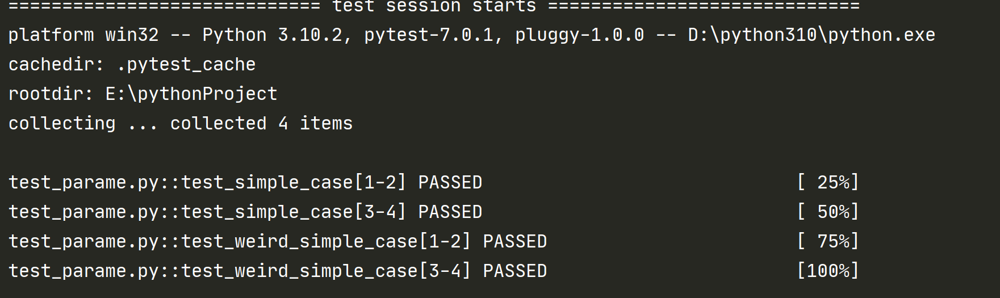

# @pytest.mark.parametrize 参数化

 ## 前言
 Pytest 可以在以下级别上实现测试参数化：
 + `pytest.fixture()` 允许 fixture 有参数化功能（后面讲解）
 + `@pytest.mark.parametrize` 允许在测试函数或类中定义多组参数和 fixtures
 + `pytest_generate_tests` 允许定义自定义参数化方案或扩展（拓展）
 
 ## 为什么要参数化
 先来看个例子： 
  ```
     def test_1():
         assert 3 + 5 == 9
     
     def test_2():
         assert 2 + 4 == 6
     
     def test_3():
         assert 6 + 9 == 15
  ``` 
 三个用例都是断言 2 个数相加的值，重复写了 3 遍，代码是不是有点冗余
 
 如何改善减少代码，又能执行上面 3 个用例涉及的场景？
 
 这就可以使用参数化实现
 
 ## 如何进行参数化
 先来看下 parametrize 的源码：
 ```python
def parametrize(
        self,
        argnames: Union[str, List[str], Tuple[str, ...]],
        argvalues: Iterable[Union[ParameterSet, Sequence[object], object]],
        indirect: Union[bool, Sequence[str]] = False,
        ids: Optional[
            Union[Iterable[Optional[object]], Callable[[Any], Optional[object]]]
        ] = None,
        scope: "Optional[_ScopeName]" = None,
        *,
        _param_mark: Optional[Mark] = None,
    )
```
**argnames** : 
+ 参数的名字
+ 格式："arg1,arg2,arg3" 需要用逗号隔开

**argvalues** :
+ 参数值列表
+ 单个参数时，值是列表，如：[1,2,3]
+ 多个参数时，需要使用元组存放多个参数值，如：[(1,2),(2,3)]

**indirect** :
+ 默认 False，如果设置成True，则把传进来的参数当函数执行，而不是一个参数
+ 与 fixture 传参时会用到，后面会讲到

**ids** :
+ 用例的 id ，表示每一个用例
+ 格式：字符串列表
+ 如果 id 为中文时，输出的可能是 unicode 编码，想要显示中文有 2 种方式：
    + conftest.py 文件中使用 pytest-collect-modifyitems 钩子函数，对输出的 item.name 和 item.nodeid 重新编码
    ```python
        def pytest-collect-modifyitems(items):
            for item in items:
                item.name = item.name.encode("utf-8").decode("unicode_escape")
                item._nodeid = item.nodeid.encode("utf-8").decode("unicode_escape")
    ```
    + pytest.ini 文件中设置
    ```python
       [pytest]
        disable_test_id_escaping_and_forfeit_all_rights_tocommunity_support = True
    ```

 ::: tip 参数化设置
 参数名：用来定义参数的名称
 
 参数值：通过数组定义参数值，每个元组都是一条测试用例的测试数据
 
 ids 参数：默认为 None，用来重新定义测试用例名称
 :::
 了解了相关参数的作用，现在来改写上面例子中的测试用例：
 ```
    @pytest.mark.parametrize("test_input,expected", [("3+5", 8), ("2+4", 6), ("6+9", 15)])
    def test_eval(test_input, expected):
        assert eval(test_input) == expected
 ```
 测试结果：
 
 

 可以看到上面结果中执行了 3 次用例
 
 除了上面函数，类和模块也可以使用参数化
 ### 测试类使用参数化
 ```
    @pytest.mark.parametrize("n,expected", [(1, 2), (3, 4)])
    class TestClass:
        def test_simple_case(self, n, expected):
            assert n + 1 == expected
    
        def test_weird_simple_case(self, n, expected):
            assert (n * 1) + 1 == expected
 ```
 
 测试结果：
 
 
 
 可以看出对类进行参数化后，类下的每个测试方法都执行了 2 遍用例
 
 ### 模块使用参数化

 ::: tip 全局参数化设置
 如果要参数化模块下的所有用例，需要给全局变量 pytestmark 赋值
 :::
 
 ```
    # 模块全局参数化
    pytestmark = pytest.mark.parametrize("n,expected", [(1, 2), (3, 4)])
    
    def test_simple_case(n, expected):
        assert n + 1 == expected
    
    def test_weird_simple_case( n, expected):
        assert (n * 1) + 1 == expected
 ```

测试结果：

 
 
 当前模块下的测试每个用例都执行了 2 遍
 
 ### pytest.mark.parametrize 叠加使用
 
 直接看个例子
 ```python
 import pytest
 
 @pytest.mark.parametrize('a,b,c',[(1,1,2),(2,2,0),(3,3,1),(4,4,0)])
 def test_1(a,b,c):
     print(a,b,c)
 
 @pytest.mark.parametrize('a',[11,12],ids=['1叠加','2叠加'])
 @pytest.mark.parametrize('b,c',[(21,31),(22,32)],ids=['3叠加','4叠加'])
 def test_1(a,b,c):
     print(a,b,c)
 ```
 执行结果：
 ```python
 test_paramtrize.py::test_1[3叠加-1叠加] 11 21 31
 PASSED
 test_paramtrize.py::test_1[3叠加-2叠加] 12 21 31
 PASSED
 test_paramtrize.py::test_1[4叠加-1叠加] 11 22 32
 PASSED
 test_paramtrize.py::test_1[4叠加-2叠加] 12 22 32
 PASSED
 ```
 ::: danger 总结
 + 叠加使用和不叠加使用同时存在时，优先叠加使用
 + 叠加后，ids 也会叠加，显示的顺序是下面的叠加在上面的前面
 + 参数是组合使用，上面的在前
 :::
 
 ### 参数化实际应用场景：
 
 ::: warning 例如：登录场景
 + 需要测试账户名正确、密码错误等情况
 + 设计的用例主要就是输入的数据和期望的结果不一样
 + 使用参数化可以简化代码编写
 :::


## 参考文档
[官方文档](https://docs.pytest.org/en/latest/how-to/parametrize.html?highlight=mark)

（完）