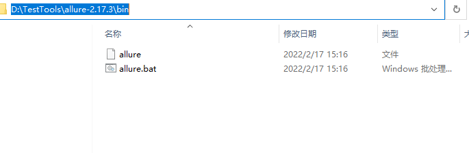
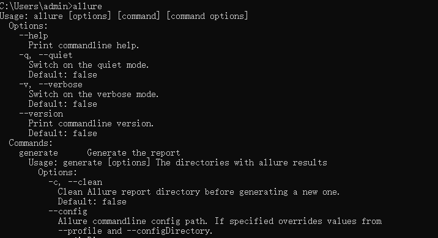

# Allure 环境准备

Allure 是一款界面优美的测试报告

## Windows 下 Allure 环境准备

**前提**：已安装 Java 环境

### 下载

下载地址：https://github.com/allure-framework/allure2/releases

这里下载了最新的版本

### 环境变量设置

+ 下载完成后，解压到相应目录

+ 将目录下的 bin 文件的目录添加到环境变量中

  

+ 设置完成后，在 cmd 窗口中输入 `allure` 命令

  

  出现上述结果说明配置成功

::: warning 注意
配置 Java 的环境变量时，如果使用了变量，在命令行输入 allure 时会报错:
```
ERROR: JAVA_HOME is set to an invalid directory: D:\Program Files\Java\jdk1.8.0_321\bin
Please set the JAVA_HOME variable in your environment to match the
location of your Java installation.
```

解决方案：不使用变量，直接添加到 PATH 中
:::

## pytest 下安装 allure-pytest

执行命令

```python
pip install allure-pytest
```

（完）