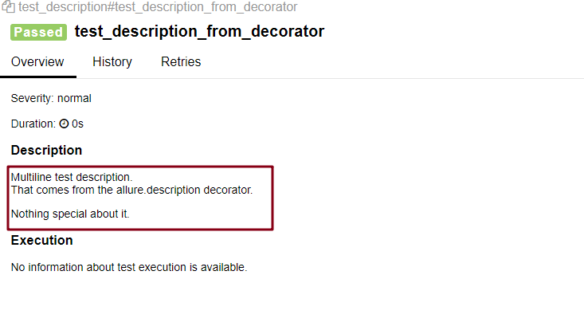
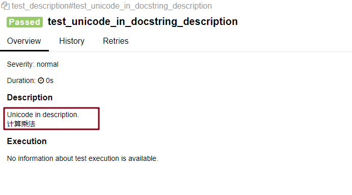
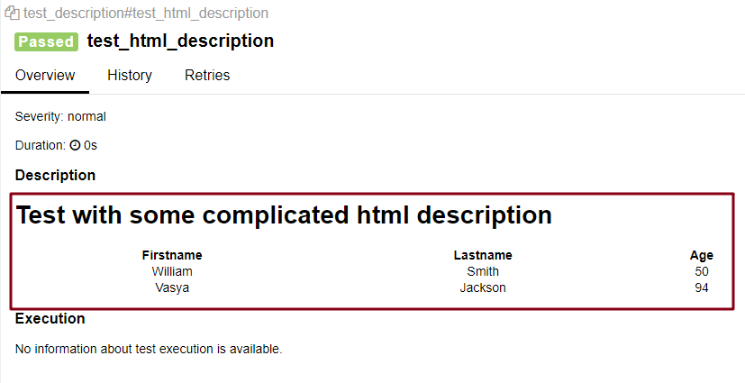
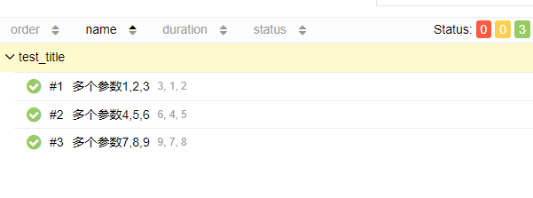
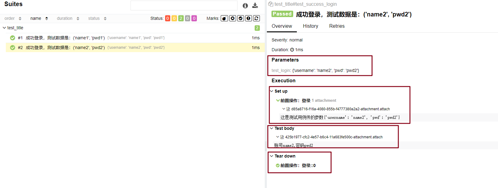

# @allure.description/title 使用

## @allure.description

**作用**：可以给测试用例添加详细的描述信息

**3 种语法格式**：

+ @allure.description(str）
+ 在测试用例函数声明下方添加 """  """
+ @allure.description_html(str）：相当于传一个 HTML 代码组成的字符串，类似 `allure.attach()` 中传 HTML

其中第一和第二种方式的效果一样的

### 示例

```python
import allure

# 方式一
@allure.description("""
Multiline test description.
That comes from the allure.description decorator.

Nothing special about it.
""")
def test_description_from_decorator():
    assert 42 == int(6 * 7)


# 方式二
def test_unicode_in_docstring_description():
    """Unicode in description.
    计算乘法
    """
    assert 42 == int(6 * 7)
    
# 方式三    
@allure.description_html("""
<h1>Test with some complicated html description</h1>
<table style="width:100%">
  <tr>
    <th>Firstname</th>
    <th>Lastname</th>
    <th>Age</th>
  </tr>
  <tr align="center">
    <td>William</td>
    <td>Smith</td>
    <td>50</td>
  </tr>
  <tr align="center">
    <td>Vasya</td>
    <td>Jackson</td>
    <td>94</td>
  </tr>
</table>
""")
def test_html_description():
    assert True
```

#### 测试结果：

##### 方式一：



##### 方式二：



##### 方式三：



## @allure.title

**作用**：

- 可以自定义用例标题，使得测试用例的标题更具有可读性，可以写成中文
- 支持占位符传递关键字参数（动态标题，结合 `@pytest.mark.parametrize` 使用）

**语法格式**:

```python
@allure.title
```

### 示例

#### 使用 @allure.title

先看个简单例子

```python
@allure.title("多个参数{name},{phone},{age}")
@pytest.mark.parametrize("name,phone,age", [
    (1, 2, 3),
    (4, 5, 6),
    (7, 8, 9)
])
def test_test_test(name, phone, age):
    print(name, phone, age)
```

测试结果：



**用到一些前面学到的特性和 fixture + parametrize 参数化**:

```python
import pytest, allure

@allure.title("前置操作：登录")
@pytest.fixture
def test_login(request):
    params = request.param
    name = params["username"]
    pwd = params["pwd"]
    allure.attach(f"这是测试用例传的参数{params}")
    print(name, pwd, params)
    yield name, pwd


# 占位符形式设置 title    
@allure.title("成功登录，测试数据是：{test_login}")
@pytest.mark.parametrize("test_login", [
    {"username": "name1", "pwd": "pwd1"},
    {"username": "name2", "pwd": "pwd2"}], indirect=True)
def test_success_login(test_login):
    name, pwd = test_login
    allure.attach(f"账号{name},密码{pwd}")
```

测试结果：



结果中左侧可以看见自定义设置的 title ，右边可以显示一些参数和前置操作

## 参考资料

[官方文档](https://docs.qameta.io/allure/#_pytest)

（完）