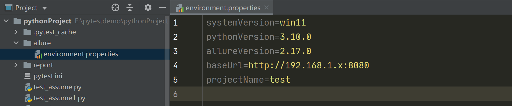
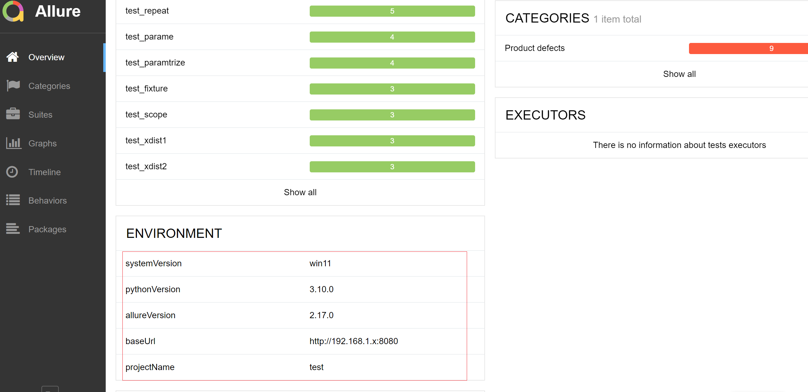

# Allure 主要特性

Allure 除了可以在命令行敲命令之外，还有一些内置的主要特性

## Environment

+ 环境变量配置可以添加报告相关的配置参数，如运行的系统环境，版本号，测试环境，测试人员等基本信息

+ 默认报告中是没有的
+ 用处不大

### 配置方式

#### 方式一

添加 `environment.properties` 文件放入 allure 目录中

```python
systemVersion=win11
pythonVersion=3.10.0
allureVersion=2.17.0
baseUrl=http://192.168.1.x:8080
projectName=test
```



#### 方式二

也可以用 `environment.xml` 文件，格式如下

```python
<environment>
    <parameter>
        <key>Browser</key>
        <value>Chrome</value>
    </parameter>
    <parameter>
        <key>Browser.Version</key>
        <value>63.0</value>
    </parameter>
    <parameter>
        <key>Stand</key>
        <value>Production</value>
    </parameter>
</environment>
```

::: danger 注意

都不可以写中文，会乱码

:::

#### 报告展示

```
pytest -sq --alluredir ./allure
allure serve ./report
```



::: tip 思考

在运行 Pytest 生成 Allure 报告的时候，有时候需要加 `--clean` 参数，清楚之前的报告记录，这样会之前清空 report 目录，`environment.properties` 文件也会被删除，那是不是每次都要重新新建这个文件？

:::

解决方案：

**使用 copy 命令**：

为了不让 `environment.properties` 文件删除掉，可以把 `environment.properties` 文件放项目根目录，在运行报告的时候，先 copy 到 allure 目录

Windows：

```python
pytest -sq --alluredir ./allure --clean

copy environment.properties allure\environment.properties

allure serve ./allure
```

Linux 使用 cp 命令：

```python
pytest -sq --alluredir ./allure --clean
cp environment.properties ./allure/environment.properties
allure serve ./allure
```

## categories

测试用例结果的分类

默认情况下，有两类缺陷：

+ Product defects 产品缺陷（测试结果：failed）
+ Test defects 测试缺陷（测试结果：error/broken）

可以创建自定义缺陷分类的，将 `categories.json` 文件添加到 allure 目录即可（和上面 `environment.properties` 放同一个目录）

categories.json

```
[
  {
    "name": "Ignored tests", 
    "matchedStatuses": ["skipped"] 
  },
  {
    "name": "Infrastructure problems",
    "matchedStatuses": ["broken", "failed"],
    "messageRegex": ".*bye-bye.*" 
  },
  {
    "name": "Outdated tests",
    "matchedStatuses": ["broken"],
    "traceRegex": ".*FileNotFoundException.*" 
  },
  {
    "name": "Product defects",
    "matchedStatuses": ["failed"]
  },
  {
    "name": "Test defects",
    "matchedStatuses": ["broken"]
  }
]
```

- **name**：分类名称，**可以是中文哦**
- **matchedStatuses**：测试用例的运行状态，默认["failed", "broken", "passed", "skipped", "unknown"]
- **messageRegex**：测试用例运行的错误信息，默认是 .* ，是通过正则去匹配的
- **traceRegex**：测试用例运行的错误堆栈信息，默认是 .* ，也是通过正则去匹配的

## Flaky test

可以将整个测试类标记为 Flaky

**用法**：在类或者方法上直接加 @Flaky 

### Flaky 是什么

- 简单来说就是，不够稳定的测试用例集，有可能前阵子还运行成功，过阵子就运行失败，理解成“闪烁”
- 标记成 Flaky 的好处就是：当用例失败的情况下，我们能获取足够详细的信息，毕竟有可能某些测试用例是非常重要的
- 如果不标记为 Flaky 的话，可能就要禁用这些测试

## 参考资料：

[官方文档](https://docs.qameta.io/allure/#_features)

（完）