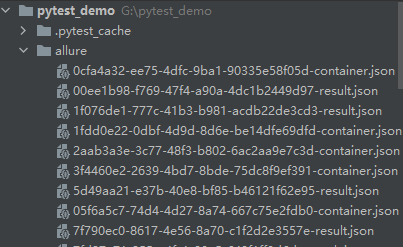
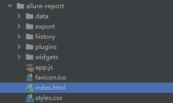
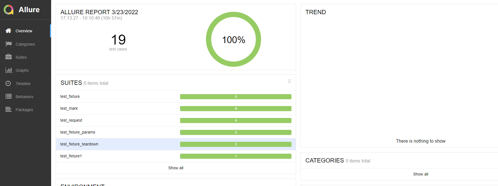
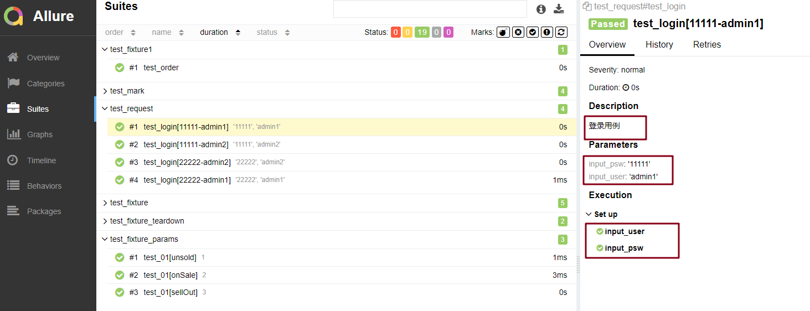

# Pytest + Allure 基础使用

## 为什么要使用 Allure 

官方介绍：

+ Allure Framework 是一种灵活的轻量级多语言测试报告工具，不仅可以以简洁的 Web 报告形式非常简洁地显示已测试的内容，也允许参与开发过程的每个人从日常测试中提取最大程度的有用信息
+ 从开发/质量保证的角度来看，Allure 报告可以缩短常见缺陷的生命周期：可以将测试失败划分为 Bug 和损坏的测试，还可以配置 log，step，fixture，attachments，timings，历史记录以及与 TMS 的集成以及 Bug 跟踪系统，因此负责任的开发人员和测试人员将掌握所有信息
+ 从管理人员的角度来看，Allure 提供了一个清晰的“全局”，涵盖了已涵盖的功能，缺陷聚集的位置，执行时间表的外观以及许多其他方便的事情
+ Allure 的模块化和可扩展性确保您始终能够微调某些东西，以使 Allure 更适合您

总结：

+ Allure 可以很直观、简洁的展示数据
+ 相比于 pytest-html 报告来说，界面美观

## 如何使用 Allure

### 环境配置

之前已经讲过如何配置 Allure 的环境，可参考：[Allure 环境配置](/test/auto-test/pytest/allure 环境准备)

### 示例

+ allure-pytest 生成 allure 报告的 json 文件

```python
pytest -sq --alluredir=./alure 
```

+ 运行完成后，可以看到当前目录下生成了 json 文件



+ 在 cmd 中当前目录下输入

```
G:\pytest_demo>allure generate -c -o ./allure-report ./allure
```

会生成 .html 的报告，可以在浏览器中打开





查看用例明细：



- **parameters**：如果用了 @pytest.mark.parametrize ，在右侧的 parameters 是可以看到传了什么参数和对应的值
- **set up**：调用 fixture 的前置操作
- **tear down**：调用 fixture 的后置操作
- **Description**：测试用例的描述

::: tip 注意

+ 上述 cmd 中输入的命令，会在目录下生成一个文件夹，里面包含 .html 文件，可在浏览器中打开

+ 如果使用 `allure serve allure` 会自动打开测试报告，且不会生成 .html 文件

:::

## Allure报告结构

+ Overview：总览
+ Categories：类别，默认是分了 failed 和 error，凡是执行结果是其中一个的都会被归到类里面，可以通过这里快捷查看哪些用例是 failed 和 error 的
- Suites：测试套件，就是所有用例的层级关系，可以根据 package、module、类、方法来查找用例
- Graphs：测试结果图形化，包括用例执行结果的分布图，优先级，耗时等
- Timeline：可以看到测试用例精确的测试时序（执行顺序），包括执行时间
- Behaviors：行为驱动，根据 epic、feature、story 来分组测试用例（后面会讲到）
- Packages：这就是按照 package、module 来分组测试用例了

（完）