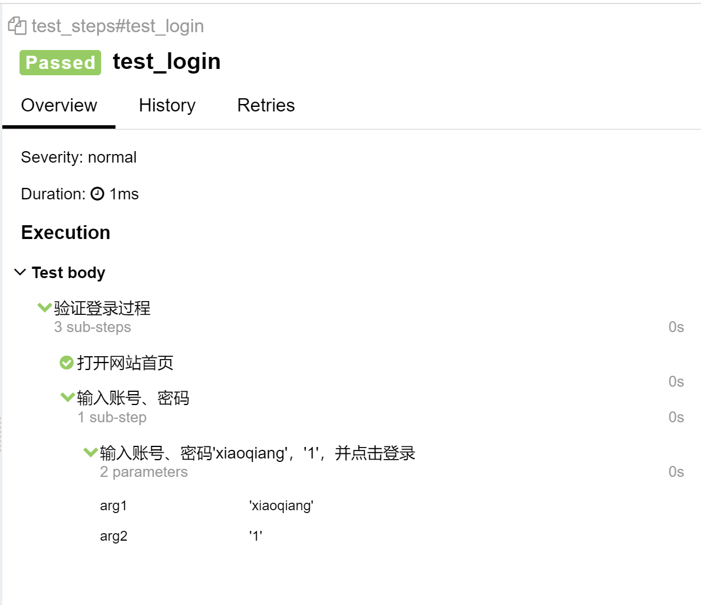
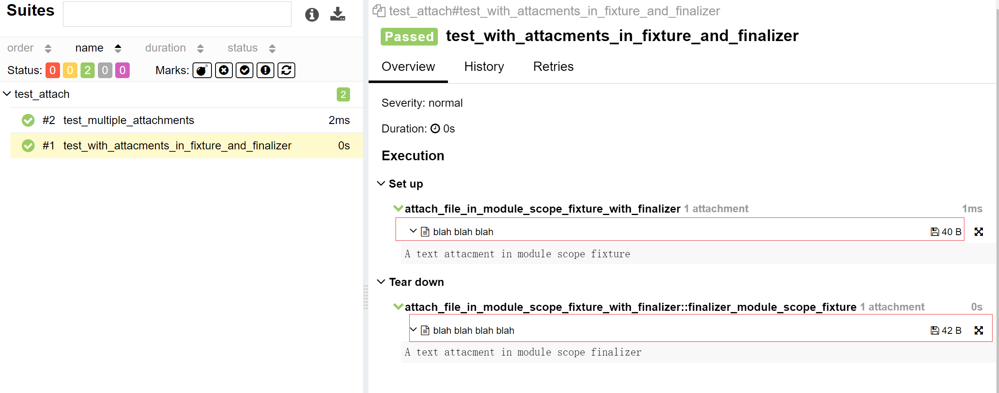
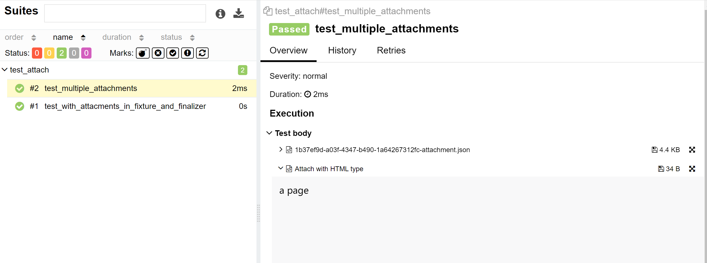

# @allure.step/@allure.attach 使用

## @allure.step

+ 可以理解为我们编写测试用例中的每一步操作步骤，而在 allure 中表示对每个测试用例进行非常详细的步骤说明
+ 通过 `@allure.step()` 可以让测试用例在 allure 报告中显示更详细的测试过程

### 示例

```python
import allure

@allure.step("打开网站首页")
def open():
    pass

@allure.step("输入账号、密码")
def input_UsernameAndPassWord():
    sendAndClickLogin("xiaoqiang", "1")

@allure.step("输入账号、密码{arg1}，{arg2}，并点击登录")
def sendAndClickLogin(arg1, arg2):
    pass

@allure.step("验证登录过程")
def test_login():
    open()
    input_UsernameAndPassWord()
```
测试报告显示：



::: tip 总结
+ step(param)，参数就是标题，你传什么，在 allure 上的步骤名就显示什么
+ 支持位置参数和关键字参数 {arg1}，{arg2}，可参考报告中“ 输入账号、密码 'xiaoqiang'，'1'，并点击登录”处，如果函数的参数没有匹配成功就会报错
:::

## @allure.attach

**作用**：allure 报告还支持显示许多不同类型的附件，可以补充测试结果

### 两种语法格式

#### 语法一：

```python
allure.attach(body, name, attachment_type, extension)
```
**参数列表**：

+ body：要显示的内容（附件）
+ name：附件名字
+ attachment_type：附件类型，是 `allure.attachment_type` 里面的其中一种
+ extension：附件的扩展名（比较少用）

allure.attachment_type 提供的附件类型:
```python
TEXT = ("text/plain", "txt")
CSV = ("text/csv", "csv")
TSV = ("text/tab-separated", "tsv")
URi_LIST = ("text/uri-list", "uri")

HTML = ("text/html", "html")
XML = ("application/xml", "xml")
JSON = ("application/json", "json")
YAML = ("application/yaml", "yaml")
PCAP = ("application/vnd.tcpdump.pcap", "pcap")

PNG = ("image/png", "png")
JPG = ("image/jpg", "jpg")
SVG = ("image/svg-xml", "svg")
GIF = ("image/gif", "gif")
BMP = ("image/bmp", "bmp")
TIFF = ("image/tiff", "tiff")

MP4 = ("video/mp4", "mp4")
OGG = ("video/ogg", "ogg")
WEBM = ("video/webm", "webm")

PDF = ("application/pdf", "pdf")

```

#### 语法二

```python
allure.attach.file(source, name, attachment_type, extension)
```
**参数列表**：
+ source : 文件路径，相当于传一个文件
+ 其他参数和语法一中的一样

### 示例

```python
import allure
import pytest

@pytest.fixture
def attach_file_in_module_scope_fixture_with_finalizer(request):
    allure.attach('A text attacment in module scope fixture', 'blah blah blah', allure.attachment_type.TEXT)
    def finalizer_module_scope_fixture():
        allure.attach('A text attacment in module scope finalizer', 'blah blah blah blah',
                      allure.attachment_type.TEXT)
    request.addfinalizer(finalizer_module_scope_fixture)

def test_with_attacments_in_fixture_and_finalizer(attach_file_in_module_scope_fixture_with_finalizer):
    pass

def test_multiple_attachments():
    allure.attach.file('./result.json', attachment_type=allure.attachment_type.JSON)
    allure.attach('<head></head><body> a page </body>', 'Attach with HTML type', allure.attachment_type.HTML)
```
**运行结果**：

txt 附件：



用 allure.attach() 来插入一段自己写的 HTML 和 allure.attach.file() 来导入一个已存在的 JSON 文件



## 参考资料

[官方文档](https://docs.qameta.io/allure/#_pytest)

（完）