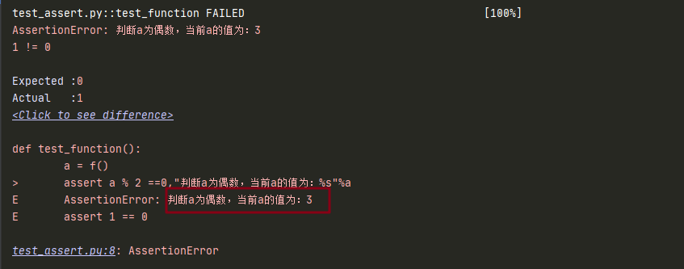
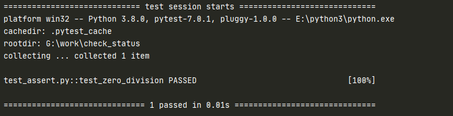
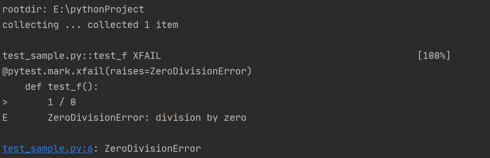

# assert 断言

## 前言

回顾下 Unittest 的断言：

+ assertIn（expect，result）断言包含（被包含的写前面）
+ assertEqual（expect，result）断言相等
+ assertTure（条件）断言是否为真。返回 Ture 或 False

Pytest 与 Unittest 不同，直接使用 Python 中 **assert** 关键字进行断言，关键字可接表达式，表达式值为 true 则通过，否则失败

## 常用断言

+ assert xx：判断 xx 为真
+ assert not xx：判断 xx 不为真
+ assert a in b：判断 b 包含 a
+ assert a == b：判断 a 等于 b
+ assert a !=b：判断 a 不等于 b

### 实例

想在异常的时候，输出一些提示信息，这样报错后，就方便查看是什么原因了

```python
def f():
    return 3

def test_function():
    a = f()
    assert a % 2 ==0,"判断 a 为偶数，当前 a 的值为：%s"%a
```

结果：



## 异常断言

可以使用 pytest.raises 作为上下文管理器，当抛出异常时可以获取到对应的异常实例

```python
def test_zero_division():
    with pytest.raises(ZeroDivisionError):
        1 / 0
    assert eval("1+2") ==3
```

结果：



可以看到 raises 捕获了异常，并继续下面断言代码

::: tip 注意
使用 `pytest.raises` 作为上下文管理器，是上下文管理器范围内的最后一行
后面在上下文管理器范围内的代码行将不会被执行
:::

在捕获异常后，可以从上下文管理器中获取异常的一些详细信息，可以辅助我们更好的去断言

### 实例

**断言场景**：断言它抛的异常是不是预期想要的

**代码执行**：1/0

**预期结果**：抛的异常是 `ZeroDivisionError: division by zero`

**如何断言**：通常是断言异常的 type 和 value 值了

**具体方式**：这里 1/0 的异常类型是 ZeroDivisionError，异常的 value 值是 `division by zero`

```python
def test_zero_division():
    '''断言异常'''
    with pytest.raises(ZeroDivisionError) as excinfo:
        1 / 0

    # 断言异常类型type
    assert excinfo.type == ZeroDivisionError
    # 断言异常value值
    assert "division by zero" in str(excinfo.value)
```

excinfo ：是一个异常信息实例

**主要属性**：`.type` 、`.value` 、`.traceback` 

**注意**：断言 type 的时候，异常类型是不需要加引号的，断言 value 值的时候需转 str

### match 参数

可以将 match 关键字参数传递给上下文管理器，以测试正则表达式与异常的字符串表示形式是否匹配

**注意**：这种方法只能断言 value，不能断言 type

```
# 自定义消息
def myfunc():
    raise ValueError("Exception 123 raised")

def test_match():
    with pytest.raises(ValueError, match=r".* 123 .*"):
        myfunc()
```

该 match 方法的 regexp 参数与 `re.search` 函数匹配，因此在上面的示例中 `match='123'` 也可以使用

### 检查断言装饰器

```
@pytest.mark.xfail(raises=ZeroDivisionError)
def test_f():
    1 / 0
```



::: warning 总结
+ 代码抛出异常，但是和 raises 指定的异常类相匹配，所以不会断言失败
+ 它相当于一个检查异常装饰器，功能：检查是否有异常，不确定是否有异常
+ `with pytest.raise(ZeroDivisionError)` 对于故意测试异常代码的情况，使用可能会更好
+ 而 `@pytest.mark.xfail(raises=ZeroDivisionError)` 对于检查未修复的错误（即，可能会发生异常），使用检查断言可能会更好
:::

## 参考资料

[官方文档](https://docs.pytest.org/en/latest/how-to/assert.html#assertraises)

（完）