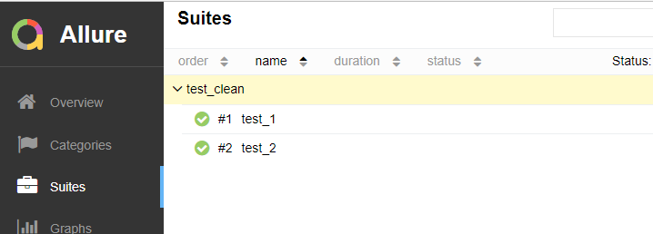
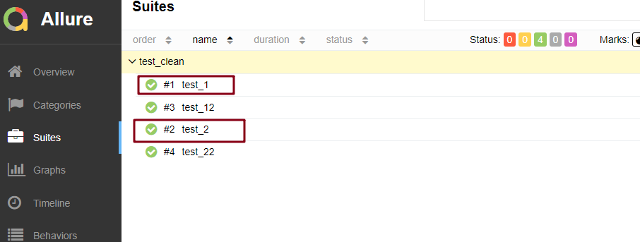
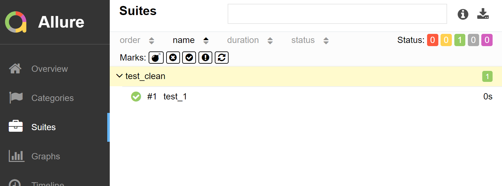
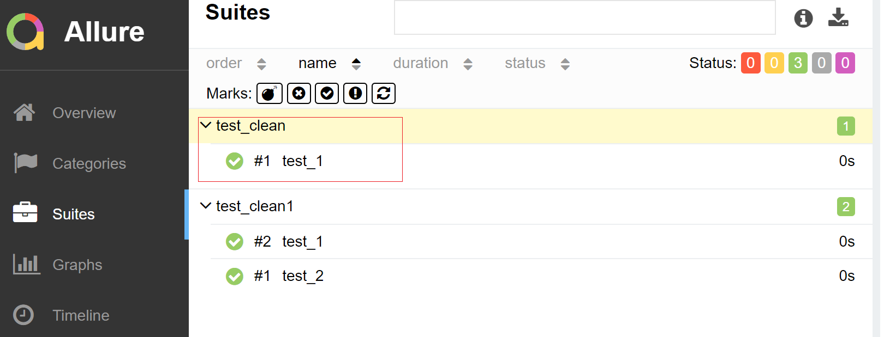
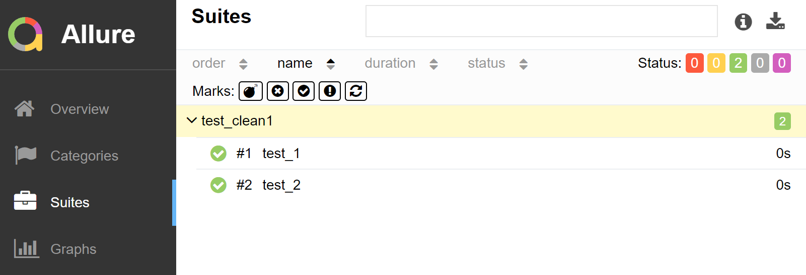

# --clean 清除历史记录

## 为什么使用 --clean 

- pytest 运行 测试用例生成 allure 报告时，当测试用例名称修改后重新运行，会保留历史运行记录
- 又或者分开运行两个测试用例文件，但是 allure 报告生成目录是同一个，那么 allure 报告会同时显示两个文件的测试用例运行情况

## 示例

`test_clean.py` 代码

```python
def test_1():
    print("执行测试用例1")

def test_2():
    print("执行测试用例2")
```

执行用例，并打开报告：



修改 `test_clean.py` 代码

```python
def test_12():
    print("执行测试用例12")

def test_22():
    print("执行测试用例22")
```

执行用例，并打开报告：



结果上可以看到，之前的测试用例也显示了

将这两个用例分开放到 2 个 py 文件中

`test_clean.py`

```python
def test_1():
    print("执行测试用例1")
```

`test_clean1.py`

```python
def test_2():
    print("执行测试用例2")
```

先运行 `test_clean.py` 

结果：



再运行 `test_clean1.py`

结果：



**使用 `--clean`**：

```python
pytest -sq --alluredir=allure test_clean1.py --clean-alluredir
```

再次运行 `test_clean1.py`



（完）