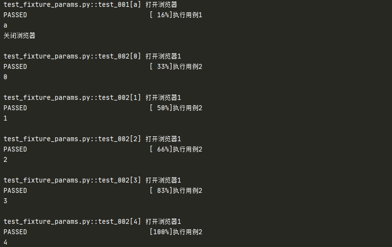
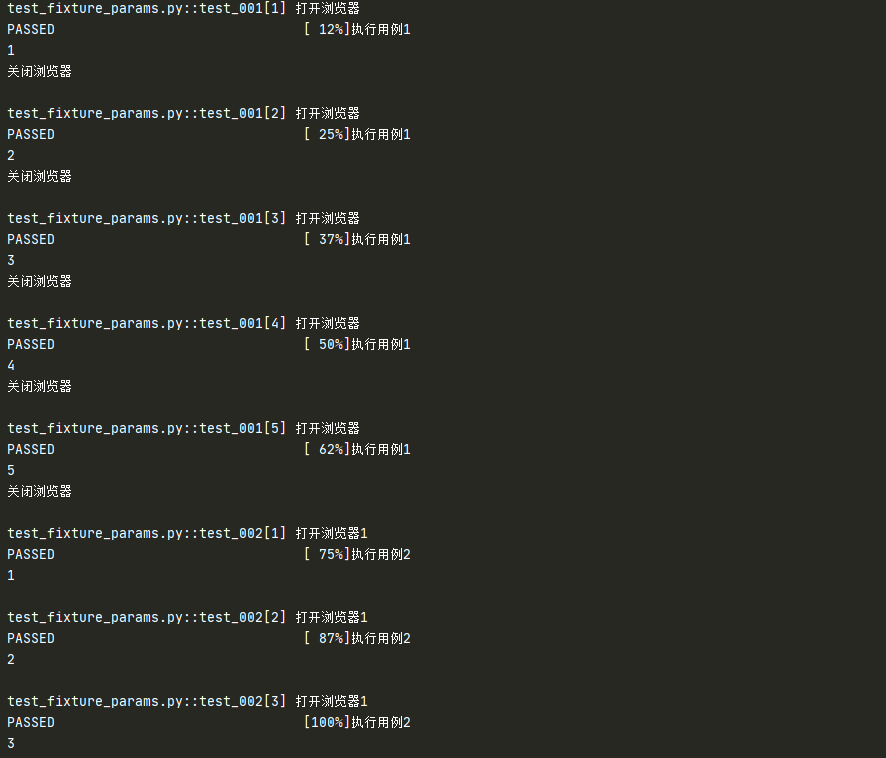
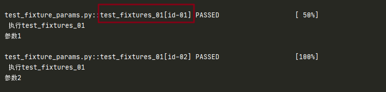
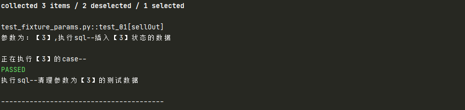

# params

## params 是什么

+ fixture 的一个参数，支持列表传入
+ 默认None，每个 param 的值 fixture 都会去调用执行一次
+ 被 fixture 装饰的函数要调用是采用 `request.param` 的形式获取参数
+ 可与参数 ids 一起使用，作为每个参数的标识

## params 使用

先看简单例子

```python
import pytest
# 传入单个值
@pytest.fixture(params="a")
def login(request):
    print("打开浏览器")
    yield request.param
    print("关闭浏览器")

def test_001(login):
    print("执行用例1")
    b = login
    print(b)
    
# 传入列表
@pytest.fixture(params=range(5))
def login1(request):
    print("打开浏览器1")
    return request.param

def test_002(login1):
    print("执行用例2")
    b = login1
    print(b)
```

执行结果：



结果可以看到列表中的每个值都被执行了

```python
param_data = [1,2,3]
def login2():
    return [1,2,3,4,5]

# 传入函数值
@pytest.fixture(params=login2())
def login(request):
    print("打开浏览器")
    yield request.param
    print("关闭浏览器")

def test_001(login):
    print("执行用例1")
    b = login
    print(b)

# 传入变量值
@pytest.fixture(params=param_data)
def login1(request):
    print("打开浏览器1")
    return request.param

def test_002(login1):
    print("执行用例2")
    b = login1
    print(b)
```

测试结果：



### 标记参数

对某个参数添加 mark 标记，在 params 中使用 `pytest.param('789', marks=pytest.mark.skip)`

```python
@pytest.fixture(params=['123', '456', pytest.param('789', marks=pytest.mark.skip)])
def para_func(request):
    return request.param

class TestLoginSuccess:
    def test_fixt(self, para_func):
        assert para_func == '123'
```

结果：1 条用例 pass ，1 条用例 fail，1 条用例跳过

::: tip 注意

这个和 `pytest-html` 插件一起使用的时候会报一些内容错误，但依然可以使用

:::

### params + ids

+ `ids` 是要结合着 `params` 一起使用的
+ 当有多个 `params` 时，针对每一个 `param`，可以指定一个`id`，这个 `id` 会变成测试用例名字的一部分
+ 如果没有提供 `id`，则 `id` 将自动生成
+ 默认是 None

```python
@pytest.fixture(params=['参数1', '参数2'], ids=["id-01", "id-02"])
def my_fixture(request):
    return request.param

def test_fixtures_01(my_fixture):
    print('\n 执行test_fixtures_01')
    print(my_fixture)
```

测试结果：



可以看到指定的 id 变成了测试用例名字的一部分

#### 指定具体 id 执行用例

```python
# 动态生成 id
def init_data(param):
    if param == 1:
        return "unsold"
    elif param == 2:
        return "onSale"
    elif param == 3:
        return "sellOut"


@pytest.fixture(params=[1, 2, 3], ids=init_data)
def my_method(request):
    req_param = request.param
    print("\n参数为：【{}】,执行sql--插入【{}】状态的数据".format(req_param, req_param))
    yield req_param
    print("\n执行sql--清理参数为【{}】的测试数据".format(req_param, req_param))
    print("\n----------------------------------------")


def test_01(my_method):
    print("\n正在执行【{}】的case--".format(my_method))
```

使用 `pytest -s -v -k sellOut test_fixture_params.py` 执行

测试结果：



### params + scope

::: warning 注意

+ 当 fixture 作用范围大于等于 module 时，Pytest 会自动按照参数进行分组，每一个参数只会初始化一次和结束一次
+ 这样有可能会打乱正常的用例执行顺序

:::

```python
@pytest.fixture(scope='module', params=['13', '456'])
def para_func(request):
    print('开始')
    yield request.param
    print('结束')


class TestLoginSuccess:
    def test_01(self, para_func):
        print('执行1')
        assert para_func == '123'

    def test_02(self, para_func):
        print('执行2')

        assert para_func == '123'
```

执行结果：开始-->执行1-->执行2-->结束-->开始-->执行1-->执行2-->结束


（完）
