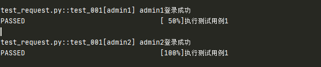
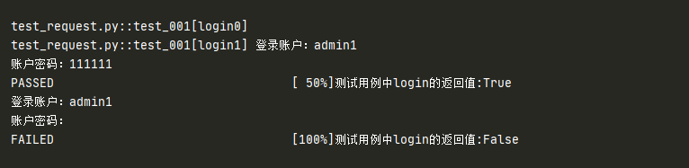
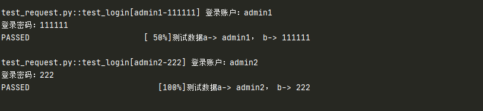
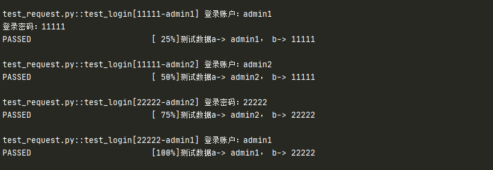

# request

## 作用

+ 获取 fixture 参数 params 的值，实现参数化
+ 与 `@pytest.mark.parametrize` 结合实现参数化

## request + params 

前面在讲 fixture 的参数时，已经讲过 request 如何获取 params 的值，这里就不在讲述了

具体可以参考 [fixture 参数之 params](/test/frameworks/pytest/fixture-params)

## request + `@pytest.mark.parametrize`

在 fixture 前置操作中使用参数化

### request 传入单个参数

```python
import pytest

# 单个传参

test_user = ["admin1","admin2"]

@pytest.fixture
def login(request):
    user = request.param
    print("{}登录成功".format(user))
    return user

@pytest.mark.parametrize("login",test_user,indirect=True)
def test_001(login):
    print("执行测试用例1")
    assert login != ""
```

执行结果：



::: warning 注意

+ `indirect=True` 参数是为了把 login 当成一个函数去执行，而不是参数
+ `def test_login(login)` 就是 login 的返回值

:::

### request 传入多个参数

+ 多个参数时，需要使用字典去存储
+ 不同的参数取对应的 key 值

```python
import pytest
test_user = [{"user": "admin1", "psw": "111111"},
                  {"user": "admin1", "psw": ""}]

@pytest.fixture
def login(request):
    user = request.param["user"]
    pwd = request.param["psw"]
    print("登录账户：{}".format(user))
    print("账户密码：{}".format(pwd))
    if pwd:
        return True
    else:
        return False

@pytest.mark.parametrize("login",test_user,indirect=True)
def test_001(login):
    a = login
    print("测试用例中login的返回值:%s" % a)
    assert a, "失败原因：密码为空"
```

测试结果：



### 多个 fixture 使用一个 `@pytest.mark.parametrize`

```python
test_user = [( "admin1","111111"),("admin2","222")]
@pytest.fixture
def input_user(request):
    user = request.param
    print("登录账户：%s" % user)
    return user

@pytest.fixture
def input_psw(request):
    psw = request.param
    print("登录密码：%s" % psw)
    return psw

@pytest.mark.parametrize("input_user,input_psw",test_user,indirect=True)
def test_login(input_user, input_psw):
    '''登录用例'''
    a = input_user
    b = input_psw
    print("测试数据a-> %s， b-> %s" % (a,b))
    assert b
```

测试结果：



### 多个 fixture 使用多个 `@pytest.mark.parametrize` 叠加

使用 parametrize 装饰器叠加时，用例组合是 2 个参数个数相乘

```python
test_user = ["admin1", "admin2"]
test_psw = ["11111", "22222"]

@pytest.fixture(scope="module")
def input_user(request):
    user = request.param
    print("登录账户：%s" % user)
    return user

@pytest.fixture(scope="module")
def input_psw(request):
    psw = request.param
    print("登录密码：%s" % psw)
    return psw

@pytest.mark.parametrize("input_user", test_user, indirect=True)
@pytest.mark.parametrize("input_psw", test_psw, indirect=True)
def test_login(input_user, input_psw):
    '''登录用例'''
    a = input_user
    b = input_psw
    print("测试数据a-> %s， b-> %s" % (a,b))
    assert b
```

测试结果：



用例有 2*2 =4 个

（完）