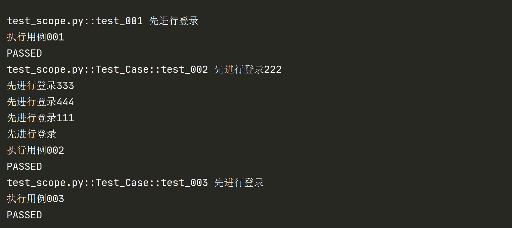

# scope

## scope 是什么

+ fixture 的一个参数
+ 控制 fixture 的作用范围
+ 有以下可选值：
    + function：默认，每个函数或方法都会调用
    + class：每个类会调用，一个类可以有多个方法
    + module：每一个 `.py` 文件调用一次，该文件内又有多个 function 和 class
    + package/session：多个文件调用一次，可以跨 `.py` 文件

## scope 作用范围顺序

先来看个例子
```
import pytest

@pytest.fixture(scope="function")
def login():
    print("先进行登录")

def test_001(login):
    print("执行用例001")

@pytest.fixture(scope="class")
def login1():
    print("先进行登录111")

@pytest.mark.usefixtures("login3","login2","login4","login1","login")
class Test_Case():
    def test_002(self):
        print("执行用例002")

    def test_003(self):
        print("执行用例003")

@pytest.fixture(scope="session")
def login2():
    print("先进行登录222")

@pytest.fixture(scope="package")
def login3():
    print("先进行登录333")

@pytest.fixture(scope="module")
def login4():
    print("先进行登录444")

```
执行结果：



::: tip 总结
+ 作用范围顺序：session > package > module > class > function
+ session/package、module 级别的 fixture 只执行了一次
+ session/package 可以结合 `conftest.py` 文件使用
:::

相关 `conftest.py` 可参考 [conftest.py](test/frameworks/pytest/conftest.py)

（完）