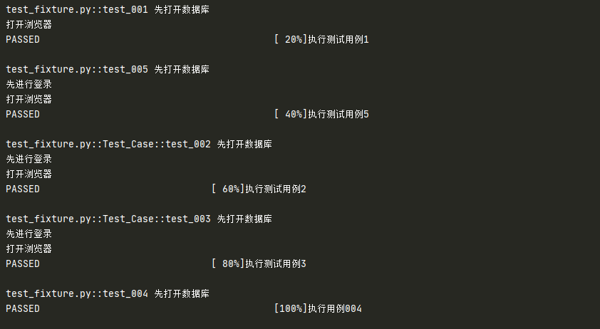
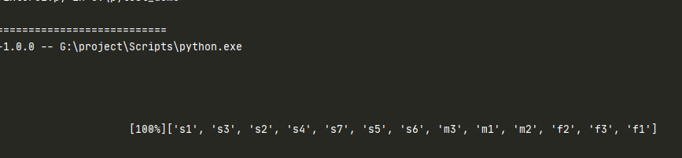
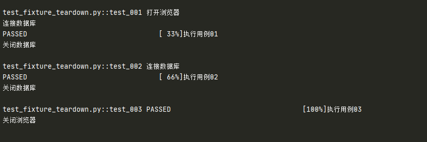
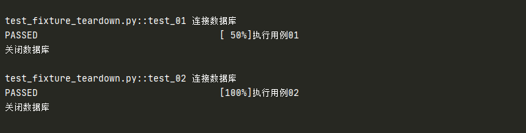
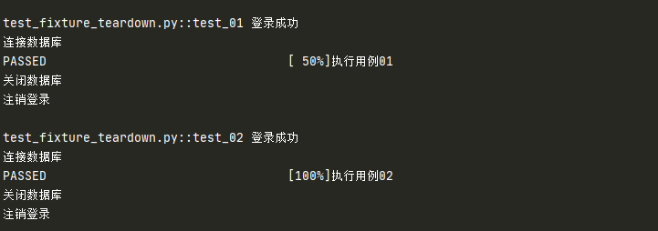

# fixture

## 什么是 fixture

本质上就是一个装饰器

## 为什么要使用 fixture

- 前面讲了 setup、teardown 可以实现在执行用例前或结束后加入一些操作，但这种都是针对整个脚本全局生效的
- 如果有以下场景：用例 1 需要先登录，用例 2 不需要登录，用例 3 需要先登录，很显然无法用 setup 和 teardown 来实现了
- fixture 可以自定义测试用例的前置条件

### fixture 优势：

- 命名方式灵活，不局限于 setup 和 teardown 这几个命名
- conftest.py 配置里可以实现数据共享，不需要 import 就能自动找到一些配置
- `scope=”module”` 可以实现多个 .py 跨文件共享前置
- `scope=”session”` 以实现多个 .py 跨文件使用一个 session 来完成多个用例

## fixture 使用

### 定义 fixture

+ 可以使用此装饰器（带或不带参数）来定义 fixture 功能
+ fixture 功能的名称可以在以后使用引用它会在运行测试之前调用它

```
@pytest.fixture(scope="function", params=None, autouse=False, ids=None, name=None)
```

参数说明：

| 参数    | 说明                                                         |
| ------- | ------------------------------------------------------------ |
| scope   | fixture 的作用域<br />默认 function，还有其他三个级别：class、module、package/session |
| params  | fixture 的参数化                                             |
| autouse | 默认 False<br />设置为 True 开启自动使用 fixture 功能        |
| ids     | 配合 params 使用                                             |
| name    | 设置 fixture 函数的别名，调用时可以使用别名调用              |

### 如何调用 fixture

调用 fixture 方式

+ 将 fixture 名称作为测试用例函数的输入参数
+ 测试用例加上装饰器：`@pytest.mark.usefixtures(fixture_name)`
+ fixture 设置 `autouse=True`

```python
import pytest

@pytest.fixture
def open():
    print("打开浏览器")

# 使用方式一
def test_001(open):
    print("执行测试用例1")

def test_005(login,open):
    print("执行测试用例5")

# 使用方式三
@pytest.fixture(autouse=True)
def sql():
    print("先打开数据库")

# 使用方式二：
@pytest.fixture
def login():
    print("先进行登录")

@pytest.mark.usefixtures("open")
@pytest.mark.usefixtures("login")
class Test_Case():
    def test_002(self):
        print("执行测试用例2")

    def test_003(self):
        print("执行测试用例3")


def test_004():
    print("执行用例004")

if __name__ == '__main__':
    pytest.main(["-s","-v"])
```

测试结果：



::: danger 总结

- 在类声明上面加 `@pytest.mark.usefixtures()`，代表这个类里面所有测试用例都会调用该 fixture
- 可以叠加多个 `@pytest.mark.usefixtures()`，先执行的放底层，后执行的放上层
- 可以传多个 fixture 参数，先执行的放前面，后执行的放后面
- 如果 fixture 有返回值，用 `@pytest.mark.usefixtures()` 是无法获取到返回值的，必须用传参的方式（方式一）
- 自动使用（`autouse=True`）的 fixture 将在显式使用（传参或装饰器）的 fixture 之前实例化
:::

### fixture 实例化顺序

- 高级别 scope 的 fixture 在低级别 scope 的 fixture 之前实例化（session > package > module > class > function）

- 具有相同 scope 的 fixture 遵循测试函数中声明的顺序

- 遵循 fixture 之间的依赖关系（在 `fixture_A` 里面依赖的 `fixture_B` 优先实例化，然后到 `fixture_A` 实例化）

```python
  import pytest
  
  order = []
  
  @pytest.fixture(scope="session")
  def s1():
      order.append("s1")
  
  @pytest.fixture(scope="session")
  def s2():
      order.append("s2")
  
  @pytest.fixture(scope="session")
  def s3():
      order.append("s3")
  
  @pytest.fixture(scope="session")
  def s4():
      order.append("s4")
  
  @pytest.fixture(scope="session")
  def s5(s7):
      order.append("s5")
  
  @pytest.fixture(scope="session")
  def s6():
      order.append("s6")
  
  @pytest.fixture(scope="session")
  def s7():
      order.append("s7")
  
  @pytest.fixture(scope="module")
  def m1():
      order.append("m1")
  
  @pytest.fixture(scope="module")
  def m2(s5):
      order.append("m2")
  
  @pytest.fixture(scope="module")
  def m3(s4):
      order.append("m3")
  
  @pytest.fixture
  def f1(s2, f3):
      order.append("f1")
  
  @pytest.fixture
  def f2(m2, s3):
      order.append("f2")
  
  @pytest.fixture
  def f3(s6):
      order.append("f3")
  
  def test_order(f2, f1, m3, m1, s1):
      print(order) # ['s1', 's3', 's2', 's4', 's7', 's5', 's6', 'm3', 'm1', 'm2', 'f2', 'f3', 'f1']
  
  
  if __name__ == '__main__':
      pytest.main(["-s","-v"])
```
测试结果：



::: warning 注意：

添加了 @pytest.fixture ，如果 fixture 还想依赖其他 fixture，需要用函数传参的方式，不能用 @pytest.mark.usefixtures() 的方式，否则会不生效

如上述例子中的 s5 

:::

### fixture 实现 teardown

前面讲的 fixture 都是实现的 setup

#### yield

fixture 实现 teardown 需要使用 yield

```python
import pytest

@pytest.fixture(scope="module",autouse=True)
def login():
    print("打开浏览器")
    yield
    print("关闭浏览器")


@pytest.fixture
def sql():
    print("连接数据库")
    yield
    print("关闭数据库")

def test_001(sql):
    print("执行用例01")

def test_002(sql):
    print("执行用例02")

def test_003():
    print("执行用例03")

if __name__ == '__main__':
    pytest.main(["-s","-v"])
```

测试结果：



::: tip 注意

+ 如果 yield 前面的代码，即 setup 部分已经抛出异常了，则不会执行 yield 后面的 teardown 内容

- 如果测试用例抛出异常，yield 后面的 teardown 内容还是会正常执行

:::

##### yield + with

yield 也可以配合 with 语句使用

```python
官方例子：
@pytest.fixture(scope="module")
def smtp():
    with smtplib.SMTP("smtp.gmail.com") as smtp:
        yield smtp  # provide the fixture value
```

#### addfinalizer 

Pytest 中做 teardown 的处理，除了使用带有 yield 的 fixture 函数，还可以在 `request-context` 对象中注册 addfinalizer 方法实现终结函数

##### 注册单个 request.addfinalizer

```python
@pytest.fixture
def sql(request):
    print("连接数据库")
    def close():
        print("关闭数据库")
    # 注册 close 为终结函数
    request.addfinalizer(close)

def test_01(sql):
    print("执行用例01")

def test_02(sql):
    print("执行用例02")
```

测试结果：



效果上与 yield 一致

##### 注册多个 request.addfinalizer

```python
@pytest.fixture
def sql(request):
    print("登录成功")
    print("连接数据库")
    def logout():
        print("注销登录")
    def close():
        print("关闭数据库")
    # 注册 close 为终结函数
    request.addfinalizer(logout)
    request.addfinalizer(close)

def test_01(sql):
    print("执行用例01")

def test_02(sql):
    print("执行用例02")
```

测试结果：



::: danger 注意

+ 如果 `request.addfinalizer()` 前面的代码，即 setup 部分已经抛出异常了，则不会执行 `request.addfinalizer()` 的 teardown 内容（和 yield 相似，应该是最近新版本改成一致了）
+ 可以声明多个终结函数并调用
+ 多个终结器的情况下，执行的顺序是与注册时候相反的

:::

## 参考资料

[官方文档-关于 fixture](https://docs.pytest.org/en/latest/explanation/fixtures.html?highlight=fixture)

[官方文档-如何使用 fixture](https://docs.pytest.org/en/latest/how-to/fixtures.html#how-to-fixtures)

（完）