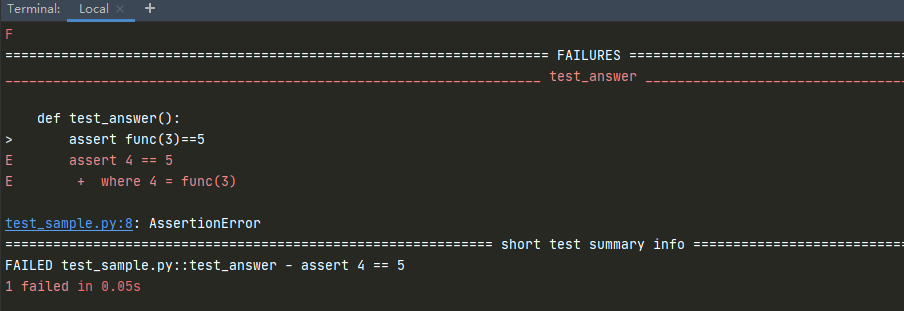
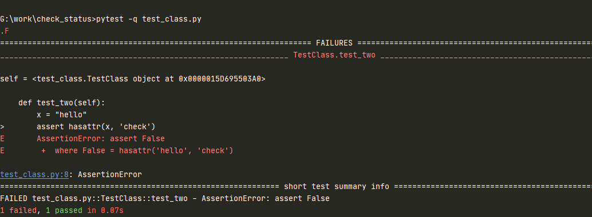
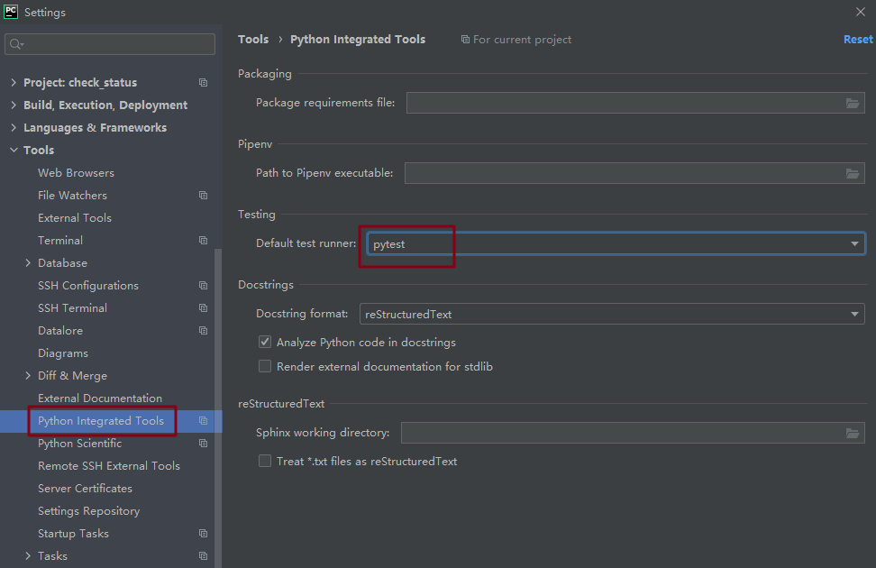
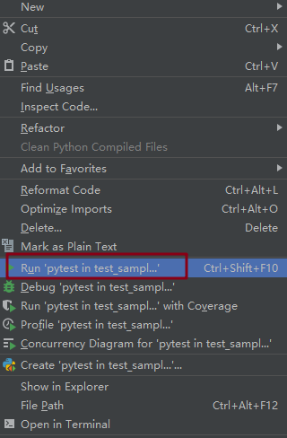

# 环境准备与入门

## 安装 Pytest

安装方法

```python
pip install pytest
```

安装完成后查看版本信息

```python
pip show pytest
或
pytest --version
```

## 快速入门

### 测试函数

新建 `test_sample.py` 文件

```python
def func(x):
    return x +1

def test_answer():
    assert func(3)==5
```

在该 py 文件所在的路径下运行：`pytest`



**知识点**：

查找当前目录及其子目录下以 `test_*.py` 或`*_test.py`文件，找到文件后，在文件中找到以 test 开头函数并执行

### 测试类

当用例有多个的时候，可以把多个测试用例，写到一个测试类里

新建一个 `test_class.py`

```python
class TestClass:
    def test_one(self):
        x = "this"
        assert 'h' in x

    def test_two(self):
        x = "hello"
        assert hasattr(x, 'check')
```

在该 py 文件所在的路径下指定该文件运行：`pytest -q test_class.py`



## 用例设计原则

用 Pytest 写用例时候，一定要按照下面的规则去写，否则不符合规则的测试用例是不会执行的

+ 文件名以 `test_*.py` 文件和 `*_test.py`
+ 以 `test_` 开头的函数
+ 以 Test 开头的类，不能包含`__init__` 方法
+ 以 `test_` 开头的方法
+ 所有的包 package 必须要有 `__init__.py` 文件

## 执行用例规则

**注意，下面讲的都是在 cmd 中执行 pytest 命令**

### 某个目录下所有的用例

```
pytest
```

### 执行某一个 py 文件下用例 

```
pytest 脚本名称.py
```

### 运行 start.py 模块里面的某个函数，或者某个类，某个类里面的方法

加v和不加 -v 都可以，加 -v 的话，打印的信息更详细
```
pytest -v 08_mark.py::TestClass::test_method 
pytest start.py::test_answer
```

### 运行 start.py 模块里面,测试类里面的某个方法

```
pytest start.py::TestClass::test_two
```

### `-m` 标记表达式（后续讲解）

```
 pytest -m login
```

将运行用 `@pytest.mark.login` 装饰器修饰的所有测试，后面再展开讲标记哦

### `-q` 简单打印，只打印测试用例的执行结果

```
 pytest -q start.py
```

### `-s` 详细打印

```
 pytest -s start.py
```

### `-x` 遇到错误时停止测试

```
pytest start.py -x
```

### `--maxfail=num`，当用例错误个数达到指定数量时，停止测试

```
pytest start.py --maxfail=1
```

### `-k` 匹配用例名称

执行测试用例名称包含http的所有用例
```
pytest -s -k http start.py
```

### `-k` 根据用例名称排除某些用例

```
pytest -s -k "not http" start.py
```

### `-k` 同时匹配不同的用例名称

```
pytest -s -k "method or weibo" start.py
```

::: danger Python 测试发现约定
+ 如果未指定任何参数，则收集从 testpaths（如果已配置）或当前目录开始
+ 命令行参数可以在目录、文件名或节点 ID 的任何组合中使用
+ 递归到目录，除非它们匹配 norecursedirs
+ 在这些目录中，搜索 `test_*.py` 或 `*_test.py`
+ 从这些文件中，搜集测试项目：
    + 在类之外拥有 test 前缀的测试函数或方法
    + 在拥有 Test 前缀中的测试类(不含 `__init__` 方法)中的拥有 test 前缀的测试函数或方法
+ 可自定义测试发现规则
+ Pytest 是可以兼容 Unittest 脚本的，之前写的 Unittest 用例也能用 Pytest 框架去运行
:::

## Pycharm 运行 Pytest





（完）


