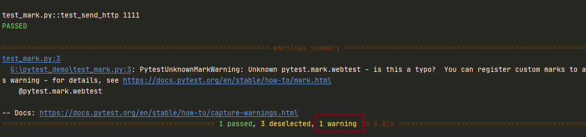
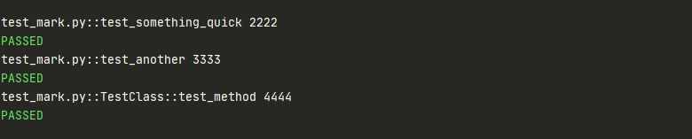

# 自定义 mark

## 作用

+ Pytest 可以支持自定义标记，自定义标记可以把一个项目划分多个模块，然后指定模块名称执行
+ 比如标明哪些是 ios 用例，哪些是 android 的，运行代码时候指定 mark 名称运行就可以

## 示例

```python
import pytest

@pytest.mark.webtest
def test_send_http():
    print("1111") # perform some webtest test for your app

def test_something_quick():
    print("2222")

def test_another():
    print("3333")

class TestClass:
    def test_method(self):
        print("4444")
```

使用命令：`pytest -s -v -m webtest test_mark.py`

测试结果：



可以看到结果中有个 warning 

**原因**：自定义的 mark 没有在 pytest.ini 文件中注册

**解决方案**：

+ 新建 pytest.py 文件

+ 在文件中输入

```python
  [pytest]
  mark = 
  	webtest
```

**注意**: `pytest.ini` 需要和运行的测试用例同一个目录，或在根目录下作用于全局

### 执行未标记的用例

```python
pytest -s -v -m "not webtest" test_mark.py
```

测试结果：



### 执行多个标记的用例

```python
pytest -s -v -m "login or webtest" test_mark.py
```

（完）

