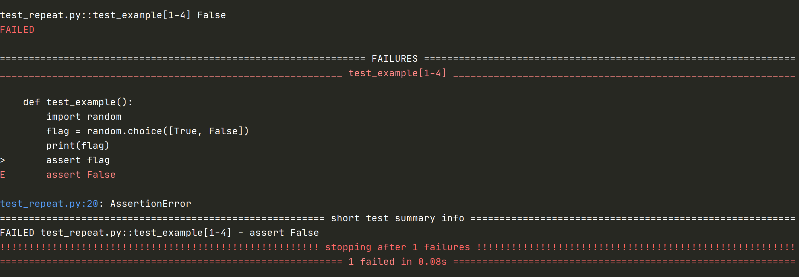

# pytest-repeat

pytest-repeat 是 Pytest 的一个插件，用于重复执行单个用例，或多个测试用例，并指定重复次数

## 环境要求

+ Python 2.7, 3.5+ 或者 PyPy
+ pytest 3.6 或者更高

## 安装 pytest-repeat

```python
pip install pytest-repeat
```
## pytest-repeat 使用

有两种方式：
+ 命令行模式
+ 装饰器模式

### 命令行模式

使用 `--count` 参数指定要重复几次
```python
pytest --count=10 test_file.py
```
使用上面的命令是每个用例会被重复执行，但有时候希望按 `test_1,test_2` 这样执行的顺序重复执行
`--repeat-scope` 就是用来解决这个问题的

#### --repeat-scope

作用：类似于 fixture 的 scope 参数，可以覆盖默认的测试用例执行顺序

`--scope` 参数：
+ function：默认，范围针对每个用例重复执行，再执行下一个用例
+ class：以 class 为用例集合单位，重复执行 class 里面的用例，再执行下一个
+ module：以模块为单位，重复执行模块里面的用例，再执行下一个
+ session：重复整个测试会话，即所有测试用例的执行一次，然后再执行第二次

##### 示例

###### --repeat-scope=module

```python
def test_repeat1():
    print("测试用例执行111")

def test_repeat2():
    print("测试用例执行222")

class Test_repeat:
    def test_repeat3(self):
        print("测试用例执行333")
```
执行结果：
```
test_repeat.py::test_repeat1[1-2] 测试用例执行111
PASSED
test_repeat.py::test_repeat2[1-2] 测试用例执行222
PASSED
test_repeat.py::Test_repeat::test_repeat3[1-2] 测试用例执行333
PASSED
test_repeat.py::test_repeat1[2-2] 测试用例执行111
PASSED
test_repeat.py::test_repeat2[2-2] 测试用例执行222
PASSED
test_repeat.py::Test_repeat::test_repeat3[2-2] 测试用例执行333
PASSED
```
#### 重复测试直到失败

+ 如果需要验证偶现问题，可以一次又一次地运行相同的测试直到失败，这个插件将很有用
+ 可以将 pytest 的 `-x` 选项与 `pytest-repeat` 结合使用，以强制测试运行程序在第一次失败时停止

例如：
```python
def test_example():
    import random
    flag = random.choice([True, False])
    print(flag)
    assert flag
```
执行命令：`pytest -s --count 5 -x test_repeat.py`

执行结果：



### 装饰器模式

使用 `@pytest.mark.repeat(count)` 可以将代码中某些测试用例标记为重复执行
```python
@pytest.mark.repeat(5)
def test_repeat():
    print("测试用例执行")
```
执行命令：`pytest -s -v test_repeat.py`

执行结果：

```
test_repeat.py::test_repeat[1-5] 测试用例执行
PASSED
test_repeat.py::test_repeat[2-5] 测试用例执行
PASSED
test_repeat.py::test_repeat[3-5] 测试用例执行
PASSED
test_repeat.py::test_repeat[4-5] 测试用例执行
PASSED
test_repeat.py::test_repeat[5-5] 测试用例执行
PASSED
```

## 参考资料

[官方文档：pytest-repeat](https://github.com/pytest-dev/pytest-repeat/)

（完）