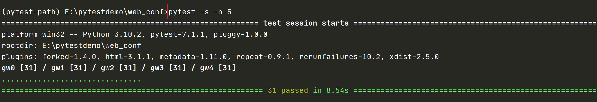

# pytest-xdist

## 什么是 pytest-xdist

+ Pytest 的一款插件
+ 可以分布式执行测试用例

## 为什么要用 pytest-xdist

+ 平常我们功能测试用例非常多时，比如有 1 千条用例，假设每个用例执行需要 1分钟，如果单个测试人员执行需要 1000 分钟才能跑完
+ 当项目非常紧急时，会需要协调多个测试资源来把任务分成两部分，于是执行时间缩短一半，如果有 10 个小伙伴，那么执行时间就会变成十分之一，大大节省了测试时间
+ 为了节省项目测试时间，10 个测试同时并行测试，这就是一种分布式场景
+ 同样道理，当我们自动化测试用例非常多的时候，一条条按顺序执行会非常慢，`pytest-xdist` 的出现就是为了让自动化测试用例可以分布式执行，从而节省自动化测试时间
+ `pytest-xdist` 是属于进程级别的并发

## 安装 pytest-xdist

```python
pip install pytest-xdist
```
::: tip pytest-xdist 通过一些独特的测试执行模式扩展了 Pytest:
+ 测试运行并行化：如果有多个 CPU 或主机，则可以将它们用于组合的测试运行，这样可以加快开发速度或使用远程计算机的特殊资源
+ `--looponfail`：在子进程中重复运行测试，每次运行之后，Pytest 都会等到项目中的文件更改后再运行之前失败的测试，重复此过程，直到所有测试通过，然后再次执行完整运行
+ 跨平台覆盖：您可以指定不同的 Python 解释程序或不同的平台，并在所有这些平台上并行运行测试
:::

### 执行命令

```python
pytest -n 3 
或
pytest -n auto
```
**`-n 3`**: 指定具体的进程数

**`-n auto`**: 使用与计算机 CPU 内核一样多的进程

## pytest-xdist 示例

### 项目工程结构

```
web_conf是工程名称
├─douban
│  │  conftest.py
│  │  test_douban.py
│  │  __init__.py
|
├─jd
│  │  test_jd.py
│        
├─taobao
│  │  conftest.py
│  │  test_taobao.py
│  │  __init__.py
│   
|  main.py
│  conftest.py
│  __init__.py
|  test_001.py
```
### web_conf 下

#### conftest.py 代码

::: details 点击查看代码
```python
import pytest
@pytest.fixture(scope="session")
def start():
    print("\n获取driver，全局获取一次")
    driver = "Chrom"
    yield driver
    print("\n释放driver，全局释放一次")

@pytest.fixture(autouse=True)
def get_driver(start):
    print("\n每个用例都要获取driver")
    return start
```
:::

#### main.py 代码

运行所有用例
::: details 点击查看代码
```python
import pytest

if __name__ == '__main__':
    pytest.main(["-s"])
```
:::

#### test_001.py 代码

根目录下的测试用例
::: details 点击查看代码
```python
from time import sleep
def test_001(start):
    sleep(1)
    print(f"\n测试用例1获取driver:{start}")
```
:::

### web_conf/douban 下

#### conftest.py 代码

::: details 点击查看代码
```python
import pytest
@pytest.fixture(scope="module")
def open_douban(start):
    print("\n打开douban页面")
    return start

@pytest.fixture
def login(open_douban):
    print("\n登录成功")
    token = "douban"
    yield token
    print("\n退出登录")
```
:::

#### test_douban.py 代码

douban 包下的测试用例
::: details 点击查看代码
```python
import pytest
from time import sleep

@pytest.mark.repeat(5)
def test_002(login):
    sleep(1)
    print(f"\n{login} 操作douban111")

@pytest.mark.repeat(5)
def test_003(login):
    sleep(1)
    print(f"\n{login} 操作douban222")
```
:::

### web_conf/jd 下

目录下没有 `__init__.py` 文件

#### test_jdn.py 代码

jd 包下的测试用例
::: details 点击查看代码
```python
import pytest
from time import sleep

@pytest.mark.repeat(5)
def test_jd1(start):
    sleep(1)
    print(f"\n{start} 操作jd1")

@pytest.mark.repeat(5)
def test_jd2(start):
    sleep(1)
    print(f"\n{start} 操作jd2")
```
:::

### web_conf/taobao 下

#### conftest.py 代码

设置 taobao 包下的 fixture
::: details 点击查看代码
```python
import pytest

@pytest.fixture(scope="module")
def open_taobao(start):
    print("\n打开taobao页面")
    return start

@pytest.fixture
def login(open_taobao):
    print("\n登录成功")
    token = "taobao"
    yield token
    print("\n退出登录")
```
:::

#### `test_taobao.py` 代码

taobao 包下的测试用例
::: details 点击查看代码
```python
import pytest
from time import sleep

@pytest.mark.repeat(5)
def test_taobao1(login):
    sleep(1)
    print(f"\n{login} 操作taobao1")

@pytest.mark.repeat(5)
def test_taobao2(login):
    sleep(1)
    print(f"\n{login} 操作taobao2")
```
:::

**不使用分布式测试和执行结果**：

```python
pytest -s
```
```python
#结果：
31 passed in 31.40s
```
上面每条用例执行之前都加了等待时间 1 s，总共 31 条用例，时间为 31 秒

**使用分布式测试和执行结果**：
指定进程数 5：
```python
pytest -s -n 5
```
结果：



结果明显比不使用分布式时缩短了很多

::: tip pytest-xdist 可以和 pytest-html 结合使用
pytest -s -n auto --html=report.html --self-contained-html
:::

## 分布式执行用例设计原则(重点)

+ 用例之间是独立的，用例之间没有依赖关系，用例可以完全独立运行
+ 用例执行没有顺序，随机顺序都能正常执行
+ 每个用例都能重复运行，运行结果不会影响其他用例

## pytest-xdist 执行顺序

pytest-xdist 默认是无序执行的，可以通过 `--dist` 参数来控制顺序

`test_xdist1.py`
::: details 点击查看代码
```python
def test1():
    print('执行用例111')

class Test1():
    def test12(self):
        print('执行用例121212')

    def test13(self):
        print('执行用例131313')
```
:::

test_xdist2.py
::: details 点击查看代码
```python
def test2():
    print('执行用例2222')

class Test2():
    def test22(self):
        print('执行用例22222')

    def test23(self):
        print('执行用例232323')
```
:::

### `--dist=load`

将待运行的用例随机发给可用的执行器 worker，用例执行顺序随机的，目前默认采用这种方式

执行命令：`pytest -s -v -n 3 --dist=load test_xdist1.py`

执行结果：
::: details 点击查看结果
```python
test_xdist1.py::Test1::test13
test_xdist1.py::test1
test_xdist1.py::Test1::test12
[gw2] PASSED test_xdist1.py::Test1::test13
[gw0] PASSED test_xdist1.py::test1
[gw1] PASSED test_xdist1.py::Test1::test12
```
:::

[gw0] 、[gw1] 、[gw2] 随机执行用例

### `--dist=loadscope`

+ 将按照同一个模块 module 下的函数和同一个测试类 class 下的方法来分组，然后将每个测试组发给可以执行的 worker，确保同一个组的测试用例在同一个进程中执行
+ 目前无法自定义分组，按类 class 分组优先于按模块 module 分组

执行命令：`pytest -s -v -n 3 --dist=loadscope test_xdist1.py test_xdist2.py`

执行结果：
::: details 点击查看结果
```
结果：
test_xdist2.py::test2
test_xdist1.py::Test1::test12
test_xdist1.py::test1
[gw2] PASSED test_xdist2.py::test2
[gw0] PASSED test_xdist1.py::test1
[gw1] PASSED test_xdist1.py::Test1::test12
test_xdist1.py::Test1::test13
test_xdist2.py::Test2::test22
[gw1] PASSED test_xdist1.py::Test1::test13
[gw0] PASSED test_xdist2.py::Test2::test22
test_xdist2.py::Test2::test23
[gw0] PASSED test_xdist2.py::Test2::test23
```
:::

[gw0]: 执行 `test_xdist1.py::test1、test_xdist2.py::Test2::test22`、`test_xdist2.py::Test2::test23` 用例

[gw1]: 执行 `test_xdist1.py::Test1::test12`、`test_xdist1.py::Test1::test13` 用例

[gw2]: 执行 `test_xdist2.py::test2` 用例

### `--dist=loadfile`

按照同一个文件名来分组，然后将每个测试组发给可以执行的 worker，确保同一个组的测试用例在同一个进程中执行

执行命令：`pytest -s -v -n 3 --dist=loadfile test_xdist1.py test_xdist2.py`

执行结果：
::: details 点击查看结果
```python
test_xdist1.py::test1
test_xdist2.py::test2
[gw1] PASSED test_xdist2.py::test2
[gw0] PASSED test_xdist1.py::test1
test_xdist1.py::Test1::test12
test_xdist2.py::Test2::test22
[gw0] PASSED test_xdist1.py::Test1::test12
[gw1] PASSED test_xdist2.py::Test2::test22
test_xdist1.py::Test1::test13
test_xdist2.py::Test2::test23
[gw0] PASSED test_xdist1.py::Test1::test13
[gw1] PASSED test_xdist2.py::Test2::test23
```
:::

[gw0]: 执行 `test_xdist1.py` 下的所有用例

[gw1]: 执行 `test_xdist2.py` 下的所有用例

### `--dist=each`

是将每个用例，分别发给所有的执行器 worker，相当于开了几个执行器 worker，同一个用例就执行几遍

执行命令：`pytest -s -v -n 3 --dist=each test_xdist1.py`

执行结果：
::: details 点击查看结果
```python
test_xdist1.py::test1
[gw2] PASSED test_xdist1.py::test1
[gw1] PASSED test_xdist1.py::test1
test_xdist1.py::Test1::test12
[gw0] PASSED test_xdist1.py::test1
test_xdist1.py::Test1::test12
[gw2] PASSED test_xdist1.py::Test1::test12
[gw0] PASSED test_xdist1.py::Test1::test12
test_xdist1.py::Test1::test12
[gw1] PASSED test_xdist1.py::Test1::test12
test_xdist1.py::Test1::test13
[gw2] PASSED test_xdist1.py::Test1::test13
[gw0] PASSED test_xdist1.py::Test1::test13
[gw1] PASSED test_xdist1.py::Test1::test13
```
:::

可以看到，每个用例都分别被 [gw0]、[gw1]、[gw2] 执行了一遍

## 如何让 `scope=session` 的 fixture 在 test session 中仅仅执行一次

### 存在问题

pytest-xdist 是让每个 worker 进程执行属于自己的测试用例集下的所有测试用例

这意味着在不同进程中，不同的测试用例可能会调用同一个 scope 范围级别较高（例如 session）的 fixture，该 fixture 则会被执行多次，这不符合 `scope=session` 的预期

### 如何解决

`pytest-xdist` 没有内置的支持来确保会话范围的夹具仅执行一次，但是可以通过使用锁定文件进行进程间通信来实现

例子：
```python
import pytest
from filelock import FileLock

@pytest.fixture(scope="session")
def login():
    print("====登录功能，返回账号，token===")
    with FileLock("session.lock"):
        name = "testyy"
        token = "npoi213bn4"
        # web ui自动化
        # 声明一个driver，再返回

        # 接口自动化
        # 发起一个登录请求，将token返回都可以这样写
    yield name, token
    print("====退出登录！！！====")
```
+ 下面的示例只需要执行一次 login（因为它是只需要执行一次来定义配置选项，等等）
+ 当第一次请求这个 fixture 时，则会利用 FileLock 仅产生一次 fixture 数据
+ 当其他进程再次请求这个 fixture 时，则会从文件中读取数据

::: tip 思考
+ 对于用例中有阻断进程的操作，如 sleep 操作，`pytest-xdist` 分布式执行确实效果很显著
+ 对于 `pytest-xdist` 有没有用例量级的限制？如果超过这个量级，`pytest-xdist` 分布式是否还有效果？这个暂时还没有得到这个量化
+ 如果用例中使用了多线程，那 `pytest-xdist` 的方式还有效？这个待后续研究
:::

## 参考资料
[官方文档-pytest-xdist](https://pytest-xdist.readthedocs.io/en/latest/)

[Pytest 分布式执行 pytest-xdist](https://www.jianshu.com/p/1c3c3095d2a9)

（完）