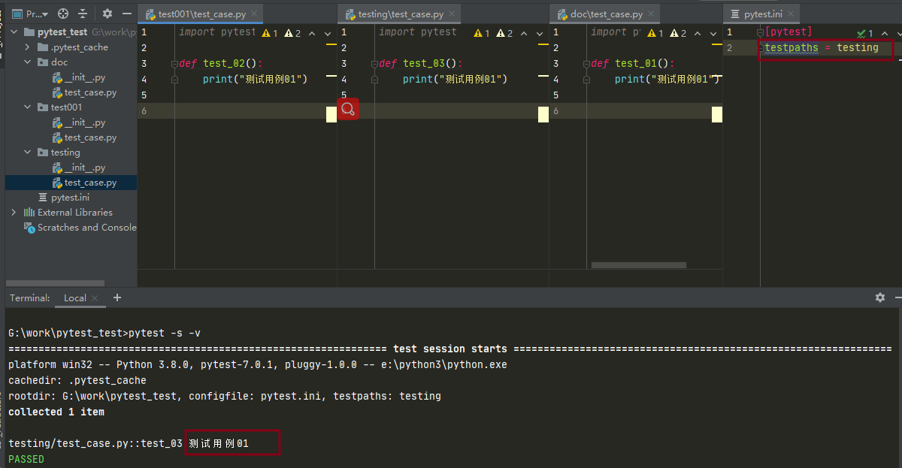
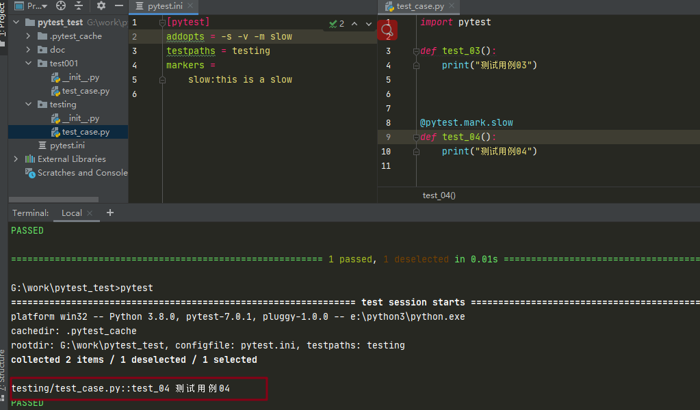

# pytest.ini 配置文件

## 配置文件作用

Pytest 配置文件可以改变 Pytest 的运行方式，它是一个固定的文件 `pytest.ini` 文件，读取配置信息，按指定的方式去运行

::: tip pytest.ini 位置

只能在根目录下

:::

## 非 test 文件

Pytest 里面有些文件是非 test 文件

- pytest.ini: Pytest 的主配置文件，可以改变 Pytest 的默认行为
- conftest.py: 测试用例的一些 fixture 配置
- `_init_.py`: 识别该文件夹为 Python 的 package 包
- tox.ini 与 pytest.ini 类似，用 tox 工具时候才有用
- setup.cfg 也是 ini 格式文件，影响 setup.py 的行为

## `pytest.ini` 配置文件

### 基本格式

```
[pytest]

addopts = -rsxX
xfail_strict = true
```

### 查看 `pytest.ini` 的设置选项

使用 `pytest -h` 命令，找到下面的内容

::: details 相关设置选项

```
[pytest] ini-options in the first pytest.ini|tox.ini|setup.cfg file found:

  markers (linelist):   markers for test functions
  empty_parameter_set_mark (string):
                        default marker for empty parametersets
  norecursedirs (args): directory patterns to avoid for recursion
  testpaths (args):     directories to search for tests when no files or
                        directories are given in the command line.
  filterwarnings (linelist):
                        Each line specifies a pattern for
                        warnings.filterwarnings. Processed after
                        -W/--pythonwarnings.
  usefixtures (args):   list of default fixtures to be used with this
                        project
  python_files (args):  glob-style file patterns for Python test module
                        discovery
  python_classes (args):
                        prefixes or glob names for Python test class
                        discovery
  python_functions (args):
                        prefixes or glob names for Python test function and
                        method discovery
  disable_test_id_escaping_and_forfeit_all_rights_to_community_support (bool):
                        disable string escape non-ascii characters, might
                        cause unwanted side effects(use at your own risk)
  console_output_style (string):
                        console output: "classic", or with additional
                        progress information ("progress" (percentage) |
                        "count").
  xfail_strict (bool):  default for the strict parameter of xfail markers
                        when not given explicitly (default: False)
  enable_assertion_pass_hook (bool):
                        Enables the pytest_assertion_pass hook.Make sure to
                        delete any previously generated pyc cache files.
  junit_suite_name (string):
                        Test suite name for JUnit report
  junit_logging (string):
                        Write captured log messages to JUnit report: one of
                        no|log|system-out|system-err|out-err|all
  junit_log_passing_tests (bool):
                        Capture log information for passing tests to JUnit
                        report:
  junit_duration_report (string):
                        Duration time to report: one of total|call
  junit_family (string):
                        Emit XML for schema: one of legacy|xunit1|xunit2
  doctest_optionflags (args):
                        option flags for doctests
  doctest_encoding (string):
                        encoding used for doctest files
  cache_dir (string):   cache directory path.
  log_level (string):   default value for --log-level
  log_format (string):  default value for --log-format
  log_date_format (string):
                        default value for --log-date-format
  log_cli (bool):       enable log display during test run (also known as
                        "live logging").
  log_cli_level (string):
                        default value for --log-cli-level
  log_cli_format (string):
                        default value for --log-cli-format
  log_cli_date_format (string):
                        default value for --log-cli-date-format
  log_file (string):    default value for --log-file
  log_file_level (string):
                        default value for --log-file-level
  log_file_format (string):
                        default value for --log-file-format
  log_file_date_format (string):
                        default value for --log-file-date-format
  log_auto_indent (string):
                        default value for --log-auto-indent
  pythonpath (paths):   Add paths to sys.path
  faulthandler_timeout (string):
                        Dump the traceback of all threads if a test takes
                        more than TIMEOUT seconds to finish.
  addopts (args):       extra command line options
  minversion (string):  minimally required pytest version
  required_plugins (args):
                        plugins that must be present for pytest to run

environment variables:
  PYTEST_ADDOPTS           extra command line options
  PYTEST_PLUGINS           comma-separated plugins to load during startup
  PYTEST_DISABLE_PLUGIN_AUTOLOAD set to disable plugin auto-loading
  PYTEST_DEBUG             set to enable debug tracing of pytest's internals


to see available markers type: pytest --markers
to see available fixtures type: pytest --fixtures
(shown according to specified file_or_dir or current dir if not specified; fixtures with leading '_' are only shown with the '-v' option
```

:::

## 常用配置项

介绍下常用的配置项，其他配置项可在参考资料中查阅

### addopts

添加命令行参数集

```
[pytest]
addopts = -s -v --maxfail=2 -rf  # exit after 2 failures, report fail info
```

相当于

```python
pytest -s -v --maxfail=2 -rf test_hello.py
```

设置后之后在 cmd 中只需输入 pytest 就行，很方便

### testpaths

设置执行测试用例的目录

```
[pytest]
testpaths = testing
```

设置后，在根目录下运行 pytest 时，只会从 testing 目录中寻找并执行测试用例

例子：



可以看到结果中只执行了 `testing/` 目录下的测试用例

### markers

指定执行被标记的测试用例

```
[pytest]
markers =
    slow:this is a slow
```

例子：



可以看到只有被标记的 `test_04` 被执行了

::: tip 注意

-m ：参数后要跟上执行的标记名，即在 markers 中设置的

:::

### 更改测试用例收集规则

pytest默认的测试用例收集规则

- 文件名以 `test_*.py` 文件和 `*_test.py`
- 以 `test_` 开头的函数
- 以 Test 开头的类，不能包含 `__init__` 方法
- 以 `test_` 开头的类里面的方法

我们是可以修改或者添加这个用例收集规则的，建议在原有的规则上添加的，如下配置

```
[pytest] 
python_files = test_*  *_test  test* 
python_classes = Test*   test* 
python_functions = test_*  test*
```

### norecursedirs

Pytest 收集测试用例时，会递归遍历所有子目录，包括某些你明知道没必要遍历的目录，遇到这种情况，可以使用 norecursedirs 参数简化 Pytest 的搜索工作

**默认设置**： `norecursedirs = .* build dist CVS _darcs {arch} *.egg`

**正确写法**：多个路径用空格隔开

```
[pytest] norecursedirs = .* build dist CVS _darcs {arch} *.egg venv src resources log report util
```

## 参考资料

[官方文档-Configuration](https://docs.pytest.org/en/latest/reference/customize.html?highlight=ini)

[官方文档-Configuration Options](https://docs.pytest.org/en/latest/reference/reference.html#ini-options-ref)

（完）