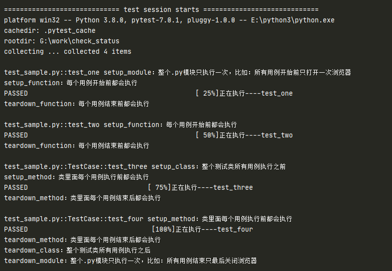
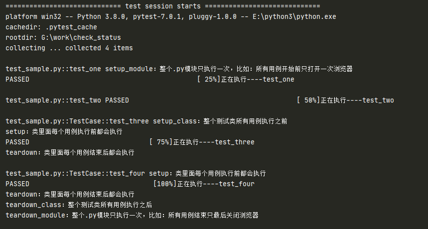

# setup 与 teardown

## 前言

学过 Unittest 的都知道有 2 个前置方法和 2 个后置方法

+ setup()
+ teardown()
+ setupClass()
+ teardownClass()

Pytest 框架也有类似于 setup 和 teardown 的语法:

- 模块级：`setup_module/teardown_module`，开始于模块始末，全局的
- 函数级：`setup_function/teardown_function`，只对函数用例生效（不在类中）
- 类级：`setup_class/teardown_class`，只在类中前后运行一次(在类中)
- 方法级：`setup_method/teardown_method`，开始于方法始末（在类中）
- 类里面的：`setup/teardown`，运行在调用方法的前后

## 示例

```python
import pytest

def setup_module():
    print("setup_module：整个.py模块只执行一次，比如：所有用例开始前只打开一次浏览器")

def teardown_module():
    print("teardown_module：整个.py模块只执行一次，比如：所有用例结束只最后关闭浏览器")

def setup():
    print("setup：每个用例执行前都会执行")

def teardown():
    print("teardown：每个用例结束后都会执行")

def setup_function():
    print("setup_function：每个用例开始前都会执行")

def teardown_function():
    print("teardown_function：每个用例结束前都会执行")

def test_one():
    print("正在执行----test_one")


def test_two():
    print("正在执行----test_two")


class TestCase():

    def setup_class(self):
        print("setup_class：整个测试类所有用例执行之前")

    def teardown_class(self):
        print("teardown_class：整个测试类所有用例执行之后")

    def setup(self):
        print("setup：类里面每个用例执行前都会执行")

    def teardown(self):
        print("teardown：类里面每个用例结束后都会执行")

    def setup_method(self):
        print("setup_method：类里面每个用例执行前都会执行")

    def teardown_method(self):
        print("teardown_method：类里面每个用例结束后都会执行")


    def test_three(self):
        print("正在执行----test_three")

    def test_four(self):
        print("正在执行----test_four")

if __name__ == "__main__":
    pytest.main(["-s","-q","-ra", "sample.py"])


```

测试结果：



注释掉以下内容，重新测试：

```python
# def setup_function():
#     print("setup_function：每个用例开始前都会执行")
#
# def teardown_function():
#     print("teardown_function：每个用例结束前都会执行")


 # def setup_method(self):
    #     print("setup_method：类里面每个用例执行前都会执行")
    #
    # def teardown_method(self):
    #     print("teardown_method：类里面每个用例结束后都会执行")
```

测试结果：



```python
def setup_module():
    global user_data
    user_data = {"path":"admin","name":"admin"}
    print(id(user_data))
    print("使用前的{}".format(user_data))


def teardown_module():
    global user_data
    user_data = 123
    print("结束后的{}".format(user_data))

def test_003():
    print(user_data)
    print(id(user_data))
```
结果：
```python
test_fixture.py::test_003 1920498803200
使用前的{'path': 'admin', 'name': 'admin'}
{'path': 'admin', 'name': 'admin'}
1920498803200
PASSED结束后的123
```
**总结**：

+ `setup_method/teardown_method` 和 `setup/teardown` 都可以作用于测试类中的方法
+ `setup_method/teardown_method` 的优先级高于 `setup/teardown`
+ setup 这种设置全局变量后，在测试用例中可以被访问

（完）