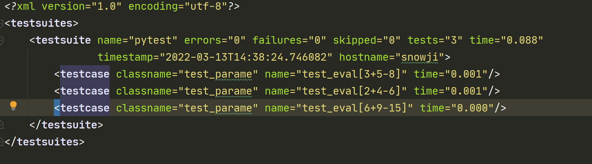
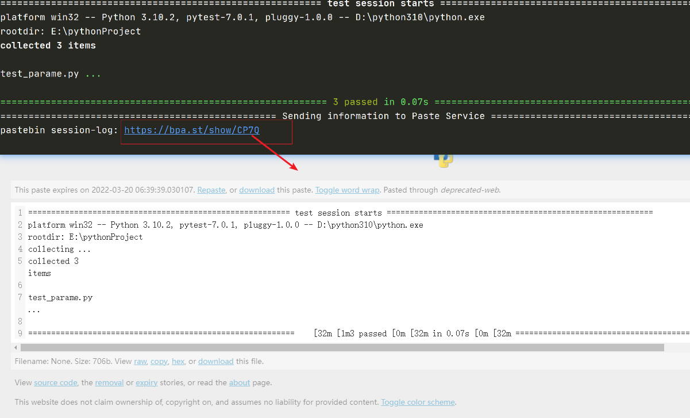

# Pytest 生成简单测试报告

## 前言

+ Pytest 可以生成 JunitXML 报告
+ Pytest 可以生成在线测试报告

## JunitXML 报告

在命令行下使用
```
pytest test_parame.py --junit-xml=./report/01.xml
```

运行结果：


## 在线测试报告

在命令行下使用

```
pytest test_parame.py --pastebin=all
```

运行后，会生成一个在线报告地址，可以点击打开



::: tip PS
+ 上面 2 种测试报告的可读性不是很友好
+ 后续会继续讲解 Pytest 使用插件生成的报告
:::