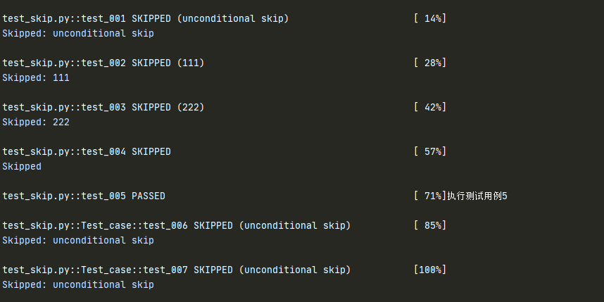

# skip/skipif

## skip/skipif 作用

+ `@pytest.mark.skip/skipif`  可以标记无法在某些平台上运行的测试功能，或希望失败的测试功能 
+ `skip/skipif` 意味着只有在满足某些条件时才希望测试通过，否则 Pytest 应该跳过运行测试
+ 常见场景：是在非 Windows 平台上跳过仅限 Windows 的测试，或跳过测试依赖于当前不可用的外部资源

## skip

两种方式：

+ 使用 `@pytest.mark.skip` 标记
+ 可以在用例运行中跳过

```python
import pytest

# 使用装饰器标记跳过 reason 可填
@pytest.mark.skip
def test_001():
    print("执行测试用例1")

@pytest.mark.skip(reason="111")
def test_002():
    print("执行测试用例2")


# 用例运行期间跳过
def test_003():
    pytest.skip("222",allow_module_level=True)
    print("执行测试用例3")

def test_004():
    pytest.skip()
    print("执行测试用例4")

def test_005():
    print("执行测试用例5")

# 跳过类
@pytest.mark.skip
class Test_case():
    def test_006(self):
        print("执行测试用例6")

    def test_007(self):
        print("执行测试用例7")
```

测试结果：



::: danger 重点

+ `allow_module_level` : 跳过整个模块级别
+ 使用 `pytest.skip()` 函数可以在测试用例执行中跳过

:::

## skipif

按条件跳过测试用例

```python
def test_001():
    print("执行测试用例1")

@pytest.mark.skipif(condition=2>1,reason="skip")
def test_002():
    print("执行测试用例2")
```

测试结果：`test_002` 被跳过

::: danger 注意

强烈建议不要在使用继承的类上使用 skipif ，Pytest 中的一个已知错误标记可能会导致超类中的意外行为

:::

### 全局 skip/skipif

如果要跳过模块的所有测试功能，可以在全局级别使用 pytestmark 名称

```
pytestmark = pytest.mark.skip/skipif(...)
```

### 模块间共享 skip/skipif

```python
#test_mymodule.py
myskip = pytest.mark.skip/skipif(...)
@myskip
def test_001():
    print("执行测试用例1")
```

其他模块可以导入 myskip

```python
from test_mymodule import myskip
@myskip
def test_002():
    print("执行测试用例2")
```

## pytest.importorskip( modname: str, minversion: Optional[str] = None, reason: Optional[str] = None )

**作用**: 如果缺少某些导入，则跳过模块中的所有测试

**参数列表**

- modname：模块名
- minversion：版本号
- reason：跳过原因，默认不给也行

```python
docutils = pytest.importorskip("pexpect", minversion="0.3")
@docutils
def test_001():
    print("1111")

```

**执行结果一**：如果找不到module

```
Skipped: could not import 'pexpect': No module named 'pexpect' 
collected 0 items / 1 skipped
```


**执行结果二**：如果版本对应不上

```
Skipped: module 'sys' has __version__ None, required is: '0.3' 
collected 0 items / 1 skipped
```

（完）


