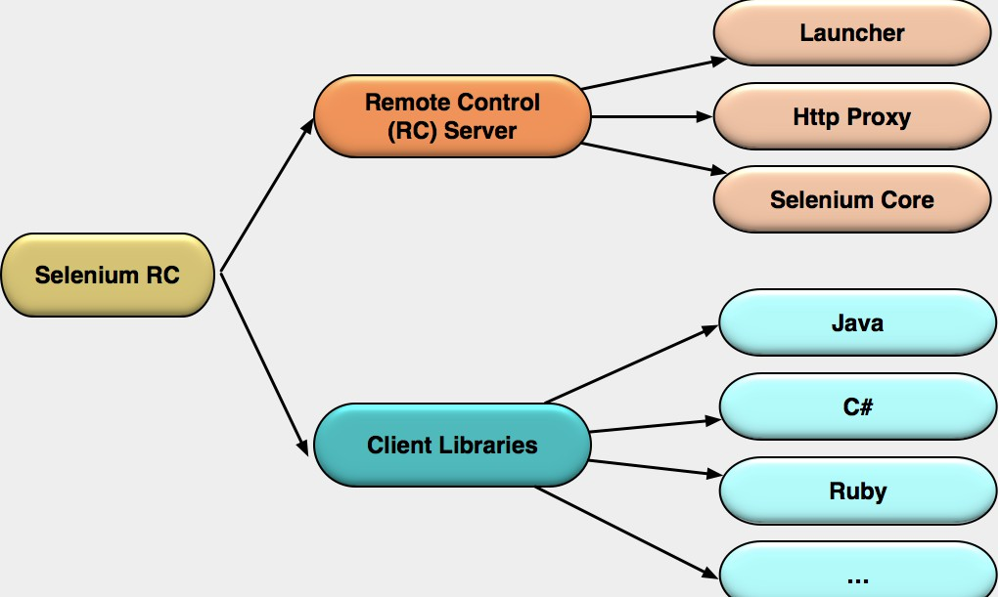
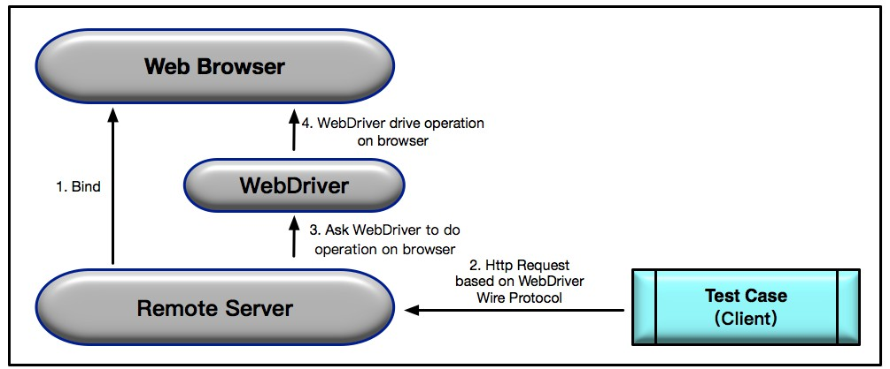

# Selenium 框架

## Selenium 原理

### Selenium 1.0 工作原理

**核心**：Selenium RC （Remote Control）,基于JavaScript代码注入 

**Selenium RC 利用的原理**：JavaScript 代码可以很方便地获取页面上的任何元素并执行各种操作 

**同源政策**： 只有来自**相同域名、端口和协议**的 JavaScript 代码才能被浏览器执行 

**Selenium RC 组成**：

**Selenium RC Server**：

+ Selenium Core：被注入到浏览器页面中的 JavaScript 函数集合，用来实现界面元素的识别和操作 
+ Http Proxy：作为代理服务器修改 JavaScript 的源，以达到“欺骗”被测站点的目的 
+ Launcher：用来在启动测试浏览器时完成 Selenium Core 的注入和浏览器代理的设置 

**Client Libraries**：是测试用例代码向 Selenium RC Server 发送 Http 请求的接口，支持多种语言

**Selenium RC的执行流程**：

具体如下：

+  测试用例通过基于不同语言的 Client Libraries 向 Selenium RC Server 发送 Http 请求，要求与其建立连接 
+  连接建立后，Selenium RC Server 的 Launcher 就会启动浏览器或者重用之前已经打开的浏览器，把Selenium Core（JavaScript 函数的集合）加载到浏览器页面当中，并同时把浏览器的代理设置为 Http Proxy 
+  Selenium Core 接收到指令后，执行操作 
+  如果浏览器收到新的页面请求信息，则会发送Http请求来请求新的 Web 页面。由于 Launcher 在启动浏览器时把 Http Proxy 设置成为了浏览器的代理，所以 Selenium RC Server 会接收到所有由它启动的浏览器发送的请求 
+  Selenium RC Server 接收到浏览器发送的 Http 请求后，重组 Http 请求以规避“同源策略”，然后获取对应的Web 页面
+  Http Proxy 把接收的 Web 页面返回给浏览器，浏览器对接收的页面进行渲染

### Selenium 2.0 的工作原理

**核心**：Selenium WebDriver，典型的 Server-Client 模式 

**原理**：使用浏览器原生的 WebDriver 实现页面操作 

**Selenium 2.0 工作原理图**：

具体执行流程如下：

+ Selenium2.0 启动浏览器 Web Browser 时，后台会同时启动基于 WebDriver Wire 协议的 Web Service 作为 Selenium 的 Remote Server，并将其与浏览器绑定，绑定完成后，Remote Server 就开始监听 Client 端的操作请求
+ 执行测试时，测试用例会作为 Client 端，将需要执行的页面操作请求以 Http Request 的方式发送给 Remote Server。该 HTTP Request 的 body，是以 WebDriver Wire 协议规定的 JSON 格式来描述需要浏览器执行的具体操作
+ Remote Server 接收到请求后，会对请求进行解析，并将解析结果发给 WebDriver，由 WebDriver 实际执行浏览器的操作
+ WebDriver 可以看做是直接操作浏览器的原生组件（Native Component），所以搭建测试环境时，通常都需要先下载浏览器对应的 WebDriver

（完）