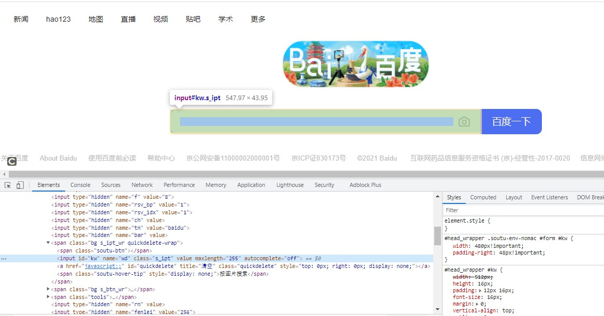
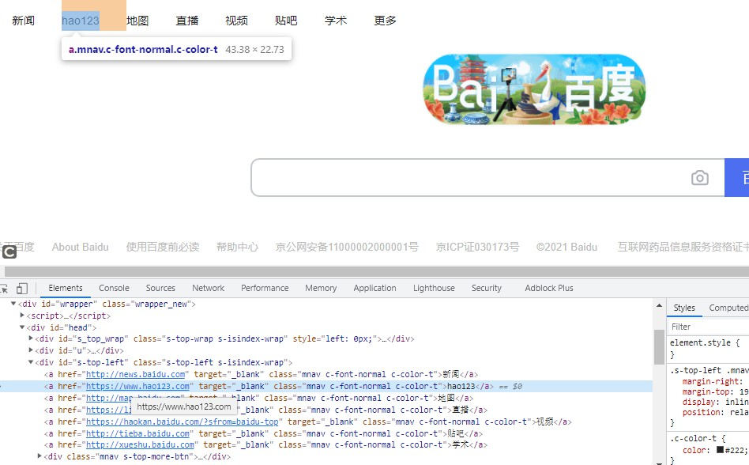

# Selenium 中 xpath定位方式

了解了 xpath 的一些语法后，可以在 Selenium 中使用 xpath 来定位一些元素

## 常用的一些定位方式：

### 通过元素属性定位

**语法**：//tag[@attr=attr]

例子：以定位百度输入框为例：



```
xpath 路径：//input[@id='kw']
```

### 使用逻辑运算符

**语法**：//tag[@attr1=attr1 and @attr2=attr2]  

这个是逻辑与 (and)，逻辑或 (or)s 是也同样的


```
xpath 路径：//input[@id='kw' and @class='s_ipt']
```

### 通过文本定位

#### text()

**语法：**//tag[text()=xx]

这里用百度首页里面的 "hao123" 链接举例子



```
 xpath 路径：//a[text()='hao123']
```

#### contains() 包含定位

**语法**：//tag[contains(text(),xx)] 或者//tag[contains(@attr,xx)]

前面一个是文本，后面一个是包含属性前面都讲了直接 @属性定位


```
 xpath 路径：//a[contains(text(),'hao123')]
```

### `position()=n` 位置定位

**语法：**//tag[@attr=attr][position()=2]

 n 表示第几个元素，n 从 1 开始


```
 xpath 路径：//a[@class='mnav'][position()=2]
```

### last()-n

`n=0` 或者不写 last() 默认倒数第一个，`n=1` 倒数第二，以此类推 


```
xpath 路径：//div[@id='s-top-left']/a[last()-5]
```

### following-sibling 选取当前节点之后的所有同级节点

定位 "hao123" 这个 a 标签的父级元素（div）的同级的第一个 div


```
xpath 路径：//div[@id='s-top-left']/following-sibling::div[1]
```

### preceding-sibling 选取当前节点之前的所有同级节点

7 和 6 相反的，6 是同级往下走，7 是同级往上走的

定位 "hao123" 这个 a 标签的父级元素（div）的同级的第一个 div


```
xpath 路径：//div[@id='s-top-left']/preceding-sibling::div[1]
```

（完）