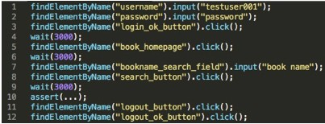
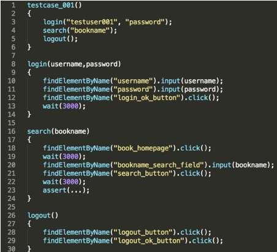
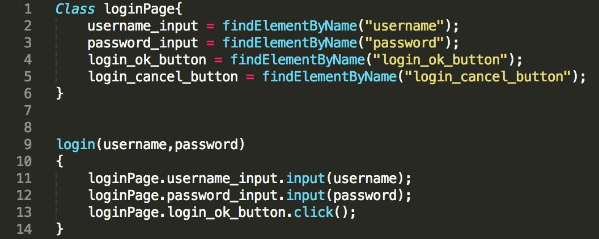

# 页面对象（Page Object）模型

## 页面对象模型介绍

**上述代码存在的问题**：

+ 脚本逻辑层次不够清晰，属于 All-in-one 的风格，既有页面元素的定位查找，又有对元素的操作 
+ 脚本的可读性差
+ 脚本的每一行都直接描述各个页面上的元素操作，很难一眼看出脚本更高层的业务测试流程 
+ 通用步骤在大量测试脚本中重复出现

**使用模块化封装**：

**优势**：

+ 脚本可读性高，逻辑层次清晰
+ 减少通用步骤在大量测试脚本中重复出现

**页面模型核心**：以页面（Web Page 或者Native App Page）为单位模块化封装页面上的控件以及控件的部分操作 

进化上面的代码：

**存在的问题**：GUI的页面会经常变动，使用元素的属性进行定位元素，Page Class 的维护成本很高

### 页面对象自动化生成

**基本思路**：不用再手工维护 Page Class 了，只需要提供 Web 的 URL，会自动帮你生成这个页面上所有控件的定位信息，并自动生成 Page Class

**适用场景**：适用于需要维护大量页面对象的中大型 GUI 自动化测试项目

**注意** ：依赖于数据的动态页面对象也会被包含在自动生成的 Page Class 里，而这种动态页面对象通常不应该包含在 Page Class 里，所以需要以手工的方式删除

**工具**：UFT、Katalon Studio 等

（完）

