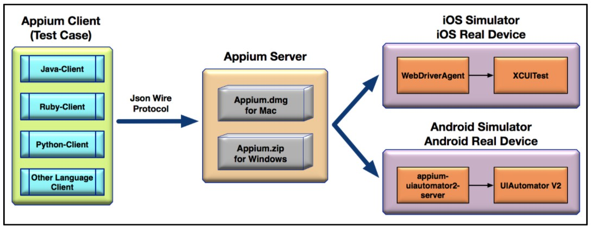

# Appium 原理

Appium  是目前主流的移动应用自动化测试框架， 具有极强的灵活性：

- 测试用例的实现支持多种编程语言，比如 Java、Ruby、Python 等
- Appium Server 支持多平台，既有基于 Mac 的版本，也有基于 Windows 的版本
- 支持 Web App、Native App 和 Hybird App 三大类移动应用的测试
- 既支持 iOS，也支持 Android
- 既支持真机，也支持模拟器

## 原理

###  **Appium Server** 

**本质**：接受来自 Appium Client 的请求，解析后通过 WebDriver 协议和设备端上的代理打交道 

+ IOS

Appium Server 把操作请求发送给 WebDriverAgent（简称 WDA），然后 WDA 再基于 XCUITest 完成 iOS模拟器或者真机上的自动化操作 

+ Android 

Appium Server 把操作请求发送给 appium-UIautomator2-server，然后 appium-UIautomator2-server 再基于 UIAutomator V2 完成 Android 模拟器或者真机上的自动化操作 

###  **Appium Client**

就是测试代码，使用对应语言的 Client 将基于 JSON Wire 协议的操作指令发给 Appium Server 

### 总结

+ Appium 属于 C/S 架构
+ Appium Client 通过多语言支持的第三方库向 Appium Server 发起请求，Appium Server 会接受 Appium Client 发来的请求，接着和 iOS 或者 Android 平台上的代理工具打交道，代理工具在运行过程中不断接收请求，并根据 WebDriver 协议解析出要执行的操作，最后调用 iOS 或者 Android 平台上的原生测试框架完成测试

（完）