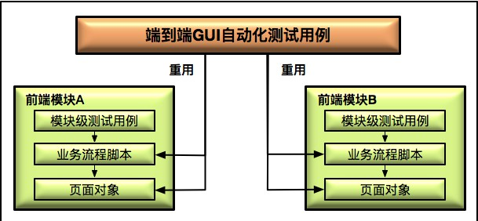

# 大型项目 GUI 自动化测试设计策略

## 测试策略设计

大型网站 GUI 自动化测试应该做得比较轻量级，而不应该把大量的功能测试，以及功能的组合测试放在 GUI 自动化测试 

GUI 的验证不是在系统全部完成后才真正开展的，应该是分阶段、分层次来设计制定测试策略的 

**策略设计**：

+ 从前端组件的级别来保证质量，需要对那些自定义开发的组件进行完整全面的测试 

公共组件库会被很多上层的前端模块依赖，它的质量将直接影响这些上层模块的质量，所以会对这些公共组件进行严格的单元测试 

**常用的方案**：基于 Jest 开展单元测试，并考量 JavaScript 的代码覆盖率指标 

完成单元测试后，在页面层面再次验证控件相关的功能和状态 ：

  + 先构建一个空页面，并加入被测控件，构建出一个被称为 Dummy Page 并包含被测控件的测试页面
  +  从黑盒的角度，在测试页面上通过手工和自动化的方式操作被测控件，并验证其功能的正确性 

+ 在每一个前端模块构建的页面对象库上，封装开发自己的业务流程脚本，组装成每个前端模块的测试用例 

以用户管理模块为例，组装过程如下：

  + 把用户管理模块中涉及到的所有页面，比如登录页面、用户注册页面等，按照页面对象模型的要求写成Page 类；
  + 利用这些 Page 类封装业务流程脚本，比如用户登录流程，用户注册流程等；
  + 在 GUI 测试用例脚本中，调用封装好的业务流程脚本构成该模块的 GUI 测试用例。

**自动化用例原则**：优先选取业务关键路径以及 Happy Path 作为自动化测试的范围

+ 组合各个前端模块，并站在终端用户的视角，以黑盒的方式使用网站的端到端（E2E）测试 

  + 通过探索式测试的方法手工执行测试，目标是尽可能多地发现新问题 
  + 通过 GUI 自动化测试执行基本业务功能的回归测试，保证网站核心业务相关的所有功能的正确性 

**GUI 自动化测试用例脚本开发**：

最好的做法：

+ 成立一个专门的 E2E 测试团队，负责这种系统级别的 GUI 测试 

+ E2E 团队应该尽可能地利用各个模块已有的页面对象和业务流程脚本，组装端到端的 GUI 测试

## 测试脚本管理

将各个模块的页面对象和业务流程脚本放在各自的代码库中，并引入页面对象和业务流程脚本的版本管理机制 

**好处**：

+ E2E 团队不需要重复开发任何的页面对象和业务流程脚本，可以始终保证与各个模块的最新实现同步

+ 同时端到端的 GUI 测试用例脚本也会比较稳定，不会因为各个模块的改动而频繁地修改

（完） 