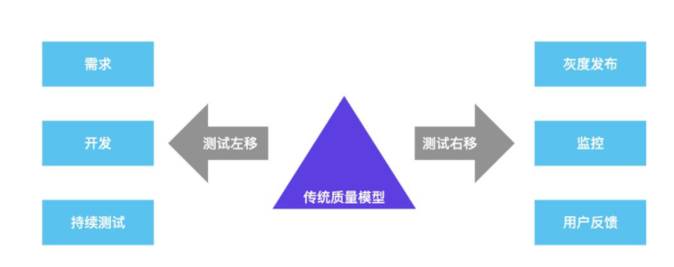

# 测试左移与右移

对软件产品而言，传统的质量模式是通过测试左移和测试右移

## 测试左移

测试左移，本质上是借助工具和测试手段更早地发现问题和预防问题。

+ 需求：对需求、架构和设计模型的测试
+ 开发：着重增加对单元、组件和服务层的测试
+ 持续测试：自动化测试

**作用**：
+ 支持测试团队在软件开发周期早期和所有干系人合作
+ 清晰地理解需求以及设计测试用例
+ 促使团队更早的修改所有的 bug

提高质量上限（举例）：
+ 健康的项目流程（合理并且严格遵守的项目流程） 
+ 合理的需求分析（评估需求的质量，分析需求的合理性以及完整性） 
+ 出色的系统架构 
+ 完整的系统设计（评估设计的质量，分析需求的合理性以及完整性） 
+ 充分利用静态代码扫描 
+ 进行研发标准的定义 
+ 更早的测试分析（先于开发完成需求的分析，做好各种评审的准备） 
+ 尽早的测试执行（提早参与测试执行，在集成前就发现一些问题）

提高质量下限（举例）：
+ 健康的测试流程
+ 优秀的测试用例
+ 合理的测试计划
+ 合适的自动化
+ 适当的探索式测试
+ 开发自测（TDD、BDD，测试提供更好的用例、技术支持）
+ 团队质量意识的培养

## 测试右移

版本上线后需要持续关注线上监控和预警，及时发现问题并跟进解决，将影响范围降到最低。

+ 灰度发布：新版本线上测试
+ 监控：合理的性能监测、数据监控和预警机制
+ 用户反馈：线上问题处理、跟踪机制

测试右移，线上监控举例：
+ 闭环的线上问题反馈-检查-解决-更新流程
+ 更便捷的日志查看、回传服务
+ 丰富有效的 log，便于问题的快速定位
+ 丰富的监控指标（例如业务异常点指标）
+ 成本监控（例如短信发送等）
+ 关键指标每日监控（服务器指标）
+ 生产数据监控（警报）（通过 sql 语句实现生产数据监控，例如是否有多个订单号一样的订单出现等）

::: tip
对于测试右移，可以围绕问题反馈、发现、定位、监控展开，参与人员则不仅仅局限于运维人员
:::

（完）