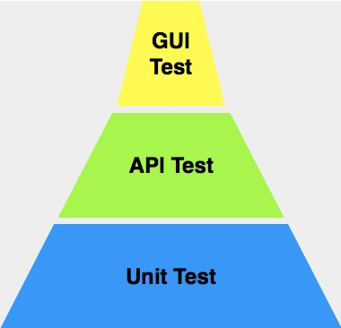
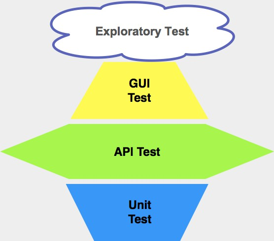

# 互联网产品如何设计测试策略

## 互联网产品

**特点**：快

+ 互联网产品的上线周期通常是以「天」甚至是以「小时」为单位。
+ 发布流程通常包含了代码静态扫描、单元测试、编译、打包、上传、下载、部署和测试的全流程。

**通常情况下，互联网产品要求全回归测试的执行时间不能超过 4 小时**。

如何在保证测试质量和测试覆盖率的前提下，有效缩短测试执行时间就是本文的主题。

## 传统软件产品的测试策略设计

**常用的模型**：金字塔模型

### 单元测试（重要）

+ 处于金字塔最底部，属于白盒测试范畴，通常由开发工程师完成
+ 能尽早发现缺陷，降低修复成本
+ 传统软件产品，生命周期都比较长，通常会有多个版本持续发布，为了在后期的版本升级过程中能够尽早发现并快速定位问题，每次 build 过程中都会多次反复执行单元测试 

### API 测试

处于金字塔中间，**主要针对的是各模块暴露的接口，通常采用灰盒测试方法** 

**灰盒测试**：

概述：介于**白盒**和**黑盒**之间的一种测试技术

核心思想：利用测试执行的代码覆盖率来指导测试用例的设计

例如 API 接口测试 ：

+  以黑盒方式设计如何调用 API 的测试用例 
+  测试执行过程中统计代码覆盖率，然后根据代码覆盖率情况来补充更多、更有针对性的测试用例 

### GUI 测试

处于金字塔最上层，模拟用户在软件界面上的各种操作，并验证这些操作对应的结果是否正确 

**优点**：能够实际模拟真实用户的行为，直接验证软件的商业价值 

**缺点**：

+ 执行的代价比较大，就算是采用 GUI 自动化测试技术，用例的维护和执行代价依然很大 
+ GUI 测试的稳定性问题，是长期以来阻碍 GUI 测试发展的重要原因 

## 互联网产品的测试策略设计

### GUI 测试（轻量级测试）

**互联网产品迭代周期对 GUI 测试的影响**：

+ 给开发 GUI 自动化测试用例的时间非常有限 
+ 客户端界面的频繁变化 , 导致 GUI 自动化测试的效率会非常低
+ GUI 测试是轻量级的, 不允许去执行大量的用例 

**测试策略**：以**手工为主，自动化为辅**

+ 手工测试：利用探索性测试思想，针对新开发或者新修改的界面功能进行测试
+ 自动化：主要放在相对稳定且核心业务的基本功能验证, **只覆盖最核心且直接影响主营业务流程的 E2E 场景** 

### API 测试（重点测试）

菱形的测试策略 ：**重量级 API 测试，轻量级 GUI 测试，轻量级单元测试** 

 **重量级 API 测试原因**：**API 测试可以实现良好的投入产出比** 

+  API 测试用例的开发与调试效率比 GUI 测试要高得多, 而且测试用例的代码实现比较规范 
+  API 测试用例的执行稳定性远远高于 GUI 测试
+  单个 API 测试用例的执行时间往往要比 GUI 测试短很多 
+  很多互联网产品采用了微服务架构，而对微服务的测试，本质上就是对不同的 Web Service 的测试，也就是 API 测试 
+  API 接口的改动一般比较少，在调用方式没有改变的情况下，测试用例不需要做大的改动，用例的可重用性很高, 可以保证较高的投入产出比 

### 单元测试（轻量级测试）

**轻量级原因**：互联网产品的**快** 

+ 快速实现功能  
  互联网产品追求的是最快速的功能实现并上线，基本不会有时间去做全面的单元测试
+ 快速寻求用户反馈
+ 快速试错
+ 快速迭代更新 

频繁的迭代会让单元测试处于不断重写的状态。

**采用「分而治之」测试策略思想**：

全面单元测试只会应用在那些**相对稳定和最核心的模块和服务**上，而应用层或者上层业务服务很少会大规模开展单元测试。

+ 后端基础服务和一些公共应用服务相对稳定，对于系统全局来说是「牵一发而动全身」，所以后端服务很有必要开展全面的单元测试。
+ 对于一些核心算法和关键应用，比如银行网关接口，第三方支付集成接口等，也要做比较全面的单元测试。

（完）

