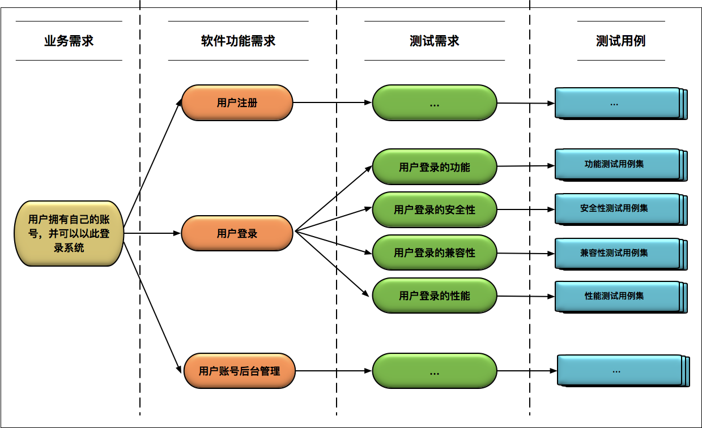

# 如何设计一个「好的」测试用例

## 如何理解什么是「好的」测试用例

「好的」测试用例一定是一个完备的集合，**能够覆盖所有等价类以及各种边界值，而跟能否发现缺陷无关**。

举个「池塘捕鱼」的例子：

+ 被测软件：池塘
+ 软件缺陷：池塘中的鱼
+ 测试用例集：捕鱼网

好的测试用例集就是一张能够覆盖整个池塘的大渔网，只要池塘里有鱼，这个大渔网就一定能把鱼给捞上来。

如果渔网本身是完整的且合格的，那么捞不到鱼，就证明池塘中没有鱼，而渔网的好坏与池塘中是否有鱼无关。

## 「好的」测试用例具备的特征 

+ 整体完整性  
  好的测试用例一定是一个完备的整体，是有效测试用例组成的集合，能够完全覆盖测试需求。

+ 等价类划分的准确性  
  指的是对于每个等价类都能保证只要其中一个输入测试通过，其他输入也一定测试通过。

+ 等价类集合完备性  
  需要保证所有可能的边界值和边界条件都已经正确识别。

## 最常用的三种测试用例设计方法

需求例子：

学生信息系统中有一个「考试成绩」的输入项，成绩的取值范围是 0~100 之间的整数，考试成绩及格的分数线是 60。

### 等价类划分法

我们只要从每个等价类中任意选取一个值进行测试，就可以用少量具有代表性的测试输入取得较好的测试覆盖结果。

等价类划分方法的另一个关键点是要找出所有「无效等价类」。

#### 用例设计

|      有效等价类       |       无效等价类       |
| :-------------------: | :--------------------: |
|  0~59 之间的任意整数  |     小于 0 的负数      |
| 59~100 之间的任意整数 |    大于 100 的整数     |
|                       | 0~100 之间的任何浮点数 |
|                       |   其他任意非数字字符   |

### 边界值法

边界值分析是对等价类划分的补充，通常选取正好等于、刚刚大于或刚刚小于边界的值作为测试数据。

#### 用例设计

选取的边界值数据应该包括：-1，0，1，59，60，61，99，100，101。

### 错误推断法

错误推测方法是指基于对被测试软件系统设计的理解、过往经验以及个人直觉，推测出软件可能存在的缺陷，从而有针对性地设计测试用例的方法，强调的是**对被测试软件的需求理解以及设计实现的细节把握**，当然还有个人的能力。

例如 Web 界面的 GUI 功能测试：

+  考虑浏览器在有缓存和没有缓存下的表现 
+  Web Service 的 API 测试，需要考虑被测 API 所依赖的第三方 API 出错下的处理逻辑 
+  对于代码级的单元测试，需要考虑被测函数的输入参数为空情况下的内部处理逻辑 

### 如何设计出「好的」测试用例

例子：面向终端用户的 GUI 测试 

**最核心测试点**：验证软件对需求的满足程度，要求测试工程师对被测软件的需求有深入的理解。

**如何做到**：测试工程师在需求分析和设计阶段就开始介入，是理解和掌握软件的原始业务需求的最好时机。

**结果**：设计针对性明确、从终端用户使用场景考虑的端到端的测试用例集，主要目的是验证各个业务需求是否被满足，基于黑盒的测试设计方法。

**重点**：在具体的用例设计时，首先需要搞清楚每一个业务需求所对应的多个软件功能需求点，然后分析出每个软件功能需求点对应的多个测试需求点，最后再针对每个测试需求点设计测试用例。

辅助例子：【用户登录】的用例设计，理清概念。

+ 关系映射图：

+ 设计关键点
  + 从软件功能需求出发，**全面地、无遗漏**地识别出测试需求是至关重要的，这将直接关系到用例的测试覆盖率，比如，如果你没有识别出用户登录功能的安全性测试需求，那么后续设计的测试用例就完全不会涉及安全性，最终造成重要测试漏洞。
  + 对于识别出的每个测试需求点，需要**综合运用等价类划分、边界值分析和错误推测方法**来全面地设计测试用例。要综合运用这三种方法，并针对每个测试需求点的具体情况，进行灵活选择。
+ 以「登录」的功能性需求为例：
  + 首先应该对「用户名」和「密码」这两个输入项分别进行等价类划分，列出对应的有效等价类和无效等价类，对于无效等价类的识别可以采用错误猜测法（比如，用户名包含特殊字符等），然后基于两者可能的组合，设计出第一批测试用例。
  + 等价类划分完后，你需要补充「用户名」和「密码」这两个输入项的边界值的测试用例，比如用户名为空（NULL）、用户名长度刚刚大于允许长度等。

**用例设计其他经验**

+ 深入理解被测试软件的架构，发现系统边界以及系统集成上的潜在缺陷。  
  不能把整个被测系统看作一个大黑盒，必须对内部的架构有清楚的认识，比如数据库连接方式、数据库的读写分离、消息中间件 Kafka 的配置、缓存系统的层级分布、第三方系统的集成等等。

+ 深入理解被测软件的设计与实现细节，深入理解软件内部的处理逻辑。
  单单根据测试需求点设计的用例，只能覆盖「表面」的一层，往往会覆盖不到内部的处理流程、分支处理，而没有覆盖到的部分就很可能出现缺陷遗漏，不要以开发代码的实现为依据设计测试用例。

+ 需要引入需求覆盖率和代码覆盖率来衡量测试执行的完备性，并以此为依据来找出遗漏的测试点。

（完）

