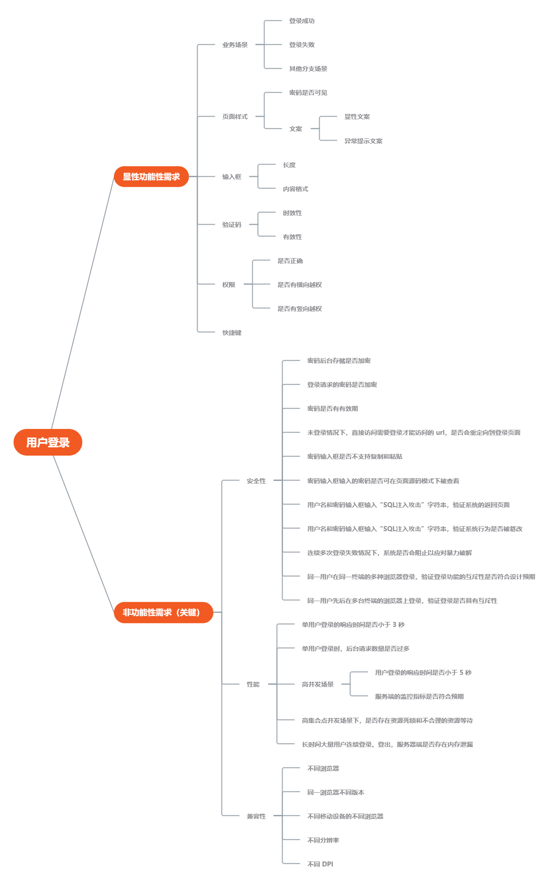

# 用户登录

## 最常用的黑盒测试方法

+ 等价类划分

  + 将可能的输入数据分成若干子集
  + 输入的数据对于揭露程序中潜在错误都具有等同效果就构成了无效等价类
  + 输入的数据是有效的则构成有效等价类
  + 后续从每个等价类中任意选取一个值进行测试，就可以用少量具有代表性的测试输入取得较好的测试覆盖结果
  + 边界值
  + 选取输入、输出的边界值进行测试
  + 选取正好等于、刚刚大于或刚刚小于边界的值作为测试数据

## 测试用例设计

### 设计思路

一般从以下两个方面进行考虑：

+ 显示功能性需求

指的是软件本身需要实现的具体功能，如“登录成功或失败”、“非注册用户无法登录”等

+ 非功能性需求

主要涉及**安全性**、**性能、兼容性**三大方面，这些往往是决定软件质量的关键因素

### 登录用例设计

（完）

