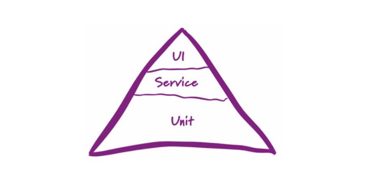

# 接口测试基础

## 什么是接口

为保证项目的高耦合性，基本上前端和后端的开发是分离的。接口就是连接前后端的桥梁，前端通过接口向后端获取数据，后端通过接口向前端输出数据。

## 接口测试的目的

上图将测试分为 3 层：

+ 底层 unit(单元测试)

  一般由开发测试，由于在最底层，发现问题和解决问题的成本会降低

+ 中层接口测试

  接口开发完成并联调完成后，进入接口测试阶段，可以发现在 UI 层发现不了的问题

+ 顶层 UI(功能或业务测试) 测试

  一般由测试进行的 UI 测试或业务测试，基本处于金字的最顶尖，此时对于发现的问题和解决，成本比较高。但这种 UI 的测试又是不可缺少的，因为它是直接面向用户的，所以有必要测试。

# 常用测试工具

+ Postman
+ Jmeter
+ fiddler
+ 代码