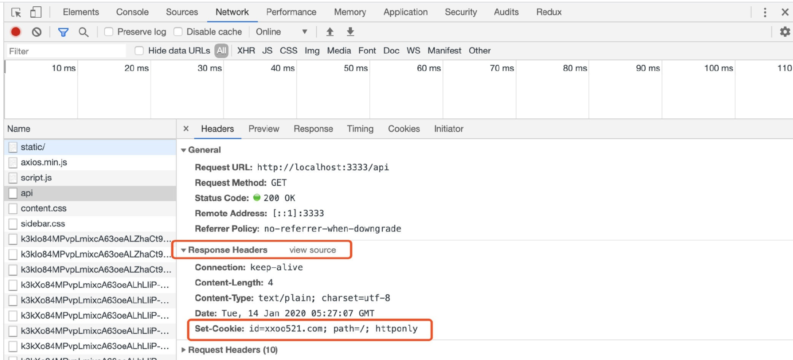
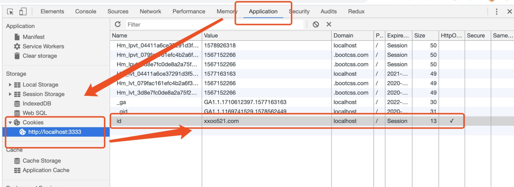

# Cookie

## 什么是 Cookie
+ 以 K-V 形式存储在浏览器中的一种数据
+ 可以在服务端设置，也可以在浏览器端用 JScript 设置
+ 拥有 maxAge、Domain、Path 等属性，可以实现父子域名之间的数据传递

## 如何设置 Cookie
+ 浏览器

通过 JScript 代码进行设置

```js
document.cookie = "firstName=dongyuanxin; path=/"
```

+ 服务端
  + 通过给 Http Response Headers 中的 `Set-Cookie` 字段赋值，来设置 Cookie
  + 客户端接收到 `Set-Cookie` 字段后，将其存储在浏览器中 

在浏览器中可以看到服务端返回的 Cookie



浏览器成功保存了 Cookie 的值，可以在 `Application => Storage => Cookies => 当前域名 ` 中查看



**使用 Cookie 栗子**：

以用户购买商品为例：
+ 监测到浏览器客户端没有标识用户的 Cookie，跳转到登陆界面
+ 用户账号密码登陆，后端验证，成功后，在 `Set-cookie` 中设置标识用户的 Cookie
+ 登陆成功，保存用户标识的 Cookie
+ 购买商品，自动携带用户身份的 Cookie，后端验证无误后，购买成功

## 总结
+ 需要将用户的身份信息保存在客户端，不安全，可以被攻击者窃取
+ Cookie 有大小限制
+ 只能使用字符串型作为 value 值

（完）