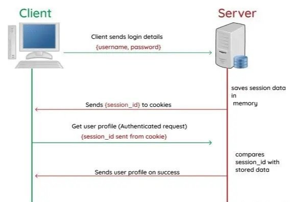
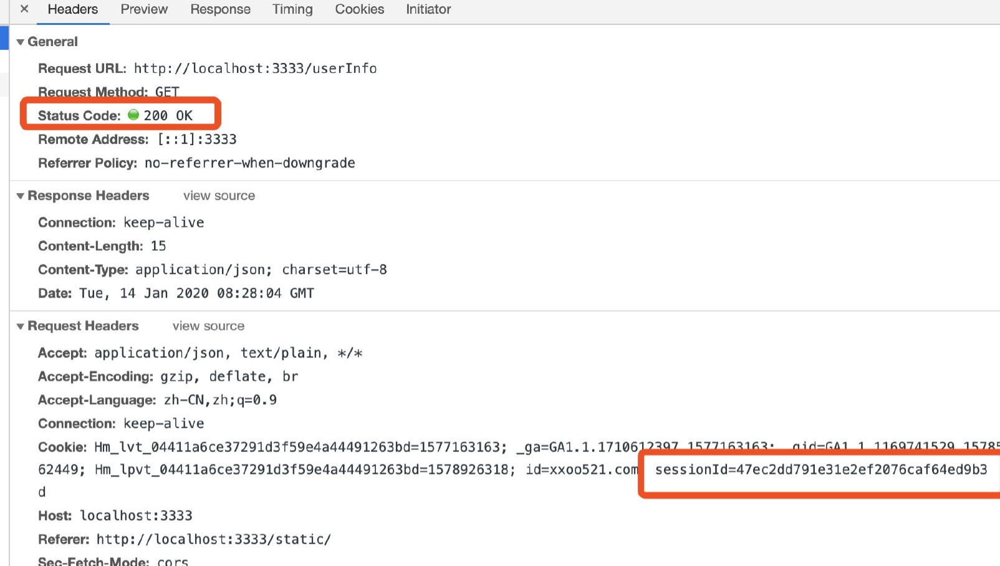

# Session
## 什么是 Session
通过 K-V 数据格式来保存数据：
+ K: 称为 SessionID 保存在客户端
+ V: 称为 Session 保存在服务端

**注意**：
+ 客户端只要存储 SessionID 具体映射的数据结构存储在服务端
+ 跳出了浏览器 Cookie 只能存储字符型的限制
+ 客户端存储 SessionID 还是需要借助 Cookie 实现

## 具体流程

+ 接口登录成功后，服务器生成 SessionID 和 Session
+ 将 SessionID 返给客户端
+ 客户端发送 HTTP 请求时，会携带 Cookie 中的 SessionID
+ 服务端获得 SessionID 后，根据值找到对应的 Session 数据比对

## 优势与不足
### 优势
+ 传输数据少，数据结构灵活

相较于 Cookie 来说，客户端仅保留 SessionID ，传输数据量小，速度快
    
+ 更安全

Session 的验证都是在服务端按照指定规则完成，而 Cookie 可能被客户端通过 JavaScript 代码篡改
    
### 不足
+ Session 会在一定时间内保存在服务器上，当访问增多，会比较占用服务器的性能
+ 多台后端服务器无法共享 Session

分布式部署服务时，不能共享服务器之间的状态
    
**解决方案**：
+ 专门准备一台服务器存储 Session，所有有关 Session 的操作都由它调用
  

**注意**：只是单点服务器时，如果服务器 down 机了，Session 就不能查询
        
+ 服务器之间的调用，可以通过内网 IP 走 RPC 调用（不走 HTTP）

（完）
  

