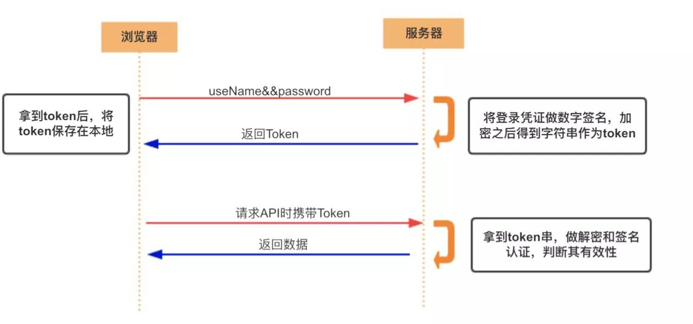
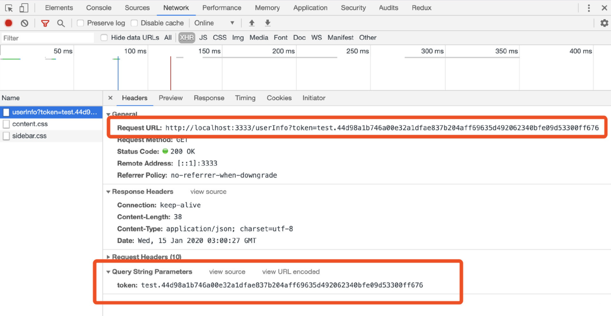

# Token

**疑问**：

前面学习了 Cookie 和 Session ，对比 Cookie 来说，Session 解决了很多问题，那为什么还需要 Token？

+ Cookie 不安全
+ 分布式的部署中 Session 不能共享

**Token 的作用** ：

+ 解决了上面的问题
+ 将状态保存在客户端，并且借助加密算法进行验证保证安全性

## 具体流程

**整体流程如下**:

- 用户尝试登陆
- 登陆成功后，后端依靠加密算法，将凭证生成 Token，返回给客户端
- 客户端保存 Token，每次发送请求时，携带 Token
- 后端在接收到带有 Token 的请求时，验证 Token 的有效性

整个流程中，重要的是**生成 Token、验证 Token**的过程

请求成功后，服务端返回数据，如下：

## Token 优势与不足

### 优势

- 服务器变成无状态了，实现分布式 Web 应用授权
- 可以进行跨域授权，不再局限父子域名
- Token 设计绝对了它本身可以携带更多不敏感数据，例如最常用的 JWT
- 安全性更高，密钥保存在服务器。若密钥被窃取，可以统一重新下发密钥

### 不足

 Token 增加了服务器压力（毕竟要加密） 
 
（完）