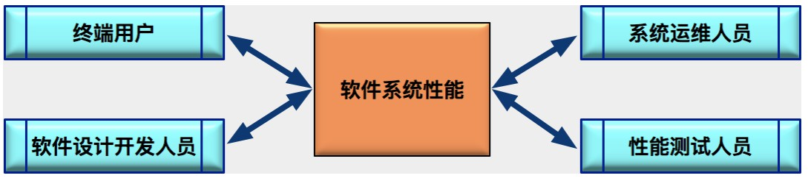

# 了解性能

## 什么是性能

**简单概述**：软件处理得及时性

**不同系统的性能关注点**：

+ Web 类应用和手机端应用，一般以终端用户感受到的端到端的响应时间来描述系统的性能

+ 非交互式的应用，比如典型的电信和银行后台处理系统，响应时间关注更多的是事件处理的速度，以及单位时间的事件吞吐量

## 不同对象对性能的理解

**对象群体**： 终端用户、系统运维人员、软件设计开发人员和性能测试人员 

### 终端用户眼中的性能

终端用户（也就是软件系统使用者）的维度来讲，  用户在界面上完成一个操作开始，到系统把本次操作的结果以用户能察觉的方式展现出来的全部时间

响应时间是终端用户对系统性能的最直观印象，包括了系统响应时间和前端展现时间 

- 系统响应时间，反应的是系统能力，又可以进一步细分为应用系统处理时间、数据库处理时间和网络传输时间等；
- 前端展现时间，取决于用户端的处理能力

### 系统运维人员眼中的性能

从软件系统运维（也就是系统运维人员）的角度， 性能包括：

+ 单个用户的响应时间
+ 关注大量用户并发访问时的负载，
+ 更大负载情况下的系统健康状态、并发处理能力、当前部署的系统容量、可能的系统瓶颈、系统配置层面的调优、数据库的调优，以及长时间运行稳定性和可扩展性 

**常见情况**： 系统运维人员在最大并发用户数和系统响应时间之间进行权衡取舍 

比如：当有两套系统配置方案可以提供以下系统能力的时 

- 配置方案A可以提供 100万 并发访问用户的能力，此时用户的登录响应时间是 3 秒

- 配置方案B可以提供 500万 并发访问用户的能力，此时用户的登录响应时间是 8 秒

从全局利益最大化角度来看，系统具有更大并发用户承载能力的价值会更大，一般都会选择方案 B 

**有些系统为了能够承载更多的并发用户，往往会牺牲等待时间而引入预期的等待机制** 

比如：火车票购票网站
优点：在处理极大并发用户时采用了排队机制，尽可能提高系统容量
不足：增加了用户实际感受到的响应时间

### 软件设计开发人员眼中的性能

从软件系统开发（也就是软件设计开发人员）的角度来讲， 关注的是性能相关的设计和实现细节

**性能包含**： 算法设计、架构设计、性能最佳实践、数据库相关、软件性能 

**算法设计包含的点**：

- 核心算法的设计与实现是否高效
- 必要时，设计上是否采用 buffer 机制以提高性能，降低 I/O
- 是否存在潜在的内存泄露
- 是否存在并发环境下的线程安全问题
- 是否存在不合理的线程同步方式
- 是否存在不合理的资源竞争

 **架构设计包含的内容**：

- 站在整体系统的角度，是否可以方便地进行系统容量和性能扩展
- 应用集群的可扩展性是否经过测试和验证
- 缓存集群的可扩展性是否经过测试和验证
- 数据库的可扩展性是否经过测试和验证

**性能最佳实践包含的点**：

- 代码实现是否遵守开发语言的性能最佳实践；
- 关键代码是否在白盒级别进行性能测试；
- 是否考虑前端性能的优化；
- 必要的时候是否采用数据压缩传输；
- 对于既要压缩又要加密的场景，是否采用先压缩后加密的顺序。

**数据库相关的点**：

- 数据库表设计是否高效
- 是否引入必要的索引
- SQL 语句的执行计划是否合理
- SQL 语句除了功能是否要考虑性能要求
- 数据库是否需要引入读写分离机制
- 系统冷启动后，缓存大量不命中的时候，数据库承载的压力是否超负荷

**软件性能的可测试性包含的点**：

- 是否为性能分析（Profiler）提供必要的接口支持
- 是否支持高并发场景下的性能打点
- 是否支持全链路的性能分析

**注意**：软件开发人员一般不会关注系统部署级别的性能，比如软件运行目标操作系统的调优、应用服务器的参数调优、数据库的参数调优、网络环境的调优等 

### 性能测试人员眼中的性能

性能工程的角度看，性能测试工程师需要关注：

+ 算法设计
+ 架构设计
+ 性能最佳实践
+ 数据库相关
+ 软件性能的可测试性

**性能测试人员需要的技能**：

- 性能需求的总结和抽象能力
- 根据性能测试目标，精准的性能测试场景设计和计算能力
- 性能测试场景和性能测试脚本的开发和执行能力
- 测试性能报告的分析解读能力
- 性能瓶颈的快速排查和定位能力
- 性能测试数据的设计和实现能力
- 面对互联网产品，全链路压测的设计与执行能力，能够和系统架构师一起处理流量标记、影子数据库等的技术设计能力
- 深入理解性能测试工具的内部实现原理，当性能测试工具有限制时，可以进行扩展二次开发；
- 极其宽广的知识面，既要有“面”的知识，比如系统架构、存储架构、网络架构等全局的知识，还要有大量“点”的知识积累，比如数据库 SQL 语句的执行计划调优、JVM 垃圾回收（GC）机制、多线程常见问题等等

**性能的三个最常用的指标** ：

并发用户数、响应时间，系统吞吐量

**并发用户数**:

是性能需求与测试最常用，最重要的指标之一

包含：

+ 业务层面

业务层面的并发用户数，指的是实际使用系统的用户总数 

单靠这个指标并不能反映系统实际承载的压力，还要结合用户行为模型才能得到系统实际承载的压力 

+ 后端服务器层面

后端服务器层面的并发用户数，是“同时向服务器发送请求的数量”，直接反映了系统实际承载的压力 

**业务并发用户数与 服务器层面的并发用户数区别**：

举个例子：

一个已经投入运行的 ERP 系统，该系统所在企业共有 5000名 员工并都拥有账号，说明这个系统有 5000 个潜在用户 

**日志分析结果**：

+ 系统最大在线用户数是 2500 人，从宏观角度来看，2500就是这个系统的最大并发用户数 
+ 2500 这个数据仅仅是说在最高峰时段有 2500 个用户登录了系统，而服务器所承受的压力取决于登录用户的行为，并不能准确表现服务器此时此刻正在承受的压力 

假设：某一时间点上，这 2500个 用户中

30% 用户处于页面浏览状态（对服务器没有发起请求）

20% 用户在填写订单（也没有对服务器发起请求）

5% 用户在递交订单

15% 用户在查询订单

而另外的 30% 用户没有进行任何操作

那么此时，这 2500个 “并发用户”中真正对服务器产生压力的只有 500个 用户（（5%+15%）*2500=500） 

**结论**：

+ 5000 是最大的“系统潜在用户数” 
+ 2500 是最大的“业务并发用户数” 
+ 500 是某个时间点上的“实际并发用户数” 
+ 服务器层面的并发用户数，这个指标同时取决于业务并发用户数和用户行为模式，而且用户行为模式占的比重较大 

**获取用户行为模式的方法**，主要分为两种：

- 对于已经上线的系统来说，往往采用系统日志分析法获取用户行为统计和峰值并发量等重要信息
- 而对于未上线的全新系统来说，通常的做法是参考行业中类似系统的统计信息来建模，然后分析

**响应时间**：

概述：**响应时间反映了完成某个操作所需要的时间** 

**包含 2 部分**：

+ 前端展现时间

取决于客户端收到服务器返回的数据后渲染页面所消耗的时间

会使用一些编程技巧在数据尚未完全接收完成时呈现数据，以减少用户实际感受到的主观响应时间  

+ 系统响应时间 

  + Web服务器时间
  + 应用服务器时间
  + 数据库时间
  + 各服务器间通信的网络时间 

**严格上，响应时间应该包含两层含义**：

+ 技术层面的标准定义
+ 基于用户主观感受时间的定义

**系统吞吐量**：

是最能直接体现软件系统负载承受能力的指标 

**通常衡量吞吐量的方式**：

+ Requests/Second 

表示的吞吐量，主要受网络设置、服务器架构、应用服务器制约 

+ Pages/Second 

表示的吞吐量，主要受网络设置、服务器架构、应用服务器制约 

+ Bytes/Second 

表示的吞吐量，主要受应用服务器和应用本身实现的制约 

业务上： 可以用单位时间的业务处理数量来衡量 

**注意**：吞吐量可以反映服务器承受负载的情况，但在不同并发用户数的场景下，即使系统具有相近的吞吐量，但是得到的系统性能瓶颈也会相差甚远 

比如：个测试场景中采用 100个 并发用户，每个用户每隔 1秒 发出一个 Request，另外一个测试场景采用 1000个 并发用户，每个用户每隔 10秒 发出一个 Request

这两个场景具有相同的吞吐量, 都是 100 Requests/second，但两个场景所占用的资源是不同的，性能拐点肯定不同

**结论**：性能测试场景的指标，必然不是单个，需要根据实际情况组合并发用户数、响应时间这两个指标 
