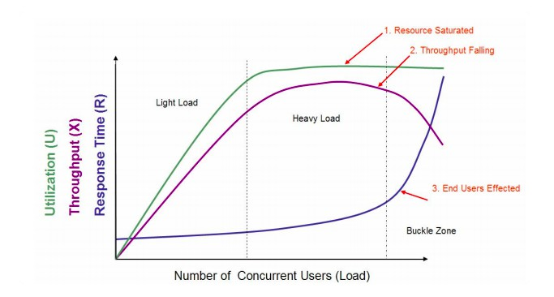
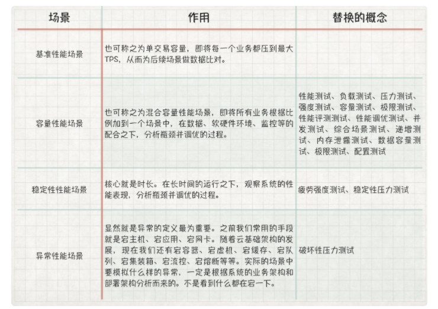

# TPS 与响应时间之间的关系

## 解析经典性能图

一张经典图：

上述图中描述的是：

+ 三条曲线

吞吐量曲线（紫色）、使用率/用户数曲线（绿色）、响应时间曲线（深蓝色）

+ 三个区域

轻负载区、重负载区、塌陷区

+ 两个点

最优并发用户数、最大并发用户数

+ 三个状态描述

资源饱和、吞吐下降、用户受影响

**存在的误差**：

+ 重负载区的资源饱和 TPS 达到最大值之间都不是在同样的并发用户数之下

如：当 CPU 达到 100% 后，随着压力增加，队列慢慢变长，但由于并发用户数的增加幅度会超过队列长度，此时 TPS 会增加，也就是在资源使用率达上限之后，还会有一段时间 TPS 才会达上限

+ 响应时间不会这么陡峭，不一定是在塌陷区上升，在重载区就有可能上升

+ 吞吐量曲线不一定出现下降的趋势，控制好的系统会持平

+ 最优并发数通常是一种感觉，并没有足够的证据证明

+ 最大并发数，肯定是在之前的某个位置

+ 没有考虑锁或线程配置不合理的情况

## 场景定义

根据场景进行一些概念的定义：

**如此划分原因**：在具体场景的操作层面，只有场景中的配置是可操作的

