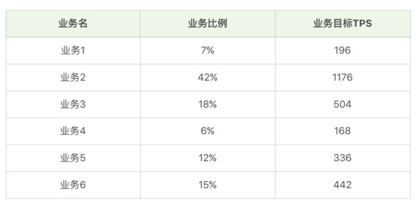
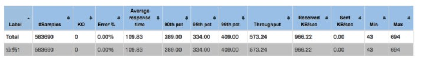

# 如何进行场景设计

**前提条件**：

+ 列出测试业务比例、业务目标 TPS  和响应时间指标

例如：

## 基准性能场景

**业务１**

场景执行时长：17 分钟

结果：

由上图可以看出：

+ TPS 达 573.24
+ 平均响应时间是 109.83ｍｓ
+ 发送字节很少
+ 接收字节 966.22KB/ｓ
+ 响应最小时间 43ｍｓ，最长 694ｍｓ

对于上述的这些结果，不能得出结论，需要结合以下图表：

**线程图**：

