# 性能分析思路

**包含**：

+ 瓶颈的精准判断
+ 线程递增的策略
+ 性能衰减的过程
+ 响应时间的拆分
+ 构建分析决策树
+ 场景的对比

## 瓶颈的精准判断

### TPS 曲线

例如，TPS 的曲线图：

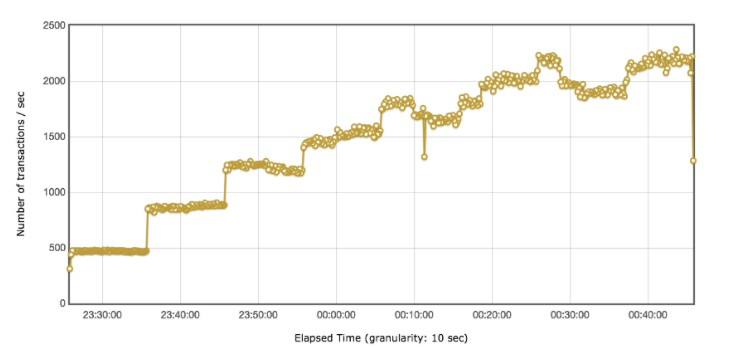

对应的响应时间的图：

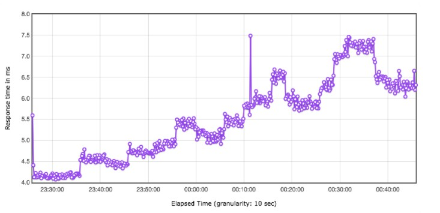

根据上面的图进行判断：

+ 有瓶颈

  第二阶梯时出现瓶颈，响应时间增加，但 TPS 没有增加很多

+ 瓶颈和压力有关

+ 压力呈阶梯，并且增长幅度在衰减

**TPS 曲线的作用**：

+ 明确有没有瓶颈

+ 明确瓶颈和压力有没有关系

  TPS 随着压力变化就有关系，不随压力变化就无关

### 响应时间曲线

例如，响应时间图：

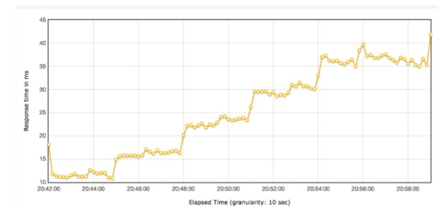

对应的线程数的曲线图：

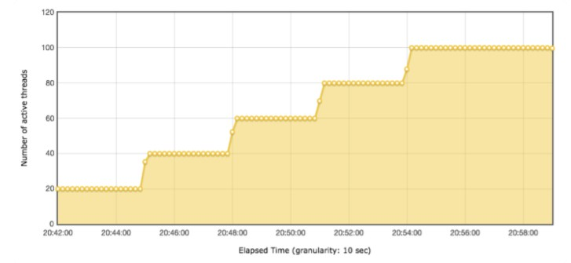

对应的 TPS 的图：

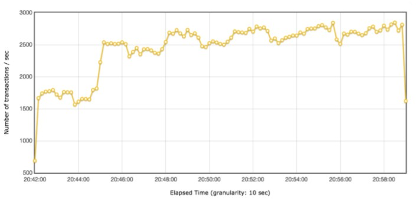

由上面的图，可以看出：

+ 对比响应时间和线程图：响应时间随着线程数的增加而增加
+ 对比 3张 图：有瓶颈，在线程数达 40 时，出现瓶颈

**结论**：

+ 响应时间判断业务的快慢
+ TPS 判断是否有瓶颈

## 线程递增的策略

**性能场景对比**：

场景 1：

线程图：

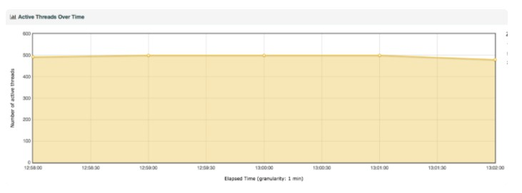

TPS：

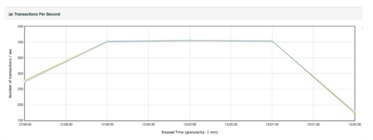

响应时间：

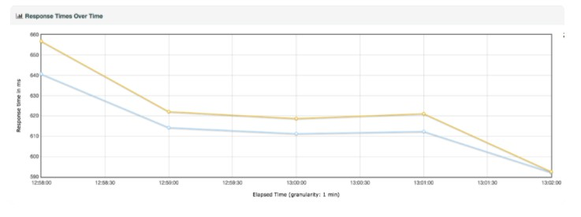

场景 2：

线程图：

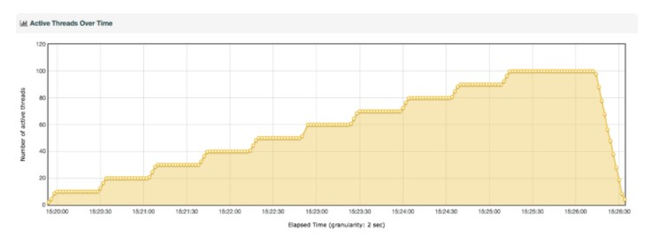

TPS：

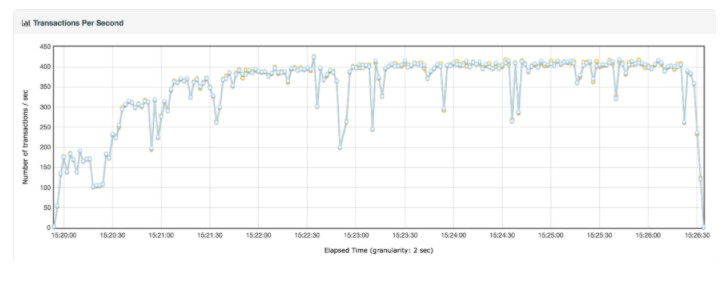

响应时间：

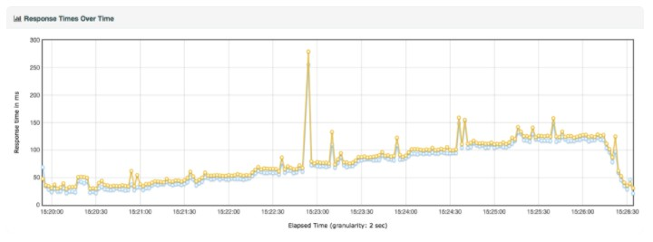

**对比**：

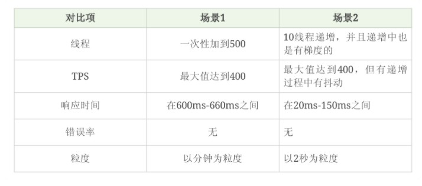

