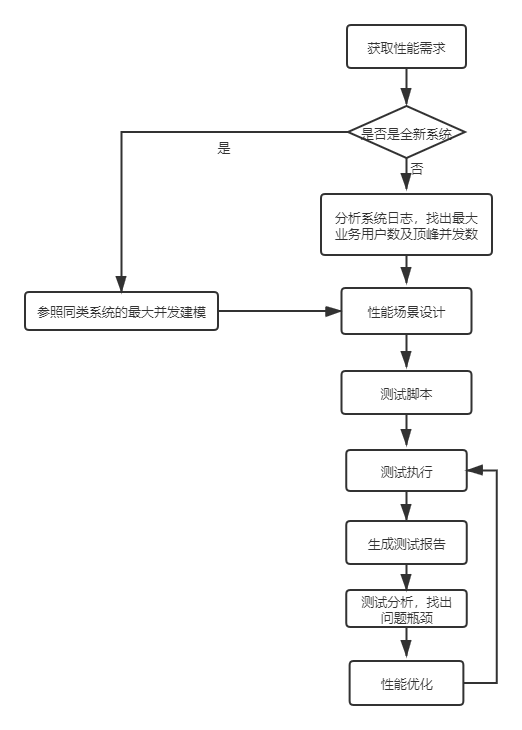

# 性能测试基础

## 性能测试类型

+ 负载测试：主要看系统能承受多大的负载，直至系统崩溃
+ 并发测试：主要看系统最大能支持多大并发
+ 压力测试：高压力，持续一段时间，看系统运行的状态
+ 容量测试：系统能承受的最大容量，可以是最大用户数量、数据库数量
+ 可靠性测试：达到最大压力时，系统长时间运行，是否会有内存泄漏
+ 配置测试：不同的配置下，系统的性能表现

## 基本流程

## 性能测试术语解释：

1、事务

2、虚拟用户数（线程数）

3、断言

4、集合点

## 性能测试指标：

+ 系统指标（与用户场景和需求相关）：

+ TPS（每秒事务数）：每秒钟系统处理的事务数

+ 并发用户数：同一时间并发的用户数

  业务层面：实际使用系统的用户总数

  后端服务器层面：同时向服务器发送请求的数量

+ 吞吐量：

  request/second

  pages/second

  bytes/second

+ 吞吐率：

+ 响应时间：客户端发送请求后，服务器作出回应后返回给client的时间

  前端响应：前端拿到服务端返回的数据后，浏览器渲染到曾献的时间

  系统响应时间：包含了请求时间、数据传输时间、应用服务处理时间、数据库时间等

+ 点击量

+ 点击率：同一时间，用户的点击率

## 并发用户、响应时间与吞吐量之间的关系

+  当系统并发用户数较少时，系统的吞吐量也低，系统处于空闲状态，我们往往把这个阶段称为 “空闲区间”。 
+  当系统整体负载并不是很大时，随着系统并发用户数的增长，系统的吞吐量也会随之呈线性增长，我们往往把这个阶段称为 “线性增长区间” 
+  随着系统并发用户数的进一步增长，系统的处理能力逐渐趋于饱和，因此每个用户的响应时间会逐渐变长。相应地，系统的整体吞吐量并不会随着并发用户数的增长而继续呈线性增长。我们往往把这个阶段称为系统的“拐点” 
+  随着系统并发用户数的增长，系统处理能力达到过饱和状态。此时，如果继续增加并发用户数，最终所有用户的响应时间会变得无限长。相应地，系统的整体吞吐量会降为零，系统处于被压垮的状态。我们往往把这个阶段称为“过饱和区间” 

## 场景分析设计
1、用户量访问比较大的功能
2、与金钱相关比较重要的场景
3、影响业务主流程的场景
4、开发人员任务可能存在性能问题的场景
5、应该考虑综合场景，防止线程争用导致现场死锁以及数据库死锁
6、应该做稳定性能场景测试，防止长时间运行导致的内存泄露情况发生

## 硬件指标：

+ cpu 使用率
+ 内存使用率
+ io

## 软件指标

+ 服务器的配置
+ 架构是否合理
+ 数据库方面：
  + 是否有索引
  + 数据库锁
  + 表空间设计是否合理
  + 慢查询等

## 性能测试工具

1、jmeter：开源的 Java 项目

2、loadrunner：

