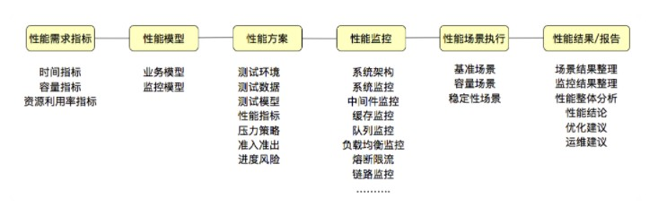

# 性能测试概念

**概念**：

+ 针对系统的性能指标，建立性能测试模型，制定性能测试方案，制定监控策略
+ 在场景条件之下执行性能场景，分析判断性能瓶颈并调优，最终得出性能结果来评估系统的性能指标是否满足既定值

## 性能指标

应该具有的指标：时间指标、容量指标、资源利用率指标

## 性能测试模型

**模型**：真实场景的抽象

**不同行业的模型**：

+ 不敢线上压测的企业

比如：有 100 个业务，可能只有 50个 业务有并发量

数据：从生产环境数据中统计业务的并发数

+ 互联网云架构企业

直接在线上导流做性能测试

+ 银行类的金融企业

测试环境中用业务模型模拟线上的流量

性能测试要选择合适自己系统业务逻辑的方式，用最低的成本、最快的时间做事情

## 性能测试方案

**关键点**：

+ 测试环境
+ 测试数据
+ 测试模型
+ 性能指标
+ 压力策略
+ 准入准出
+ 进度风险

## 性能监控

要有分层、分段的能力，要有全局监控、定向监控的能力

## 性能预定的条件

**包含**：

+ 软硬件环境
+ 测试数据
+ 测试执行策略
+ 压力补偿等

## 性能场景

定义：
+ 在既定的环境（包括动态扩展策略）、既定的数据（包括场景执行中的数据变化）、既定的执行策略、既定的监控之下，执行性能脚本
+ 同时观察系统各层级的性能状态参数变化，并实时判断分析场景是否符合预期

**场景分类**：

+ 基准性能场景

+ 容量性能场景（核心）

+ 稳定性性能场景

**核心元素**：时间

+ 异常性能场景

## 性能分析调优

**性能项目类型**：

+ 新系统性能测试

一般测试系统的最大容量

+ 旧系统新版本性能测试

一般和旧系统的性能进行比较，可根据历史数据进行容量推算，对调优要求不大

+ 新系统性能测试优化

不仅要求测试出最大容量，还要求调优到最好

**几种性能测试**：

+ 性能验证

针对给定的指标，只做性能验证

+ 性能测试

针对给定的系统，全面的进行性能测试，得到系统最大容量，但不进行调优

+ 性能测试+分析调优

针对给定的系统，全面的进行性能测试，同时将系统调优到最优状态

## 性能报告

**明确**：调优前后的 TPS 、响应时间、资源对比图

## 总结

