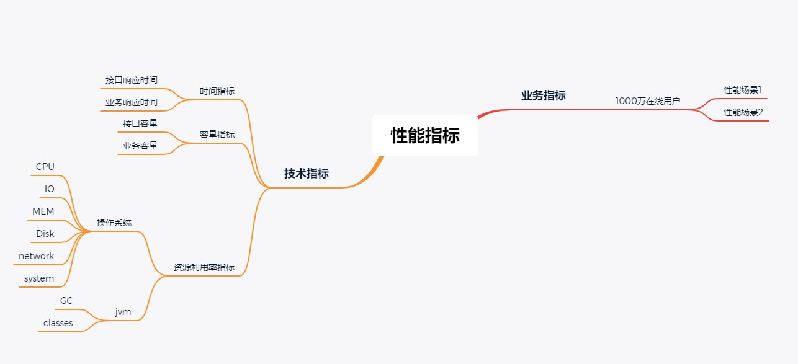
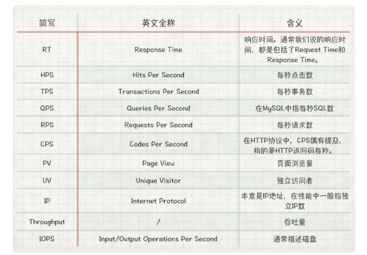
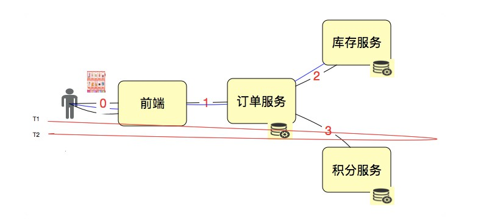

# 性能指标理解

## 指标间关系

包含：业务指标、技术指标

**两者之间关系**：是映射的关系，技术指标在业务场景的前提下制定

例如：系统要支持 1000万 人在线

**常用性能指标表示法**：不包括资源指标

## 指标理解

### 并发

+ 绝对并发

  

  严格按照上图的逻辑达到系统，绝对并发用户数是 4 ，描述 1秒 内的并发用户数是 16

+ 相对并发

  

  并发数是 16TPS ，1秒 内系统处理了 16 个事务

### TPS（重要）

含义：每秒事务数

**如何定义 T**：根据场景的目的和 T 的作用定义 T

比如：接口层性能测试，T 可定义为接口级；业务级性能测试，T 可直接定义为每个业务步骤和完整的业务流

+ 单独测试接口 1 2 3，则 T 就是接口级
+ 从用户角度下单，接口 1 2 3 处于同一个业务，T 即为业务级

**作用**：反应系统的处理能力

### QPS 

**不同描述，不同意义**：

+ 描述数据库中的 Query Per Second，表示数据库中 sql 的每秒执行条数
+ 描述前端每秒查询数，不包括插入、更新、删除操作

**不足**：不够全面的描述系统的性能，不建议使用此指标描述系统整体性能

### RPS

含义：每秒请求数

**不同描述，不同意义**：

用户点击 1 次，发出 3 个 Http Resquest，调用 2次 订单服务，2次 库存服务，1次 积分服务，Request 如何计算

+ 描述整体，算有 3个 RPS
+ 从 HTTP 理解，Http Request 是比较准确的描述

### CPS／CPM

含义：每秒、每分钟调用次数，在接口级测试中常用到

**不同描述，不同意义**：

+ 接口级

+ 操作系统级，描述系统性能能力，会出现混乱

  **处理方式**：

  + 统一概念，在各层面上加上限制条件描述
  + 团队中定义清楚术语的使用层级
  + 如果没有定义使用层级，再说概念时，加上相应背景条件

### 响应时间 RT（重要）

RT = T2 - T1

**响应时间定位复杂的解决方案**：链路监控工具、Metrics 使用

### 压力工具中的线程数和用户数与 TPS

**三者之间的关系**：

示意图：

**TPS 定义**：上图中有 4个 并发线程，每个线程在 1秒 内完成 4个 事务，总的 TPS 是 16

**用户数定义**：需要对在线用户做并发度分析，很多业务中并发度低于 5%，甚至低于 1%

比如：系统有 1万 用户在线，拿 5% 计算：

TPS = 10000 用户 *5%=500（TPS）

并发线程数（响应时间按 100ms 算）= 500（TPS）/（1000ms/100ms）=50（并发线程）

**性能分析强调的**：趋势

### 业务模型

**如何得到业务模型**：

+ 根据生产环境的统计信息做业务比例的统计，设定到压力工具中，适用于不能直接在线上做压力测试的系统

+ 直接在生产环境中做流量复制的方式或压力工具直接生产环境进行压力测试

  **重要的点**：组织协调能力

### 响应时间

**258 原则不合理原因**：该结果统计时间过久，已不适用

**响应时间如何设计比较合理**：

+ 同行业的对比数据
+ 找到使用系统的样本用户做统计，结果就是有效响应时间的制定标准

