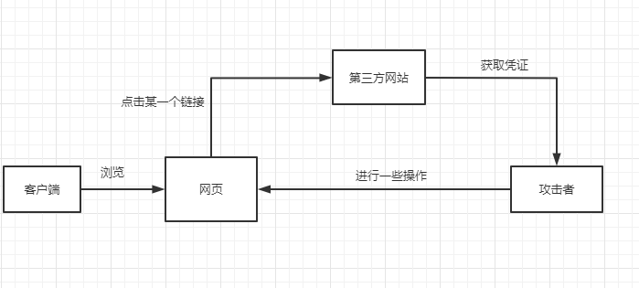

# CSRF

## 什么是 CSRF

CSRF：Cross-site request forgery 跨站请求伪造

+ 本质上是钓鱼
+ 攻击者诱导受害者进入第三方网站，在第三方网站中，向被攻击网站发送跨站请求
+ 利用受害者在被攻击网站已经获取的登录凭证，绕过后台的用户验证，达到冒充用户对被攻击的网站执行某项操作的目的

**原理**：



**一个典型的 CSRF 攻击有着如下的流程**：

+ 受害者登录 a.com，并保留了登录凭证（Cookie）
+ 攻击者引诱受害者访问了 b.com
+ b.com 向 a.com 发送了一个请求：a.com/act=xx，浏览器会默认携带 a.com 的 Cookie
+ a.com 接收到请求后，对请求进行验证，并确认是受害者的凭证，误以为是受害者自己发送的请求
+ a.com 以受害者的名义执行了 act=xx
+ 攻击完成，攻击者在受害者不知情的情况下，冒充受害者，让 a.com 执行了自己定义的操作

## CSRF 攻击方式

### get 请求产生的 CSRF

有 href 和 HTTP 请求两种方式

#### href 攻击的方式

```javascript
<a href="http://bank.com/transfer?account_number_from=123456789&account_number_to=987654321&amount=100000">View my Pictures!</a>
```
+ 已经登录了bank.com
+ 点击 "View my Pictures" 这一链接时，会将钱从一个账户转移到另一个账户，数额为 100000

#### HTTP 请求方式

```javascript

```
+ 受害者访问含有这个 img 的页面后，浏览器会自动向 http://bank.example/withdraw/account=xiaoming&amount=10000&for=hacker 发出一次 HTTP 请求
+ 在攻击者接收到请求的时候我们便可以“借用”对方的 Cookie

### post 请求产生的 CSRF

+ post 请求所产生的 CSRF 是利用地最多的攻击方式 
+ 这种类型的 CSRF 通常利用的是一个自动提交的表单

```javascript
<form action="http://bank.example/withdraw" method=POST> 
	<input type="hidden" name="account" value="xiaoming" /> 
	<input type="hidden" name="amount" value="10000" /> 
	<input type="hidden" name="for" value="hacker" /> 
</form> 
<script> document.forms[0].submit(); </script>
```
访问该页面后，表单会自动提交，相当于模拟用户完成了一次 POST 操作

## CSRF 的防御手段

主流的 CSRF 防御手段有以下两种：
+ 使用同源检测与 Samesite Cookie
+ 多加一层验证手段 CSRF Token

###  CSRF Token

**工作原理**：
+ CSRF Token 每随着页面被操作，比如 f5 刷新，点击按钮等等，都会导致 CSRF Token 变化
+ 每一个请求的 CSRF Token 会通过后端代码验证 Token 是否正确，在时间戳上是否有效，如果加密字符串一致且时间未过期，那么这个 Token 就是有效的

### 限制同源

通过设置 Set-Cookie 的值

#### Strict

+ Strict 最为严格，完全禁止第三方 Cookie
+ 跨站点时，任何情况下都不会发送 Cookie
+ 只有当前网页的 URL 与请求目标一致，才会带上 Cookie

```javascript
Set-Cookie: CookieName=CookieValue; SameSite=Strict;
```

#### Lax

+ Lax 规则稍稍放宽，大多数情况也是不发送第三方 Cookie
+ 导航到目标网址的 Get 请求除外

```javascript
Set-Cookie: CookieName=CookieValue; SameSite=Lax;
```

#### None

+ 代表关闭了 SameSite
+ 一般攻击要进行绕过可以尝试将 SameSite 设置为 None

```javascript
Set-Cookie: CookieName=CookieValue; SameSite=None;
```