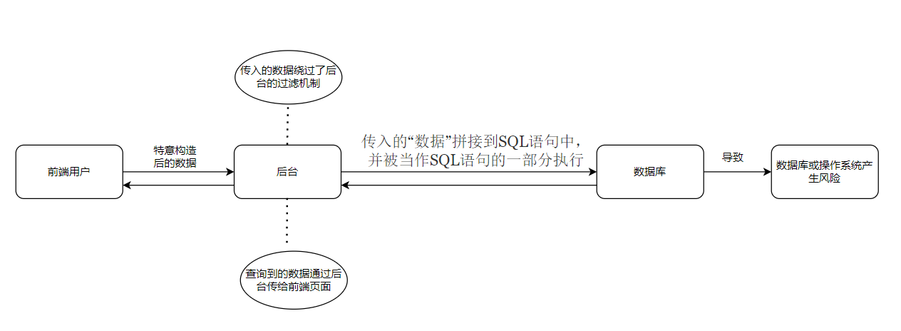
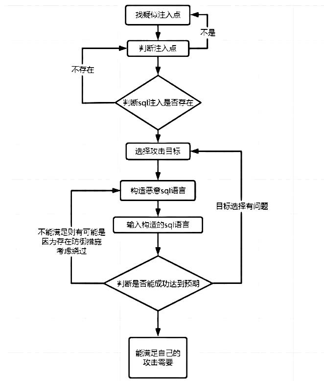

# SQL 注入原理

## 什么是 SQL 注入

+ 由于用户不可控输入，攻击者可以任意的输入恶意的 SQL 语句，使原始的查询语句的语义发生改变

+ 在**数据交互**时，**前端的数据传入到后台处理**时，**没有做严格的判断**，导致其传入的“数据”**拼接**到 SQL 语句中后，**被当作 SQL 语句的一部分执行**

**注入漏洞经常出现的位置**:

- 常发生于用户和服务交互处（增删改查操作），Ajax，接口等等

**实现注入攻击的两个关键条件(重点)**:

- 第一个：用户能控制输入——用户能控制输入变量
- 第二个：原本程序要执行的代码，**拼接**了用户输入的数据（正是拼接的这个过程导致了代码的注入）

## SQL注入危害

攻击者利用 SQL 注入漏洞，带来的风险有很多，例如：

+ 数据库被拖库
+ 管理员和重要人员信息泄露
+ 甚至还能通过 SQL 注入漏洞直 接获取 webshell 或者服务器系统权限等等

**具体危害如下**：

+ 绕过登录验证：使用万能密码登录网站后台等
+ 获取敏感数据：获取网站管理员帐号、密码等
+ 文件系统操作：列目录，读取、写入文件等
+ 注册表操作：读取、写入、删除注册表等
+ 执行系统命令：远程执行命令

## SQL注入防御

- 对传进 SQL 语句里面的变量进行过滤，不允许危险字符传入
- 预编译参数化查询 (提前编译 SQL 语句，将所有的用户输入都当做『数据』，而非『语法』)在设计与数据库连接并访问数据时，在需要填入数值或数据的地方，使用参数（Parameter）来给值
- 目前有很多 ORM 框架会自动使用参数化解决注入问题,但其也提供了"拼接"的方式,所以使用时需要慎重
- **采用黑名单、白名单**等形式对用户提交的信息进行过滤，一旦发现用户参数中出现敏感的词或者内容，则将其删除，使得执行失败
- 安全设计遵循“数据与代码分离”原则
- 使用 WAF(web 应用防护墙)等安全产品

### 如何发现被 SQL 注入攻击

>日志监控--->蜜罐数据--->异常报警

**监测方面**

目前大多都是：日志监控 + WAF

+ 日志推荐走数据库日志，越是离资源操作 近的地方，越是容易做到真正的安全
+ 数据库日志容易解析，语法出错的、语法读 Info表的，都明确是黑客嘛，还能帮我们发现 SQL 注入点

**蜜罐方面**

+ 数据库里可放置一些蜜罐数据的帐号和密码，假如这有一个服务，可以先从日志入手，发现请求恶意异常时，自动转发蜜罐
+ 比如用户表里，前几十行里，做些用户名和密码 进行，实际上没有人用，一旦被登录，立马报警

## SQL注入分类

### 按照数据类型分类

+ 数字型

+ 字符型

### 按照注入点分类(哪些地方存在 SQL注入)

+ GET 型（注入点在 UR）

+ POST 型（注入点在表单输入框中，且数据提交方式是 POST，如登录框、注册框）

+ COOKIE 型（注入点在 cookie中）

+ Header 型(注入点在头部)

+ 其他(请求报文中只要能够被后端脚本引擎接受的数据均可 SQ L注入)

### 按照数据获取的方式分类

+ 回显注入--联合查询

+ 报错注入--报错回显(extractvalue(), updatexml(), floor())

+ 盲注（没有错误回显）
  + bool 盲注--逻辑语句判断查询出的字符
  + 时间盲注--利用页面演示情况判断数据库中的数据

**注意:**

**`盲注，time盲注，报错注入，union注入`**,这些注入漏洞出现频率较高

**`在不影响正常服务的情况下，拼接查询算最高危害的，接下来就是union。`**

**`比较好检测的注入有：盲注，time盲注，报错注入等`**

## SQL注入流程

### 流程细节

+ 找疑似注入点--找数据输入的地方

+ 判断注入点----找输入点中与数据库有交互的地方

+ 确认注入存在----确认找到于数据库有交互的地方是不是存在sql注入

+ 选择攻击目标----选择攻击后需要达到的目的

+ 根据选择的目标构sql语言

+ 提交sql语言

+ 判断网页响应是否与目标一致
  + 后端语言对输入的 sql 语句有限制，考虑重构sql语句
  + 选择的目标在当前网站不具备成功的条件，考虑重新选择目标

+ 响应符合预期，则完成注入