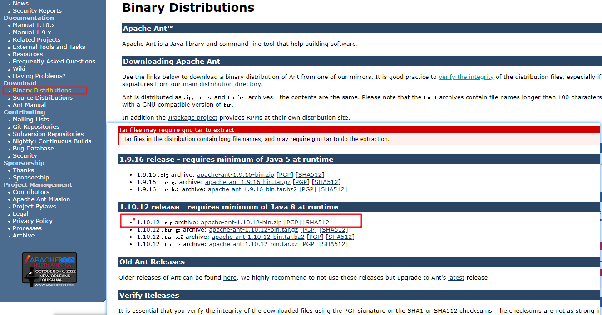
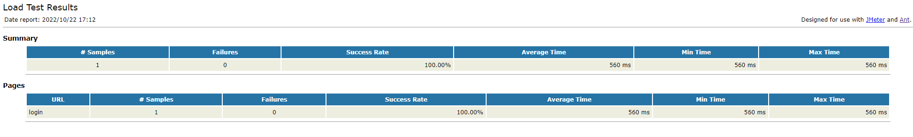

# Jmeter + Ant + Jenkins 实现自动化

**前言**:
- 本文是基于 Jmeter5.0+ 在 Windows 环境下
- 先安装好 Java 环境 和 Jmeter，可参考 [Jmeter在Windows上安装](/test/tools/Jmeter/jmeter-install-linux)

## Ant 的安装与配置

### 下载安装

**下载**：

下载地址：http://ant.apache.org/

选择 JDK 8 的安装包



**配置环境变量**：

将 Ant 目录下的 `/bin` 和 `/lib` 路径添加到环境变量中

配置完成后，在 cmd 中输入 `ant -version`, 出现以下内容说明安装成功
```shell
E:\greenSoftware\apache-jmeter-5.2.1\apache-jmeter-5.2.1>ant -version
Apache Ant(TM) version 1.10.12 compiled on October 13 2021
```

### 相关文件配置

**拷贝 jar 包**：

将 Jmeter 目录中的 extras 文件夹下 `ant-jmeter-1.1.1.jar` 文件拷贝到 Ant 安装目录下的 lib 文件夹下

**配置 Ant 的编译文件**：

配置前准备：
+ 在 Jmeter 下创建 scripts 目录用于存放脚本
+ 在 Jmeter 下创建 reports 目录用于存放测试报告

编写 build.xml 文件，存放于 Jmeter 的安装目录下，文件内容如下，修改相应的部分即可：
```xml
<?xml version="1.0" encoding="UTF8"?>
<project name="ant-jmeter-test" default="run" basedir=".">
    <tstamp>
        <format property="time" pattern="yyyyMMddHHmmss" />
    </tstamp>
    <!-- 需要改成自己本地的 Jmeter 目录-->  
    <property name="jmeter.home" value="E:\greenSoftware\apache-jmeter-5.2.1\apache-jmeter-5.2.1" />
    <!-- 需要修改成jmeter生成jtl格式的结果报告的路径--> 
    <property name="jmeter.result.jtl.dir" value="E:\greenSoftware\apache-jmeter-5.2.1\apache-jmeter-5.2.1\reports" />
    <!-- 需要修改成jmeter生成html格式的结果报告的路径-->
    <property name="jmeter.result.html.dir" value="E:\greenSoftware\apache-jmeter-5.2.1\apache-jmeter-5.2.1\reports" />
    <!-- 生成的报告的前缀，可修改-->  
    <property name="ReportName" value="TestReport" />
    <property name="jmeter.result.jtlName" value="${jmeter.result.jtl.dir}/${ReportName}${time}.jtl" />
    <property name="jmeter.result.htmlName" value="${jmeter.result.html.dir}/${ReportName}${time}.html" />
     
    <target name="run">
        <antcall target="test" />
        <antcall target="report" />
    </target>
     
    <target name="test">
        <taskdef name="jmeter" classname="org.programmerplanet.ant.taskdefs.jmeter.JMeterTask" />
        <jmeter jmeterhome="${jmeter.home}" resultlog="${jmeter.result.jtlName}">
             <!-- 修改成jmeter的脚本目录，"*.jmx"指包含此目录下的所有jmeter脚本-->
            <testplans dir="E:\greenSoftware\apache-jmeter-5.2.1\apache-jmeter-5.2.1\scripts" includes="*.jmx" />
            <property name="jmeter.save.saveservice.output_format" value="xml"/>
        </jmeter>
    </target>
     
    <path id="xslt.classpath">
        <fileset dir="${jmeter.home}/lib" includes="xalan*.jar"/>
        <fileset dir="${jmeter.home}/lib" includes="serializer*.jar"/>
    </path> 
     
    <target name="report">
        <tstamp><format property="report.datestamp" pattern="yyyy/MM/dd HH:mm"/></tstamp>
        <xslt 
              classpathref="xslt.classpath"
              force="true"
              in="${jmeter.result.jtlName}"
              out="${jmeter.result.htmlName}"
              style="${jmeter.home}/extras/jmeter-results-report_21.xsl">
              <!-- 修改自己本地存在的样式文件名 -->
              <param name="dateReport" expression="${report.datestamp}"/>
        </xslt>
             
        <copy todir="${jmeter.result.html.dir}">
            <fileset dir="${jmeter.home}/extras">
                <include name="collapse.png" />
                <include name="expand.png" />
            </fileset>
        </copy>
    </target>
</project>
```

**修改 `jmeter.properties` 文件**：

- 进入 Jmeter 安装目录 `/bin` 目录下打开 `jmeter.properties`文件
- 将 `#jmeter.save.saveservice.output_format=csv` 修改为 `jmeter.save.saveservice.output_format=xml`并去掉注释

### 调试运行 Ant

**前提**：在 Jmeter 安装目录的 scripts 目录中创建 .jmx 脚本

进入 build.xml 文件目录下，进入 cmd 运行环境，输入 ant 命令：
```shell
E:\greenSoftware\apache-jmeter-5.2.1\apache-jmeter-5.2.1>ant
Buildfile: E:\greenSoftware\apache-jmeter-5.2.1\apache-jmeter-5.2.1\build.xml

run:

test:
   [jmeter] Executing test plan: E:\greenSoftware\apache-jmeter-5.2.1\apache-jmeter-5.2.1\scripts\login.jmx ==> E:\greenSoftware\apache-jmeter-5.2.1\apache-jmeter-5.2.1\reports\TestReport20221022171155.jtl
   [jmeter] Creating summariser <summary>
   [jmeter] Created the tree successfully using E:\greenSoftware\apache-jmeter-5.2.1\apache-jmeter-5.2.1\scripts\login.jmx
   [jmeter] Starting standalone test @ Sat Oct 22 17:11:59 CST 2022 (1666429919792)
   [jmeter] Waiting for possible Shutdown/StopTestNow/HeapDump/ThreadDump message on port 4445
   [jmeter] summary +      1 in 00:00:01 =    1.4/s Avg:   560 Min:   560 Max:   560 Err:     0 (0.00%) Active: 1 Started: 1 Finished: 0
   [jmeter] summary =      1 in 00:00:01 =    1.4/s Avg:   560 Min:   560 Max:   560 Err:     0 (0.00%)
   [jmeter] Tidying up ...    @ Sat Oct 22 17:12:00 CST 2022 (1666429920899)
   [jmeter] ... end of run

report:
     [xslt] Processing E:\greenSoftware\apache-jmeter-5.2.1\apache-jmeter-5.2.1\reports\TestReport20221022171155.jtl to E:\greenSoftware\apache-jmeter-5.2.1\apache-jmeter-5.2.1\reports\TestReport20221022171155.html
     [xslt] Loading stylesheet E:\greenSoftware\apache-jmeter-5.2.1\apache-jmeter-5.2.1\extras\jmeter-results-report_21.xsl
     [copy] Copying 2 files to E:\greenSoftware\apache-jmeter-5.2.1\apache-jmeter-5.2.1\reports

BUILD SUCCESSFUL
Total time: 7 seconds
```
出现 BUILD SUCCESSFUL 说明运行成功，可以查看下 reports 目录下的测试报告：



## Jenkins 安装与配置

